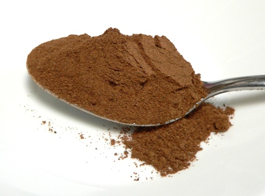

# Mixed Spice

*This blend of ground spices has a whole host of uses, both in sweet and savory dishes. It typically features cinnamon, nutmeg, and allspice as the core, but also contains cloves, cayenne pepper, coriander, ginger, and mace. This is the spice of autumn baking and winter stews.*

**Yield:** Approximately 63-70 grams (makes 20-25 portions)

## Overview
Mixed spice (also called pudding spice or cake spice) is a British baking staple used in cakes, cookies, fruit compotes, and sometimes in meat dishes. The blend emphasizes warm spices, those that evoke autumn and winter. Unlike curry or other savory blends, mixed spice is designed to complement sweetness, though it works beautifully in savory applications as well. This is a spice blend that bridges sweet and savory cuisine, appearing equally often in apple pies and stewed meats.

## Ingredients

### Pre-Ground Spices
- 1 tablespoon ground allspice
- 1 tablespoon ground cinnamon
- 1 tablespoon ground nutmeg
- 2 teaspoons ground mace (or additional nutmeg if unavailable)
- 1 teaspoon ground cloves
- 1 teaspoon ground coriander
- 1 teaspoon ground ginger
- 1/4 teaspoon cayenne pepper (optional, for subtle heat)
- 1.5 teaspoons fine sea salt (optional, for savory applications)

## Method

### Stage 1 – Combine All Spices
1. Pour all pre-ground spices into a medium mixing bowl.
1. Include the cayenne pepper if desired for subtle background heat.
1. If preparing a savory version, add the salt.

### Stage 2 – Mix Thoroughly
1. Using a spoon or small whisk, stir very thoroughly for 2-3 minutes.
1. Mix until the color is completely uniform throughout, no streaks or patches.
1. Break up any small clumps of spice that have formed during storage.

### Stage 3 – Sift for Consistency (Optional)
1. Sift the mixture through a fine mesh sieve into a clean bowl (optional but recommended).
1. This creates a more uniform, finer texture.
1. Return any larger particles to the original mixture.

### Stage 4 – Store
1. Transfer to an airtight glass jar with a tight-fitting lid.
1. Label with preparation date.
1. Store in a cool, dark place away from direct light and heat.

## Notes
- **Pre-Ground Spices:** This blend uses pre-ground spices, unlike roasted-whole-spice blends. Quality grinds matter; use fresh spice powders.
- **Mace Alternative:** If mace is unavailable, use additional nutmeg (1.5 teaspoons nutmeg, omit mace).
- **Sweetness Assumption:** This blend assumes use in sweet applications; reduce or omit salt for baking.
- **Savory Adaptation:** For stews and braised meats, include the salt and consider adding 1 teaspoon additional ginger.
- **Nutmeg Potency:** This ingredient dominates the blend; it's the most assertive flavor. Start with less if uncertain.

## Variations
**For Baking:** Omit salt and cayenne; this emphasizes warmth and sweetness.
**For Savory Cooking:** Include salt and cayenne; increase ginger to 1.5 teaspoons and coriander to 1.5 teaspoons.
**Spicier:** Add 1/2 teaspoon cayenne instead of 1/4 teaspoon.
**Without Cloves:** Reduce cloves to 1/2 teaspoon if clove flavor is overpowering.
**Extra Sweet:** Add 1/4 teaspoon additional cinnamon for chai-like warmth.

## Serving
Use in: Apple pies and fruit compotes, cakes and cookies, Christmas puddings, braised meats, stewed fruits, masala chai
Typical ratio: 1-2 teaspoons in baking recipes per 2-3 cups flour
Application: Mix into dry ingredients for baking; add to stews during cooking
Temperature: Works in both raw and cooked applications

## Storage
- Store in airtight glass jar in a cool, dark place away from light and heat
- Properly stored, remains flavorful for 8-10 months
- The lighter spices (cinnamon) fade faster than darker ones (cloves); check aroma after 6 months
- Does not require refrigeration
- Monitor for moisture or clumping
- Make fresh every 8-10 months for optimal flavor
- Label with preparation date
- Nutmeg loses potency fastest; check that warmth is still apparent before using in important desserts

