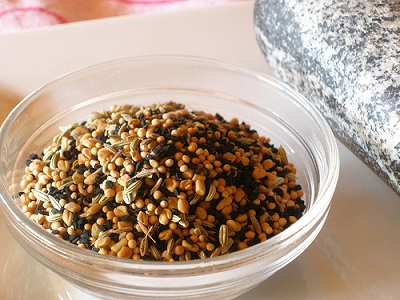

# Panch Phoram (Bengali Five-Spice)

*This is a Bengali mixture of five (panch) spices, one of India's fundamental spice blends. Panch phoram is traditionally tempered in hot oil and the fragrant seeds scattered over vegetables, lentils, or rice. It's a Bengali staple with a history stretching back centuries.*

**Yield:** Approximately 10-15 grams (makes 8-12 portions as a tempering blend)

## Overview
Panch phoram is unique: instead of roasting and grinding, the typical spice blend approach, these five seeds are kept whole and briefly fried in hot oil to release their inherent aromas, then scattered over finished dishes. Each seed contributes equally: fenugreek for bitterness, cumin for earthiness, fennel for sweetness, mustard for pungency, and wild onion for sharpness. When tempered together in oil, they create a complex flavor base that's more about technique than blend chemistry.

## Ingredients

### Five Equal Parts (By Weight)
- 1 teaspoon white cumin seeds
- 1 teaspoon fennel seeds (saunf)
- 1 teaspoon fenugreek seeds (methi)
- 1 teaspoon black mustard seeds (rai)
- 1 teaspoon wild onion seeds (nigella seeds or kalonji - as substitute if wild onion unavailable)

## Method

### Stage 1 – Measure & Mix
1. Measure one teaspoon each of white cumin seeds, fennel seeds, fenugreek seeds, mustard seeds, and wild onion/kalonji seeds.
1. Pour all five into a small bowl.
1. Stir gently to combine, ensuring each seed type is distributed throughout.

### Stage 2 – Store or Use
1. Transfer to an airtight spice jar if storing.
1. Label with the date and "Panch Phoram" so it's clear these are not roasted/ground.

### Stage 3 – To Use: Tempering in Oil (Most Traditional Method)
1. Heat 1 tablespoon oil in a pan over medium-high heat until shimmering.
1. Add the entire panch phoram mixture (or desired amount if making for multiple dishes).
1. The seeds will immediately begin popping and releasing aroma (30 seconds to 1 minute).
1. As soon as the mustard seeds stop popping and the aroma is intense, pour the entire contents, oil and seeds, over vegetables, lentils, rice, or yogurt.
1. This is called "tempering" or "tadka."

## Notes
- **Whole Seeds, Not Ground:** This is fundamentally different from ground spice blends. The seeds are kept whole and fried.
- **Equal Parts:** The traditional formula uses equal quantities of each seed. Adjust to personal preference (more mustard for heat, more fennel for sweetness, etc.).
- **Tempering Technique:** The magic is in the hot oil frying. This wakes up the seeds and creates the characteristic flavor.
- **Timing Critical:** Thirty seconds to one minute in hot oil is perfect. Over one minute and you'll burn the seeds; under thirty seconds and they won't release their full aroma.
- **Wild Onion vs. Kalonji:** True panch phoram uses wild onion seeds (extremely hard to find). Kalonji (nigella seeds) is the standard substitute and works beautifully.
- **Bengali Staple:** This is more associated with Bengali (East Indian) cooking than other regions, though it appears throughout India.

## Variations
**Emphasis on Heat:** Increase mustard seeds to 1.5 teaspoons; decrease fennel to 0.5 teaspoon.
**Emphasis on Sweetness:** Increase fennel to 1.5 teaspoons; decrease mustard to 0.5 teaspoon.
**Extra Earthiness:** Add 0.5 teaspoon asafoetida (hing) to the seed mixture.
**For Vegetables:** Double the fennel for sweeter emphasis when using over root vegetables or squash.

## Serving
Use in: Tempering (tadka) over lentils, leafy greens, rice dishes, yogurt, roasted vegetables
Typical ratio: 1 teaspoon panch phoram seeds fried in 1 tablespoon oil per 4 servings
Application: Fry seeds in hot oil until popping (30-60 seconds), immediately pour over finished dish
Temperature: Must be used in hot oil for tempering; traditional method, not dry-roasted

## Storage
- Store in airtight jar in cool, dark place away from light and heat
- Properly stored, remains viable for 10-12 months
- The seeds maintain their oils and vitality better than ground spices
- Check for any moisture or musty smell before using
- Does not require refrigeration
- The longer panch phoram is stored, the more vital it becomes as seeds mature
- Label with preparation date
- Make fresh quarterly if using intensively; these seeds are hardy and long-lasting