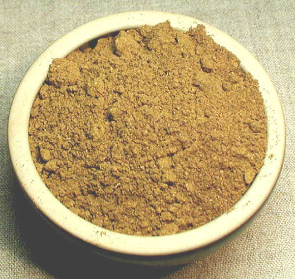

# Quatre Épices (Four Spices)

*Quatre épices (literally "four spices") is a classic French spice blend used primarily in charcuterie, meat pâtés, sausages, terrines, and ragouts. It appears across French cuisine in soups, slow-cooked meat dishes, and traditional preparations where subtle sophistication matters.*

**Yield:** Approximately 25-30 grams (makes 15-20 portions)

## Overview
Quatre épices is the soul of French charcuterie, a refined, restrained blend that enhances meat without overwhelming it. The four components are equal parts by weight, creating perfect balance: pepper for heat, cloves and nutmeg for warmth, and ginger for subtle spice. It's less spicy than most other cuisines' spice blends; it's about sophistication and tradition rather than boldness. This is the spice of terrines, sausages, and dishes where flavors have been developed over centuries.

## Ingredients

### Four Equal Parts (By Weight)
- 1 part ground black pepper (approximately 1-2 teaspoons)
- 1 part ground cloves (approximately 1-2 teaspoons)
- 1 part ground nutmeg (approximately 1-2 teaspoons, freshly grated if possible)
- 1 part ground ginger (approximately 1-2 teaspoons)

*Note: Scale all four ingredients equally; the proportions shown are approximate estimates that can be adjusted based on yield desired.*

## Method

### Stage 1 – Measure All Components
1. If starting with whole spices, grind or finely powder each separately:
   - Grind black peppercorns in a spice mill or mortar to fine powder
   - Grind cloves in a spice mill to fine powder
   - Grate fresh nutmeg or use ground nutmeg
   - Ensure ginger powder is fresh and finely ground
1. If using pre-ground spices, verify they're fresh (check color and aroma).

### Stage 2 – Measure Equal Quantities
1. Measure each spice (cloves, pepper, nutmeg, ginger) in equal amounts by weight.
1. Traditional ratio: 1 teaspoon of each creates approximately 4-5 teaspoons total blend.
1. Adjust quantities based on your needs while maintaining the 1:1:1:1 ratio.

### Stage 3 – Combine & Mix
1. Pour all four spices into a small bowl.
1. Using a spoon, stir very thoroughly for 1-2 minutes.
1. The mixture should be completely uniform in color and texture.
1. Break up any clumps of ground spice.

### Stage 4 – Sift (Recommended)
1. Sift through a fine mesh sieve for finer, more uniform texture.
1. This ensures even distribution in meat preparations.
1. Return any larger particles to the original mixture.

### Stage 5 – Store
1. Transfer to a small airtight jar.
1. Label with preparation date and "Quatre Épices."
1. Store in a cool, dark place away from light and heat.

## Notes
- **French Restraint:** This blend is about subtlety and balance, not overwhelming heat or flavor.
- **Equal Parts Essential:** The 1:1:1:1 ratio is the foundation. Deviating changes the character fundamentally.
- **Freshly Grated Nutmeg:** If possible, grate fresh nutmeg rather than using pre-ground. The difference is significant.
- **Pepper Freshness:** Freshly ground black pepper is far superior to pre-ground. Consider grinding in a mortar when preparing this blend.
- **Historical Application:** This blend has been used in French charcuterie for centuries; respect the tradition with quality spices.
- **Quantity Typically Small:** Traditional uses call for only 1/4 to 1/2 teaspoon in a medium pâté or terrine. It's not meant to dominate.

## Variations
**More Warmth:** Increase ginger and nutmeg slightly (1.25:1:1.25:1).
**More Heat:** Increase pepper to 1.25 teaspoons while keeping others at 1 teaspoon.
**Earthier:** Some regional French versions use slightly less nutmeg to emphasize the clove and ginger.
**Traditional 18th Century:** Some historical recipes used equal parts pepper, cloves, nutmeg, and Jamaican allspice instead of ginger.

## Serving
Use in: French meat pâtés, terrines, sausages, charcuterie preparations, ragouts, slow-cooked meat stews
Typical ratio: 1/4 to 1/2 teaspoon per medium pâté or terrine (3-4 servings)
Application: Mix into ground meat preparations or add to braising liquids
Temperature: Works both in raw meat mixtures (for pâté) and in cooked applications (for ragouts)

## Storage
- Store in small airtight jar in cool, dark place away from light and heat
- Properly stored, remains potent for 6-8 months
- This is a small-yield blend; make fresh every 2-3 months if using frequently
- The ground spices may settle or separate slightly; stir before each use
- Does not require refrigeration
- The individual spices (especially pepper and nutmeg) lose potency fastest
- Check aroma and color before using in important culinary preparations
- Label with preparation date
- Freshness is paramount for French cuisine where subtlety matters

