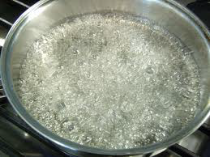

# Syrup for Sorbet (Sirop à Sorbet)

*This is the classic French sugar solution used for all sorbets. The precise sugar concentration (30° Beaumé) ensures proper freezing texture and prevents crystallization.*

**Yield:** 1 liter

## Overview
Sirop à sorbet is a carefully calibrated sugar syrup essential to sorbet making. The specific sugar concentration (30° Beaumé or 1.2624 density) ensures that sorbets freeze to a smooth, spoonable texture without becoming rock-hard or remaining mushy. This syrup is also used for soaking sponge biscuits and Genoise sponges in French pastry work. The glucose prevents crystallization. This is a foundation recipe used repeatedly in fine pastry and ice cream work.

## Ingredients
- 750 grams caster sugar (fine sugar dissolves most readily)
- 650 ml water (filtered water is preferred)
- 90 grams glucose syrup (liquid or solid; liquid dissolves more easily)

## Method

### Stage 1 – Combine Ingredients
1. Pour the water into a heavy-bottomed saucepan.
1. Add the caster sugar.
1. Add the glucose syrup.
1. Stir gently with a wooden spatula to begin dissolving the sugar.

### Stage 2 – Bring to Boil
1. Place the saucepan over medium heat.
1. Stir occasionally with a wooden spatula as the mixture heats.
1. Bring slowly to a gentle boil (don't rush; slow heating prevents crystallization).
1. Continue boiling gently for about 3 minutes.
1. Skim the surface with a spoon to remove any foam or impurities that rise.

### Stage 3 – Check Density (Optional but Recommended)
1. If you have a saccharometer (hydrometer for sugar solutions), test the syrup.
1. The reading should be exactly 30° Beaumé or 1.2624 on the specific gravity scale.
1. If too light, continue boiling slightly longer; if too heavy, add a small amount of water and reboil.

### Stage 4 – Strain & Cool
1. Pass the hot syrup through a fine conical strainer (chinois) into a clean bowl.
1. This removes any impurities or crystallized sugar.
1. Let the syrup cool completely to room temperature before using.
1. Once cool, transfer to a clean, airtight container.

## Notes
- **Temperature Precision:** The sugar concentration is critical to sorbet texture. Too concentrated and the sorbet becomes icy; too dilute and it won't freeze properly.
- **Glucose Purpose:** Prevents sugar crystallization, which would create a grainy texture.
- **Thermal Shock:** Cool the syrup completely before using in sorbet machines, or it will damage the machine and produce poor results.
- **Saccharometer Reading:** If you don't have a saccharometer, follow the visual test: the syrup should look pale golden, not caramelized or dark.
- **Water Quality:** Mineral-free water (filtered or distilled) prevents cloudiness and off-flavors.

## Variations
**Lighter Syrup (28° Beaumé):** Use 700 grams sugar instead of 750 for less-cold-sensitive sorbets.
**With Flavoring:** Infuse the syrup with citrus zest, vanilla, or herbs while cooling.
**For Sponge Soaking:** Use this same syrup to soak Genoise or sponge fingers for dessert assembly.

## Serving
Use for: Sorbets, granite, sponge soaking, Italian meringues that need cooling syrup
Temperature: Room temperature to cool
Amount: Varies by sorbet recipe (typically 300-400 ml per quart of sorbet base)

## Storage
- Refrigerate in an airtight, glass container for up to 3 months
- The glucose prevents crystallization, so this keeps indefinitely under cool conditions
- Do not freeze; cooling to below 0°C causes crystallization
- Label with the date and density for reference