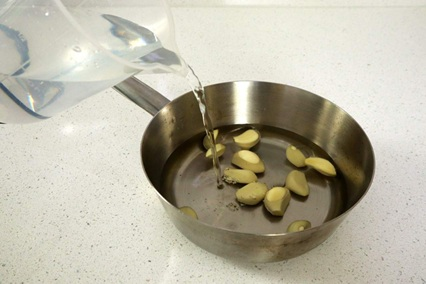

# Blanched Garlic

*Blanching garlic in milk transforms raw garlic's harsh pungency into a mild, sweet, and slightly nutty flavor. Blanched garlic pairs beautifully with vegetables, particularly with butter-fried green beans.*

**Yield:** 1 batch (about 12-15 cloves; varies by size)

## Overview
Blanching garlic is a classical French technique that completely transforms the ingredient's character. By repeatedly blanching in fresh milk, the milk absorbs the harsh sulfur compounds responsible for raw garlic's bite, leaving behind only sweet, mild flavor with a subtle nuttiness. The result is garlic that's almost creamy and delicate, perfect as a garnish or side component where garlic's presence is desired without its aggressive character.

## Ingredients

### Garlic Preparation
- 1 bulb fresh garlic (about 12-15 cloves, depending on size)
- Water (for rinsing)

### Blanching Liquid
- 500 ml whole milk (fresh, cold)
- Additional fresh milk for subsequent blanches (about 1.5 liters total)

## Method

### Stage 1 – Prepare Garlic
1. Break apart a bulb of fresh garlic.
1. Peel each clove of its papery outer skin.
1. Using a knife tip, carefully remove the germ (the small green or white core) from each clove.
1. The germ contains compounds that create harsh flavors; removing it improves the final result.
1. Rinse the prepared cloves under cold water.

### Stage 2 – First Blanch
1. Place the peeled, de-germed garlic cloves in a heavy-based saucepan.
1. Cover completely with cold milk (about 400 ml).
1. Place over medium heat and slowly bring to a boil, stirring occasionally.
1. As soon as the milk begins to boil, remove from heat.
1. Strain the garlic into a fine sieve, discarding all the milk (it will have absorbed harsh compounds and smell strong).
1. Gently rinse the garlic cloves under cold running water.

### Stage 3 – Second Blanch
1. Return the rinsed garlic to the saucepan.
1. Cover with fresh, cold milk (about 400 ml).
1. Repeat the process: slowly bring to a boil, then immediately strain and discard milk.
1. Rinse gently under cold water.

### Stage 4 – Third Blanch
1. Return garlic to the saucepan with fresh milk.
1. Repeat: bring to boil, strain, discard milk, rinse garlic.
1. The milk should smell noticeably less harsh at this stage.

### Stage 5 – Fourth Blanch (Final)
1. Return garlic with fresh milk one final time.
1. Bring to boil and immediately strain.
1. Rinse with cold water.
1. Pat dry with a clean kitchen towel.
1. The garlic is now ready to use, mild and sweet.

## Notes
- **Germ Removal:** Crucial for the best flavor. Removing germs is worth the time investment.
- **Milk Quality:** Whole milk works best; low-fat milk is less effective at absorbing harsh compounds.
- **Temperature During Blanching:** Keep heat at a gentle medium; boiling too vigorously changes the garlic's texture.
- **Number of Blanches:** Four blanches creates the mildest result. If you prefer slightly more garlicky character, reduce to 3 blanches.
- **Immediate Use:** Blanched garlic is best used immediately after preparation. It can be refrigerated for 2-3 days but loses delicate flavor as it sits.

## Variations
**Reduced Blanching:** Use only 2-3 blanches for mild but more identifiable garlic flavor.
**With Butter:** After drying, toss blanched garlic cloves in a little warm butter before serving.
**Herbed:** Add a bay leaf and thyme sprig to one of the blanching liquids for subtle herbal notes.

## Serving
Use with: Fried green beans, vegetable sides, creamed soups, with roasted meats
Temperature: Warm or room temperature (reheat gently if preparing ahead)
Amount: 2-3 cloves per serving
Preparation: Serve whole as a garnish or halved mixed into the finished dish

## Storage
- Refrigerate in an airtight container for 2-3 days maximum
- The delicate flavor fades quickly; best used the same day
- Do not freeze; freezing destroys the texture
- Can be stored in milk-based cream sauce for slightly longer keeping

