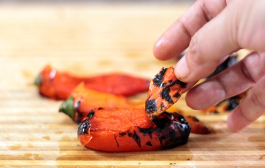

# De-Skinning Peppers

*Removing pepper skins reveals the tender, sweet flesh beneath. Two methods, roasting and searing over flame, both work beautifully but produce slightly different results depending on whether you prioritize deeper flavor or firmer texture.*

**Yield:** Varies by number of peppers (one pepper yields about 100-120 grams skinned flesh)

## Overview
Charring pepper skins under heat causes them to separate from the flesh, allowing easy removal while concentrating the pepper's sweet, fruity flavor. The key difference between the two methods: roasting in an oven cooks the internal flesh gently, creating a soft, luxurious result; searing over direct flame keeps the flesh firmer while still charring the exterior. Choose based on your intended use and desired texture.

## Ingredients

### Peppers & Oil
- Fresh red, yellow, or orange peppers (bell peppers preferred for sweetness and flesh thickness)
- Extra virgin olive oil (for coating)
- Salt and pepper (for seasoning, optional)

### For Ice Bath (Searing Method Only)
- Ice-cold water

## Method – Roasting Method (Softer Flesh)

### Stage 1 – Prepare Oven & Peppers
1. Preheat the oven to 200°C.
1. Wash the peppers and pat dry.
2. Cut each pepper in half lengthwise, removing the stem end.
3. Using a sharp knife or your fingers, remove the white pith (internal ribbed membranes) and discard.
4. Shake out the seeds and discard.

### Stage 2 – Oil & Roast
1. Lightly rub the entire surface of each pepper half with extra virgin olive oil.
1. Place the peppers skin-side up on a large baking sheet or roasting pan.
1. Place in the preheated 200°C oven.
1. Roast for 15-20 minutes until the skins turn black and blister considerably.

### Stage 3 – Steam & Cool
1. Remove the roasting pan from the oven.
1. Immediately transfer the hot peppers to a clean plastic food bag or place them in a covered bowl.
1. Close the bag or cover the bowl; this traps steam, which helps separate the skin from the flesh.
1. Leave for 10 minutes while the peppers cool in the steam.

### Stage 4 – Peel
1. Once cool enough to handle, remove the peppers from the bag.
1. Using your fingers, gently pull the blackened skin off the pepper flesh; it should come away easily.
1. If the skin resists, return peppers to the bag for a few more minutes.
1. Discard all skin.
1. Pat the peeled peppers dry with a clean cloth.

## Method – Searing Method (Firmer Flesh)

### Stage 1 – Prepare Peppers
1. Wash the peppers and leave whole, with skin intact.
1. Pat dry completely.

### Stage 2 – Oil & Sear
1. Lightly rub each pepper all over with olive oil.
1. Insert the prongs of a long fork into the top (stem end) of the pepper.
1. Hold the pepper directly over a naked flame (gas stove burner is ideal).

### Stage 3 – Char the Skin
1. Slowly rotate the pepper over the flame so the skin is evenly exposed and charred.
1. Keep it moving so the flesh doesn't cook excessively; you want blackened exterior skin, not flames touching the pepper.
1. Continue turning until the entire surface is black and charred, about 4-6 minutes total.

### Stage 4 – Cool & Peel
1. Immediately plunge the hot pepper into a bowl of ice-cold water to stop the cooking process.
1. Leave for 1-2 minutes to cool.
1. Once cool enough to handle, remove from the water.
1. The skin can now be peeled off easily using your fingers.
1. Cut off the top (stem end) and remove all remaining pith and seeds.
1. Discard skin and seeds.
1. Pat dry with a clean cloth.

## Notes
- **Pepper Color:** Red, yellow, and orange peppers are sweetest. Green peppers are more bitter but can be used.
- **Blackness is Good:** The blacker and more charred the skin, the easier it is to remove.
- **Steam Helps:** The steam in the roasting method is crucial; it creates separation between skin and flesh.
- **Ice Water Matters:** In the searing method, the cold water stops the pepper from continuing to cook in residual heat.
- **Yields Loss:** Expect to lose about 20-30% of the pepper weight during skinning (mostly skin and seeds).
- **Texture Difference:** Roasted peppers are soft and luxurious; seared peppers are still tender but with more structure.

## Variations
**Leave Some Char & Texture:** Don't remove all the blackened bits; they add flavor to some dishes.
**Grill Method:** If you have a grill, place whole peppers directly on the grate over medium-high heat, turning frequently.
**Under the Broiler:** Place peppers on a broiler pan under a hot broiler, turning frequently until charred (works well in apartment kitchens with no gas flame).

## Serving
Use for: Roasted pepper salads, antipasto, pasta dishes, tapas, sandwich fillings, soup bases, ratatouille
Temperature: Room temperature or warm
Storage: In olive oil to prevent oxidation and drying
Amount: Half a pepper per serving

## Storage
- In an airtight container with olive oil cover, keeps refrigerated for up to 1 week
- Can be frozen for up to 1 month (thaw before serving)
- Best served at room temperature or warmed very gently
- The olive oil overlay prevents oxidation that turns peppers brown

