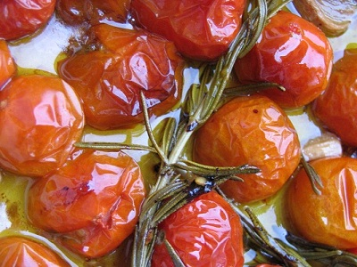

# Semi-Confit Cherry Tomatoes

*Semi-confit cherry tomatoes are oven-poached in gentle warmth, emerging soft and sweet while retaining their fresh tomato character. They're versatile: served as tapas, on crostini, stirred into pasta, layered in salads, or used as a flan filling.*

**Yield:** Approximately 700 grams (in oil)

## Overview
Semi-confit refers to slow, gentle cooking, not true confit (which involves very long cooking). This technique cooks tomatoes for just 5-10 minutes at precisely 70°C, preserving their fresh flavor while softening their skins and concentrating their sweetness slightly. The olive oil becomes infused with tomato essence and becomes part of the final dish. This is a foundation component used across many preparations from appetizers to main courses.

## Ingredients

### Tomatoes & Aromatics
- 1 kilogram ripe cherry tomatoes (at peak ripeness for best flavor)
- 2 sprigs fresh thyme
- 1 bay leaf
- 2 garlic cloves (unpeeled, halved)
- 15 grams white peppercorns (coarsely crushed)

### Oil
- 1 liter light olive oil (not extra virgin, which would overpower the tomatoes)

## Method

### Stage 1 – Prepare Equipment
1. Use an oven thermometer to ensure accuracy; preheat oven to 70°C (or the lowest your oven will hold).
1. If your oven doesn't go that low, use 90°C maximum.
1. Have a large, shallow roasting pan or ceramic baking dish ready.

### Stage 2 – Prepare Tomatoes
1. Leave cherry tomatoes whole; do not peel or cut them.
1. Rinse gently under cool water and pat dry with a clean cloth.
1. Leave the stems on if they're intact.

### Stage 3 – Combine & Cook
1. Heat the light olive oil gently in a saucepan over low heat; it should feel warm to touch, not hot.
1. Pour the warm oil into your roasting pan or baking dish.
1. Nestle the tomatoes into the oil.
1. Add the thyme sprigs, bay leaf, halved unpeeled garlic cloves, and crushed white peppercorns.
1. Stir gently to distribute aromatics.
1. Place in the preheated 70°C oven.

### Stage 4 – Monitor Cooking Time
1. Cook gently for 5-10 minutes, depending on tomato ripeness and size.
1. Riper and smaller tomatoes require less time (5-6 minutes).
1. Less ripe or larger tomatoes need 8-10 minutes.
1. The skins should just begin to split; do not overcook until fully collapsed.
1. Tomatoes are done when they're soft inside but retain their shape.

### Stage 5 – Cool & Store
1. Remove from oven and allow to cool completely in the oil.
1. Transfer the tomatoes and their oil to a clean glass jar or ceramic bowl.
1. Ensure tomatoes are completely submerged in oil.
1. Cover with cling film or a tight-fitting lid.
1. Refrigerate until ready to use.

## Notes
- **Temperature Precision:** 70°C is essential. Too hot and the tomatoes burst and become mushy; too cool and they don't soften enough.
- **Oil Type:** Use light olive oil, not extra virgin. Extra virgin has a flavor that competes with the tomatoes.
- **Tomato Ripeness:** Peak-season tomatoes at full ripeness produce the best results. Winter tomatoes may need slightly longer cooking.
- **Aromatics:** The garlic cloves are left unpeeled so they don't break apart and cloud the oil.
- **Yield Variation:** The yield depends on how much water the tomatoes release and cook off. Expect 700-900 grams including oil.
- **Serving:** These are delicious at room temperature or warmed gently. To serve warm, heat under a broiler or in a small pan with a little of their oil.

## Variations
**With Basil:** Add fresh basil leaves to the oil just before serving rather than during cooking (heat damages basil flavor).
**Spiced Heat:** Add a small dried chilli or 1/4 teaspoon red chilli flakes.
**With Herbs:** Include rosemary or oregano sprigs during cooking for Mediterranean character.

## Serving
Use with: Crostini or toast, pasta dishes, salads, as part of an antipasto platter, flan or tart fillings
Temperature: Room temperature, or warm gently
Amount: 3-5 tomatoes per serving; drizzle with the infused oil
Garnish: Fresh basil, fleur de sel, or microgreens

## Storage
- The infused oil acts as a preservative; keeps refrigerated for at least 2-3 weeks in an airtight glass container
- Can be kept for up to 4 weeks if the jar is impeccably clean and sterile
- Do not store at room temperature; the oil can support bacterial growth
- If mold appears on surface, discard immediately
- The oil can be reserved and re-used for cooking or dressing salads after the tomatoes are consumed