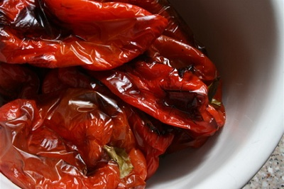

# Semi-Confit Peppers

*Semi-confit peppers are charred over flame, then gently poached in warm oil infused with herbs and garlic. They taste even better when briefly grilled on a barbecue afterward, especially when vine shoots add smoke to the coals.*

**Yield:** Approximately 400 grams (in oil, from 500 grams fresh peppers)

## Overview
Semi-confit peppers begin with seared peppers (charred over direct flame) then finish with gentle 70°C oil poaching. The combination concentrates pepper flavor, infuses herbalmotes, and creates a luxurious, tender result. The reserved oil becomes a precious infusion for dressings and cooking. This preparation bridges appetizers and main courses seamlessly, serve with bread and cheese, use in composed salads, or accompany grilled meats.

## Ingredients

### Peppers
- 500 grams red or yellow bell peppers (sweet varieties preferred)
- Extra virgin olive oil (for charring the peppers)

### Oil Poaching & Aromatics
- 600 ml light olive oil (not extra virgin for this stage)
- 2 sprigs fresh thyme
- 1 bay leaf
- 1 sprig fresh rosemary
- 1 garlic clove (unpeeled)
- 1 teaspoon white peppercorns (coarsely crushed)

### Finishing
- Sea salt (to taste, for serving)
- Freshly ground black pepper (to taste, for serving)

## Method

### Stage 1 – Char Peppers Over Flame
1. Wash and dry the peppers thoroughly.
1. Lightly smear each pepper all over with a small amount of extra virgin olive oil, using just your fingertips.
1. Hold each pepper using a long fork inserted into the top (stem end).
1. Position the pepper directly over a gas flame (or grill, if available) on medium-high heat.

### Stage 2 – Sear & Blister
1. Slowly rotate the pepper over the flame so the skin is evenly exposed to heat.
1. Keep the pepper moving; you want the exterior skin to blacken and blister, but you don't want flames to char beyond that.
1. Continue turning for 4-6 minutes until the entire surface is blackened and blistered.

### Stage 3 – Cool & Peel
1. Immediately plunge the hot, charred pepper into a bowl of ice-cold water.
1. Leave for 1-2 minutes to cool and stop cooking.
1. Once cool enough to handle, remove the pepper from the water.
1. Using your fingers, peel away the blackened skin; it should come off easily.
1. Discard all charred skin.

### Stage 4 – Finish Pepper Preparation
1. Cut the stem end off each pepper.
1. Open the pepper and remove all remaining seeds and white membrane (pith).
1. Discard seeds and pith.
1. Pat the peeled, cleaned peppers dry with a clean kitchen towel, dryness is important to prevent water diluting the oil.
1. Halve each pepper lengthwise into two manageable pieces.

### Stage 5 – Oil Poaching
1. Pour the light olive oil into a large, shallow saucepan or roasting pan.
1. Heat gently over low heat until it reaches about 70°C (use an oven thermometer if precise, or estimate by touching the side of the pan, it should feel warm but not hot).
1. Nestle the prepared pepper pieces into the warm oil.
2. Add the thyme sprigs, bay leaf, rosemary sprig, unpeeled garlic clove, and crushed white peppercorns.
1. Stir very gently to distribute aromatics without breaking the delicate peppers.

### Stage 6 – Cook Gently
1. Maintain the oil temperature at approximately 70°C.
1. Cook for about 30 minutes, keeping the heat very low.
1. The peppers should become tender and infuse the oil with their essence.
1. Do not allow the oil to boil; boiling destroys the delicate pepper flesh.

### Stage 7 – Cool & Store
1. Remove the pan from heat and allow the peppers to cool completely in the oil.
1. Transfer the peppers and oil to a clean glass jar or ceramic container.
1. Ensure peppers are completely submerged in oil.
1. Cover with cling film or a tight-fitting lid.
1. Refrigerate until ready to use.

## Notes
- **Flame Type:** A gas flame works best for even charring. Electric stove tops and induction are harder to control; use a grill or broiler as backup.
- **Temperature During Poaching:** 70°C is the target; too hot and peppers become mushy, too cool and they won't soften properly.
- **Drying Peppers:** Wet peppers will introduce moisture that dilutes the oil and can cause spoilage. Dry thoroughly after peeling.
- **Barbecue Option:** Once the peppers are fully prepared, brief grilling (1-2 minutes per side) on a barbecue with vine shoots in the coals adds wonderful smoke notes.
- **Oil Preservation:** The infused oil is precious and can be reserved for dressings, marinades, or cooking after the peppers are consumed.

## Variations
**With Garlic:** Add an extra smashed garlic clove after peeling, before oil poaching.
**Spiced Heat:** Add a small dried chilli or 1/2 teaspoon chilli flakes to the oil.
**Citrus Note:** Add a thin strip of lemon or orange zest to the oil during poaching.
**Golden Peppers:** Use yellow peppers for a sweeter, slightly different flavor profile than red.

## Serving
Use with: Crostini or bread, as part of antipasto or charcuterie boards, tossed into salads, alongside grilled meats, in composed vegetable plates
Temperature: Room temperature or warmed gently
Amount: 2-3 pepper pieces per serving
Accompaniments: Fleur de sel, fresh basil, grilled bread rubbed with garlic

## Storage
- Refrigerate in an airtight glass container for up to 3 weeks; the oil preserves them well
- Do not store at room temperature; oil can support bacterial growth in warm conditions
- If any mold appears on the surface, discard immediately
- Can be frozen for up to 1 month if sealed impeccably
- The infused oil can be strained and re-used for cooking or dressing greens after peppers are consumed