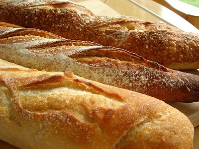

# Baguette

*Many people think that a French baguette, a long, thin loaf, is a good test of a baker’s skill. The baguette seems so simple, just flour, water, salt and yeast, kneading, fermenting, shaping, rising, slashing and baking. The reality is that a lot of very good bakers have spent a considerable amount of time and energy perfecting their baguette. The important characteristic of a baguette is that it is a bread that is meant to be eaten shortly after it is baked; it is not a bread that is intended to be stored on the counter top until the next day or beyond.*

**Yield:** 2-3 baguettes (depending on size preferences)

## Overview
A true French baguette relies on time, technique, and a two-stage fermentation: first the poolish (a simple fermenting starter made 18 hours ahead), then the final dough and a series of gentle folds. The result is a crispy, crackling crust and an open, airy crumb with complex flavor. Baguettes are meant to be eaten the same day they're baked; their magic lies in their freshness and the contrast between crust and crumb.

## Ingredients

### Poolish (Make 18 Hours Ahead)
- 100 grams bread flour
- 100 grams water (room temperature)
- 1/2 teaspoon caster sugar
- 2 grams instant yeast

### Final Dough
- 250 grams bread flour
- 125 grams water (lukewarm)
- 1 teaspoon fine sea salt
- 5 grams instant yeast

### For Baking
- Flour (for dusting)
- Water (for steam)

## Method

### Stage 1 – Make the Poolish (18 Hours Ahead)
1. Add the 2 grams yeast, 1/2 teaspoon sugar, and 100 grams water to a small bowl.
1. Stir well for 1-2 minutes.
1. Let sit for about 5 minutes. You should see light froth forming on top as the yeast reacts with the sugar and water.
1. Add 100 grams flour to a mixing bowl and create a small well in the center.
1. Tip the yeast mixture into the well.
1. Mix well with a wooden spoon until the water is completely incorporated and the flour is fully combined.
1. The poolish should look like a thick batter.
1. Cover the bowl tightly with cling film.
1. Store in a warm place (ideally 15-20°C; an airing cupboard is perfect) for about 18 hours.
1. The poolish will develop a slightly domed surface and may have some liquid on top; this is normal.

### Stage 2 – Prepare Final Dough
1. Remove the cling film from the poolish and stir gently with a wooden spoon to break down any surface.
1. In a separate bowl, combine 250 grams flour, 1 teaspoon salt, and 5 grams yeast.
1. Weigh out 125 grams lukewarm water.
1. Add this water to the poolish and stir with a wooden spoon to combine.
1. Add this poolish mixture to the flour mixture.
1. Mix for about 2 minutes with a wooden spoon until completely combined; no dry flour should remain.
1. Cover the bowl with a damp tea towel.
1. Let rest in a warm place for 20 minutes. This rest is called the autolyse, and it develops the gluten naturally.

### Stage 3 – Knead
1. Turn the dough out onto a lightly floured surface.
1. Knead for 20 minutes until smooth and elastic.
1. Do not add extra flour unless absolutely necessary; if the dough becomes sticky, rub a little olive oil on your hands instead.
1. The dough should be soft and slightly tacky but not wet.

### Stage 4 – Bulk Fermentation with Folds
1. Place the dough back in the bowl.
1. Cover with a damp tea towel.
1. Let ferment for 45 minutes.

**First Fold:**
1. Remove the dough from the bowl.
1. Fold the dough back onto itself gently (fold one side toward the center, then the other side).
1. Turn the dough over.
1. Return to the bowl, cover, and ferment for 45 minutes.

**Second Fold:**
1. Remove the dough again.
1. Fold once more gently, turning the dough back over onto itself.
1. Return to the bowl, cover, and ferment for 30 minutes.

1. Remove the dough from the bowl, fold gently one more time.
1. Place on the counter and let rest under a damp tea towel for 10 minutes.

### Stage 5 – Shape Baguettes
1. Divide the dough into 2-3 equal portions (depending on desired size).
1. Let each portion rest under a damp tea towel for 10 minutes.
1. Shape each portion into a baguette: gently roll into a long, thin log, tapered toward the ends.
1. Place the shaped baguettes seam-side up on parchment paper or lightly floured bannetons (proofing baskets).
1. Cover with a damp tea towel and leave to rise for 45 minutes.
1. Spray the tea towel lightly with cool water every 15 minutes to maintain moisture.

### Stage 6 – Score & Bake
1. Preheat the oven to 225°C.
1. If you have oven stones or tiles, place them on the middle rack. Place a large, oven-safe bowl filled with hot water on the rack below to create steam.
1. After the 45-minute proof, carefully flip the baguettes onto a baking sheet seam-side down.
1. Using a very sharp knife or bread lame, score diagonal slashes across the top of each baguette at a 45-degree angle.
1. Transfer carefully to the hot stones (or onto a baking tray if you don't have stones).
1. Bake for 15 minutes.
1. Rotate the baguettes carefully to ensure even browning.
1. Bake for a further 15 minutes until deeply golden brown.
1. Turn the oven off and leave the baguettes inside for 5 minutes to cool slightly and set the crust.
1. Remove and allow to cool on a wire rack for at least 30 minutes before eating (the crust continues to set and the crumb finishes cooking during this time).

## Notes
- **Poolish Importance:** The 18-hour poolish develops flavor and creates a more open crumb. This step is not optional if you want authentic baguette flavor.
- **Temperature Control:** Dough temperature affects fermentation speed. A cooler environment (15-18°C) is preferred; very warm kitchens may require shorter fermentation times.
- **Gentle Handling:** Baguette dough is delicate. Folds should be gentle and deliberate, not aggressive. Rough handling deflates the air bubbles you've carefully developed.
- **Flour Quality:** Bread flour (higher protein) is essential, not all-purpose flour. The extra gluten creates the open crumb structure.
- **Steam is Essential:** The steam in the oven creates the crispy, crackly crust. If you don't have oven stones, place a roasting pan of boiling water on the bottom rack.
- **Cooling:** Resist the urge to slice hot bread. The crumb continues to set and the flavor develops as it cools.

## Variations
**Whole Wheat Baguettes:** Replace up to 25% of the bread flour with whole wheat flour for nuttier flavor.
**With Seeds:** Brush shaped dough with water and roll in sesame, poppy, or caraway seeds before proofing.
**Demi-baguettes:** Divide dough into 3-4 portions for smaller, individual-serving loaves.
**Tartines-Ready:** Shape slightly shorter and wider loaves designed to be sliced and topped rather than torn.

## Serving
Serve with: Cheese, charcuterie, soup, butter, jam
Temperature: Serve warm or at room temperature (never cold)
Slicing: Slice warm using a serrated knife with a gentle sawing motion
Accompaniments: Salted butter, good cheese, or simple tomatoes and olive oil

## Storage
- Best consumed within 4-6 hours of baking while the crust is still crispy
- Once cooled, store in a paper bag at room temperature for 1-2 days
- To revive day-old baguettes: Spritz lightly with water and wrap in foil, then warm in a 200°C oven for 5-10 minutes
- Do not refrigerate; cold stales the bread rapidly due to starch retrogradation
- Freeze whole baguettes in freezer bags for up to 2 weeks; thaw at room temperature wrapped in a kitchen towel
- Once sliced, bread stales faster; use slices within 1 day or freeze individually