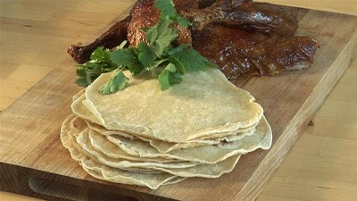

# Chinese Pancakes

*These thin, crispy-edged pancakes are made by layering two thin dough discs with sesame oil between them, creating steam pockets that allow them to separate after cooking. Serve as a vehicle for soups, curries, or stir-fries, they're sophisticated yet simple.*

**Yield:** 9 pancakes (made from 18 dough balls, serves 3-4)

## Overview
Chinese scallion pancakes (actually made without scallions here, though they can be added) are a revelation: thin, crispy-edged, tender dough that separates perfectly into two layers. The method is clever, dough balls are paired, one brushed with sesame oil, then flattened together and cooked, allowing steam to create separation. The result is restaurant-quality pancakes that are thin enough to be delicate yet crispy enough to hold their shape. They're excellent with any Asian meal or served plain as a snack.

## Ingredients

### Dough
- 275 grams all-purpose plain flour
- 225 grams very hot water (approximately 85-90°C)
- Pinch of fine sea salt (optional but recommended)

### For Layering & Cooking
- 2 tablespoons sesame oil
- Extra flour for dusting
- Minimal oil for the pan (if needed)

## Method

### Stage 1 – Make Dough
1. Put the flour into a large bowl (add salt if using).
1. Stir the hot water gradually into the flour, mixing continuously with chopsticks or a fork.
1. Continue adding the hot water until it's fully incorporated and the mixture is somewhat sticky (a hot water dough is very different from cold water dough).
1. Add more water if the mixture seems dry; it should be wetter than normal dough.

### Stage 2 – Knead
1. Remove the mixture from the bowl and knead with your hands for 8-10 minutes.
1. The dough will gradually soften and become smooth; hot water doughs soften dramatically as they cool slightly.
1. Don't be alarmed if it starts sticky, continued kneading makes it silky and manageable.
1. Form into a ball.

### Stage 3 – First Rest
1. Put the dough back in the bowl.
1. Cover with a damp tea towel.
1. Let rest for approximately 30 minutes at room temperature.
1. This rest allows the flour to fully hydrate and the dough to become more elastic.

### Stage 4 – Second Knead
1. Remove the dough from the bowl and knead again for about 5 minutes.
1. Dust with a little flour if it's sticky; it should be smooth and slightly tacky, not sticky.
1. The dough should be very smooth and elastic after this second kneading.

### Stage 5 – Form Rope & Divide
1. Form the dough into a long "rope" approximately 45 cm long and 3 cm in diameter.
1. Using a sharp knife, cut the dough into approximately 18 equal segments (each about 2.5 cm long).
1. Roll each segment into a smooth ball between your palms.

### Stage 6 – Layer with Sesame Oil
1. Take two of the dough balls.
1. Dip one side of one dough ball into sesame oil, coating it lightly.
1. Press the oiled side of that ball onto the uncoated ball so they stick together (oil facing inward).
1. Repeat with remaining dough balls, creating 9 pairs.
1. **Key technique:** The oil layer between the dough balls creates steam pockets that allow them to separate after cooking.

### Stage 7 – Roll Pancakes
1. With a rolling pin, simultaneously roll the paired dough balls into a circle approximately 15 cm (6 inches) diameter.
1. Roll gently and evenly; try to achieve even thickness.
1. **Important:** Rolling the two dough balls together is essential, rolling them separately won't create the separation you want. The dough should thin without tearing.

### Stage 8 – Cook Pancakes
1. Heat a frying pan or wok over low heat (this is important; high heat will burn them before cooking through).
1. Place one pancake into the dry wok.
1. Cook until the bottom side is dried out and shows light golden patches (approximately 1-2 minutes).
1. Flip the pancake over.
1. Cook the other side until similarly dried and lightly golden (another 1-2 minutes).
1. **The pancake should be mostly cooked through but still pliable.**

### Stage 9 – Separate & Finish
1. Remove the pancake from the pan and place on a plate.
1. While still warm, gently peel the two dough layers apart; they should separate cleanly.
1. Stack the separated pancakes on a plate.
1. Repeat with remaining paired dough balls.
1. Serve warm.

## Notes
- **Hot Water Dough:** Hot water makes the flour hydrate quickly, creating silky dough that's easier to work with than cold water doughs.
- **Temperature Important:** Hot water (85-90°C) is essential; boiling water will cook the flour; cool water defeats the purpose.
- **Sesame Oil Position:** The sesame oil must be between the two dough balls; if on the outside, it will leak out and burn.
- **Rolling Together:** Rolling paired dough balls together creates the steam layer; rolling separately won't separate properly.
- **Low Heat:** Cooking on low heat allows the dough to cook through without burning; high heat creates burnt exteriors and raw interiors.
- **Separation:** The pancakes should separate cleanly while still warm; if they stick, they've cooled too much (place briefly back in the pan with cover and steam them for 30 seconds).

## Variations
**Scallion Pancakes (Traditional):** Add 1/4 cup finely chopped scallions (green onions) to the sesame oil before spreading between dough balls.
**Savory Toppings:** Sprinkle finely chopped cilantro, chives, or white pepper before rolling together.
**Spicy:** Add chilli oil instead of plain sesame oil for heat.
**Parmesan Version:** Mix sesame oil with grated Parmesan cheese for umami richness.
**Whole Wheat:** Replace half the all-purpose flour with whole wheat flour for nuttier flavor.

## Serving
Serve with: Soups (egg drop, won ton), curries, stir-fries, congee, dipping sauces
Accompany: With soy sauce, chilli oil, or sweet bean sauce
Temperature: Serve hot or warm for best texture
Vessel: Stack on a warm plate, loosely covered with foil to retain heat

## Storage
- Best served immediately while warm and crispy-edged
- Store cooled pancakes in an airtight container at room temperature for up to 1 day
- Reheat in a dry pan over low heat for 30-60 seconds per side; they'll regain crispness
- Refrigerate uncooked dough for up to 3 days; allow to come to room temperature before rolling and cooking
- Freeze cooked pancakes: stack between parchment paper and freeze in a bag for up to 1 month; thaw and reheat as above
- Do not freeze uncooked paired pancakes; thawing creates condensation that ruins the oil layer