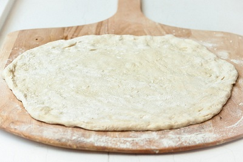

# Light Pizza Dough

*This dough makes a perfect light base for any pizza. The extra effort needed to make this fine dough is worth every second, as the resulting pizza is remarkably light and airy. This dough is best cooked in a non-fan-assisted oven.*

**Yield:** Approximately 1 kg dough (enough for 4-5 large pizzas or 8-10 medium pizzas)

## Overview
This is a sophisticated pizza dough made with a long, cool fermentation (8-12 hours), a method inspired by master pizza makers. The two-stage process builds flavor and creates exceptional crumb structure. The liquid fermentation develops extensibility and dough strength. Upon waking (Stage 2), salt, sugar, oil, and more flour are incorporated, creating a supple, elastic dough. The result is pizza with light, crispy crust, tender interior, and complex flavor, far superior to quick-rise doughs.

## Ingredients

### Stage 1 (Long Fermentation Starter)
- 450 grams Italian '00' flour (doppio zero, or bread flour)
- 330 ml lukewarm water (temperature calculated to total ~64°C with flour and air temperature as described below)
- 20 grams fresh yeast cake (compressed yeast) or 7 grams dry yeast

### Stage 2 (Final Dough Development)
- 20 grams fine sea salt
- 25 grams caster sugar
- 50 ml extra virgin olive oil
- 120 grams additional Italian '00' flour

### For Handling
- Extra flour for dusting
- Olive oil for hands if needed

## Method

### Stage 1 – Calculate Water Temperature
1. This step uses the Flour Temperature Method (essential in professional pizza making).
1. Check the room air temperature with a thermometer and record it.
1. Check the flour temperature by inserting a thermometer into the flour and record it.
1. Add the air temperature and flour temperature together. 
1. Subtract this sum from 64°C. The result is the required water temperature.
1. **Example:** If air is 20°C and flour is 22°C (total 42°C), then water should be 64°C - 42°C = 22°C (cool).
1. Heat or cool the water to this precise temperature to ensure proper fermentation.

### Stage 2 – Mix Stage 1 Dough
1. Put the flour into a large bowl.
1. Make a well in the flour and crumble in the fresh yeast (or sprinkle dry yeast).
1. Pour in a little of the calculated, temperature-controlled water.
1. Mix the yeast with the water until dissolved.
1. Gradually add the rest of the water, mixing with the fingertips of one hand.
1. Continue until the dough is smooth, homogeneous, and relatively wet (wetter than typical pizza dough).
1. **Important:** The dough should be slightly sticky and loose; this is correct.

### Stage 3 – Long Fermentation
1. Cover the bowl with cling film, tucking it in around the edges.
1. Leave to rise in a warm place (approximately 20-24°C) for 8-12 hours.
1. **Ideal fermentation:** 10-12 hours develops maximum flavor and strength.
1. The dough will more than double in volume, becoming puffy and full of bubbles.
1. The long, cool rise develops flavor through slow bacterial and yeast activity.

### Stage 4 – Prepare for Final Stage
1. After fermentation, the dough will be very soft, extensible, and full of gas.
1. Using one hand, punch the dough gently with your fist while simultaneously folding it over itself with your other hand.
1. This degassing and folding redistributes nutrients and awakens the gluten structure.
1. Don't overwork it; gentle movements preserve the gas that creates light texture.

### Stage 5 – Incorporate Final Ingredients
1. Continue folding and punching the dough gently.
1. Using one hand, add the salt, sugar, and olive oil, a little at a time, folding them into the dough.
1. The dough will initially seem to break apart as the salt and oil are added; this is normal.
1. Continue folding until it comes back together; the salt and oil will eventually incorporate.
1. Finally, add the remaining 120 grams flour, folding it in gradually.
1. Mix well, continuing to knead with gentle pressure until the dough becomes elastic, has good body, and is slightly sticky (not sticky enough to stick permanently to your hands).

### Stage 6 – Final Rest
1. Cover the dough with cling film.
1. Leave at room temperature for 1 hour.
1. The dough will become slightly puffier but won't dramatically rise (most fermentation is already complete from Stage 1).

### Stage 7 – Use
1. The dough is now ready to stretch and top for pizza.
1. Divide into portions as needed (typically 200-250g per pizza).
1. If not using immediately, place portions in oiled containers, cover, and refrigerate for up to 2 days.
1. Remove from refrigerator 1-2 hours before baking to allow them to come to room temperature.

## Notes
- **Temperature Calculation:** The 64°C total is a professional pizza baker's target; it ensures consistent fermentation regardless of room temperature. It seems fussy but makes a real difference.
- **Fresh vs. Dry Yeast:** Fresh yeast (cake yeast) is traditional; use 20g. Dry yeast (about 7g) works but gives slightly different fermentation rhythm; fresh is preferred.
- **No Extra Flour:** Only use the calculated flour amount; don't add more if sticky. Use olive oil on your hands instead for handling.
- **Long Fermentation:** The 8-12 hour fermentation is what makes this dough superior; don't rush it. The slow fermentation develops flavor and creates extensibility.
- **Fan Oven Caveat:** Non-fan (conventional) ovens bake this dough better; fan ovens can create uneven browning with such a light dough.

## Variations
**Whole Wheat:** Replace 75g of flour with whole wheat flour for nuttier flavor (adjust fermentation time slightly).
**Shorter Fermentation:** If time is limited, use 7g dry yeast and ferment for only 3-4 hours at room temperature, then proceed to Stage 2; the dough will be less flavorful but acceptable.
**Higher Hydration:** Some prefer more water (350 ml instead of 330 ml) for an even lighter result; this requires more skill in handling the stickier dough.
**Oil-Rich:** Increase olive oil to 75 ml in Stage 2 for richer dough (though this changes the style).

## Serving
Use for: Pizza bases, focaccia, thick-crust applications  
Portions: Approximately 200-250g per large pizza or standard thin-crust pizza
Results: Light, crispy crust in non-fan oven; tender, open crumb; excellent flavor from long fermentation

## Storage
- **Before Stage 1 fermentation:** Keep covered at room temperature for 8-12 hours as directed
- **After Stage 2 completion:** Divide into portions and store in oiled containers, covered
- **Refrigerate:** Portions keep refrigerated for up to 3 days; flavors intensify with longer storage
- **Freeze:** Portion the dough, freeze on a tray, then transfer to freezer bags for up to 3 months; thaw at room temperature for several hours before using
- **Before Baking:** Allow refrigerated or frozen dough to reach room temperature (1-2 hours); cold dough is harder to stretch