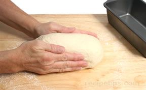

# Standard Loaf Pan Shaping

*The standard loaf pan shape is perhaps the most straightforward approach to shaping bread: gently stretch the bulk-fermented dough into an oval approximately matching the pan length, then allow final proofing. The pan's shape guides the loaf during rising and baking, requiring minimal skill or special technique.*

**Rising Time:** 45-60 minutes (final proof)
**Baking Time:** 30-35 minutes (depending on dough recipe)
**Yield:** 1 loaf, 10-12 slices

## Overview
Standard loaf pan shaping is the foundation of home bread-baking, accessible to absolute beginners yet yielding excellent results. The oval shape naturally fits the rectangular pan; the pan's walls guide upward expansion during baking, creating a neat, uniform loaf. This technique requires no shaping skill, special tools, or extensive practice; the pan does most of the work. The loaf emerges with flat sides (from pan confinement) and a slightly rounded top (from unconfined oven spring).

## Equipment
- 900g loaf tin (approximately 25 x 12 x 8 cm) or equivalent size
- Butter or oil for greasing
- Damp tea towel (for final proof cover)

## Method

### Stage 1 – Prepare for Shaping
1. After bulk fermentation and degassing, turn your dough out onto a lightly floured work surface.
1. The dough should be pliable but still have some tension and elasticity.
1. Do not over-knead; the dough should gently push back when handled.

### Stage 2 – Create Oval Shape
1. Using your hands, gently push and stretch the dough into a rough oval shape.
1. The oval should be approximately the length of your loaf pan (usually 20-25 cm) and approximately two-thirds the width of the pan (about 8-10 cm wide).
1. Work gently; you're creating a loose shape, not a tightly sealed structure.
1. The dough will be fairly loose and relaxed at this stage; that's ideal.

### Stage 3 – Grease Pan & Position Dough
1. Very lightly grease the loaf pan with butter or oil on all interior surfaces.
1. Gently place the oval-shaped dough into the center of the pan.
1. The dough should sit relaxed on the bottom, not pressed or compressed.
1. The dough width shouldn't quite touch the sides of the pan; there should be approximately 1-2 cm clearance on each side.

### Stage 4 – Reshape if Needed
1. If the dough has become too relaxed or irregular during positioning, gently push it back into an oval shape using your hands.
1. Push from the top to help the dough settle evenly across the pan bottom.
1. The dough should conform somewhat to the pan shape but retain a natural oval appearance.

### Stage 5 – Final Rising
1. Cover the pan with a damp tea towel (prevents drying of the surface).
1. Place in a warm location (approximately 20-25°C).
1. Allow to rise for 45-60 minutes.
1. The dough will gradually expand and conform to the pan as fermentation continues.

### Stage 6 – Check Readiness for Baking
1. The dough should have visibly risen in the pan.
1. It should feel puffy and light when gently pressed.
1. Press very gently with one finger; if the indent springs back slowly (over 2-3 seconds), the dough is ready to bake.
1. If it springs back immediately, it needs more proofing time.
1. If the indent doesn't spring back at all, the dough has over-proofed.

### Stage 7 – Bake
1. Preheat the oven to 200-220°C (specific temperature depends on your dough recipe).
1. Place the loaf pan on the middle oven rack.
1. Bake for 30-35 minutes (or according to your dough recipe, usually 30-35 minutes for this size).
1. The loaf should be deeply golden brown on top.
1. To test doneness, carefully remove the loaf from the pan using oven gloves.
1. Tap the bottom of the loaf with your knuckles; it should sound hollow.
1. If it sounds dull, return to the oven for 2-3 more minutes.

### Stage 8 – Cool
1. Remove the loaf from the pan immediately after baking.
1. Place on a wire cooling rack.
1. Allow to cool for at least 1 hour (preferably 2 hours) before slicing.
1. Cutting too early releases steam and makes the crumb gummy.
1. The loaf will continue to cook internally as it cools.

## Notes
- **Pan Greasing:** Light greasing prevents sticking without adding excess oil that browns the sides. Too much grease creates an overly-brown crust.
- **Dough Placement:** The dough should sit relaxed in the pan, not compressed. Tight packing inhibits rise and creates dense crumb.
- **Pan-to-Dough Ratio:** There should be slight clearance on the sides (the pan guides the rise without compressing the dough). Too tight and the dough is constrained; too loose and rise is uncontrolled.
- **Final Rise Indication:** Gentle pressure test (finger poke) is more reliable than visual estimates. Properly proofed dough gives gently under pressure then slowly recovers.
- **Temperature Importance:** The specific oven temperature depends on your dough type (lean dough = 220°C; enriched dough = 190-200°C). Follow your specific recipe.
- **Hollow Sound Test:** This is the definitive doneness indicator; internal temperature (210°F/98°C) is precise but requires a thermometer.

## Variations
- **Larger Pan:** Use a 1kg loaf tin for larger loaves; increase proofing and baking time slightly (5 minutes each).
- **Smaller Pan:** Use an 800g tin for smaller loaves; slightly reduce proofing and baking time (2 minutes each).
- **Shaped Scoring:** Score the top before baking for controlled oven spring (optional but improves appearance).
- **Egg Wash:** Brush very lightly with diluted egg before baking for glossy finish (adds 5-10 minutes to cooling for sheen to set).
- **Seeded Top:** Sprinkle sesame or poppy seeds on egg-washed loaf before baking for texture and visual appeal.

## Serving
Serve: Sliced warm or at room temperature
Best within: 24 hours of baking; excellent toasted on day 2  
Accompaniments: Butter, jam, spreads, soups, stews
Temperature: Serve at room temperature or warm

## Storage
- Best served within 24 hours of baking
- Store in paper bag at room temperature for up to 2 days
- After 2 days, slice and freeze in plastic wrap for up to 1 month
- Refresh stale loaf: Wrap loosely in foil and warm at 180°C for 5-10 minutes
- Do not refrigerate; cold stales bread faster