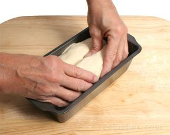

# Tin Loaf (Split Pan or Moulded Tin)

*A moulded tin loaf is a rectangular bread shape that has the striking appearance of being split down the length, created either by using two adjoining dough portions or by scoring a single large dough ball. The result is elegant, distinctive, and ideal for slicing.*

**Rising Time:** 45-60 minutes (final proof)
**Baking Time:** 30-35 minutes (depending on dough recipe)
**Yield:** 1 loaf, sliced into 10-12 portions

## Overview
The tin loaf is a classic bread shaping technique that creates visual drama and practical slicing. Two approaches exist: joining two dough portions side-by-side in the tin (creating two narrow loaves that appear fused), or shaping one rounded dough ball and scoring a deep slash down its length. Both methods produce the characteristic split appearance when baked. This technique requires no special equipment beyond a standard loaf tin, making it accessible to all home bakers.

## Equipment
- 900g loaf tin (approximately 25 x 12 x 8 cm)  
- Sharp knife or bread lame (for scoring deep slash method)
- Damp tea towel (for covered proofing)

## Method – Two-Portion Method

### Stage 1 – Prepare Dough
1. Prepare your desired bread dough according to a standard bread recipe (using approximately 500g flour as baseline).
1. After first rise and bulk fermentation, divide the dough into 2 equal portions.
1. Each portion should be shaped to approximately half the width of your loaf tin.

### Stage 2 – Shape Individual Portions
1. Working with one portion at a time, gently stretch it into a rectangular shape roughly half the width of your tin (approximately 10-12 cm wide).
1. Round the top of each portion into a gentle dome (this aids oven spring during baking).
1. Repeat with the second portion.

### Stage 3 – Position in Tin
1. Lightly grease the loaf tin with oil or butter.
1. Place one shaped portion on the left side of the tin.
1. Place the second portion directly next to it on the right side.
1. The two portions should fit snugly together with minimal gap between them; they will fuse during rising and baking.

### Stage 4 – Final Rise
1. Cover the tin with a damp tea towel.
1. Leave in a warm place (approximately 20-25°C) for 45-60 minutes.
1. The dough should rise until the two portions are puffy and their tops are slightly above the rim of the tin.
1. When poked gently, the dough should spring back very slowly; a fast spring-back indicates under-proofing.

### Stage 5 – Bake
1. Preheat oven to 200-220°C (specific temperature depends on your dough recipe).
1. Place the tin on the middle rack.
1. Bake for 30-35 minutes until deeply golden brown.
1. The bread should sound hollow when removed from tin and tapped on bottom.

## Method – Single-Dough Scoring Method

### Stage 1 – Prepare & Shape Dough
1. Prepare your desired bread dough according to a standard recipe.
1. After first rise and bulk fermentation, shape the dough into a round ball.
1. Smooth the top of the ball (the scoring step will create the split appearance).

### Stage 2 – Position in Tin
1. Lightly grease the loaf tin.
1. Place the rounded dough ball in the tin, centered lengthwise.
1. The round should fill most of the tin but not be compressed.

### Stage 3 – Score Deep Slash
1. Using an extremely sharp knife or bread lame, cut a deep slash down the center length of the dough from one end to the other.
1. The slash should be approximately 0.5 cm deep and run the entire length.
1. Cut with confidence and speed; hesitant cutting creates ragged edges.

### Stage 4 – Final Rise
1. Cover the tin with a damp tea towel.
1. Leave in a warm place for 45-60 minutes until puffy and risen.
1. The two halves of the slash should be slightly separated but still joined at the edges.

### Stage 5 – Bake
1. Preheat oven to 200-220°C.
1. Bake for 30-35 minutes until deeply golden.
1. The split down the center will widen and deepen during baking as the dough rises.
1. When removed from the tin, the loaf should sound hollow when tapped.

## Notes
- **Two-Portion Method Advantage:** Creates two wholly separate loaves that look fused; each loaf can be eaten individually, making portion control easier.
- **Scoring Method Advantage:** Simpler, requires only one dough shaping; slightly more impressive visual appearance of the split.
- **Scoring Depth:** The slash must be deep (at least 0.5 cm) to create the appearance of separation; shallow cuts won't create the desired effect.
- **Tin Size:** A 900g tin is standard; smaller tins produce taller, narrower loaves; larger tins produce shorter, flatter loaves. Adjust shaping proportions accordingly.
- **Final Rise Timing:** Both methods require proper final proofing; under-proofed loaves will have dense crumb and poor oven spring; over-proofed will collapse during baking.
- **Oven Spring:** The split will widen significantly during baking as gas expands; this is desirable.

## Serving
Serve: Sliced, warm or at room temperature
Best within: 24 hours of baking; excellent toasted on day 2
Accompaniments: Butter, jam, spreads, soups, stews

## Storage
- Best served within 24 hours
- Store in paper bag at room temperature for up to 2 days
- Slice and freeze for up to 1 month wrapped in plastic
- Do not refrigerate; cold stales bread faster than room temperature
