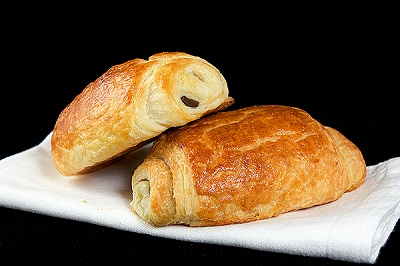

# Pains au chocolat

*These can be frozen, interleaved with greaseproof paper as soon as they are shaped and will keep for up to 2 weeks. After thawing, warm through gently in the oven to serve.*

**Yield:** 20-22 pastries

## Overview
Pains au chocolat are French pastries made from laminated croissant dough enclosing dark chocolate sticks. The butter-layered dough creates a crispy, flaky exterior while the chocolate melts into the warm pastry. They're ideal for breakfast or afternoon tea, and freezing capability makes them practical for baking in advance.

## Ingredients

### Pastry Base & Chocolate
- 1.1 kg croissant dough (prepared according to [croissant dough recipe](../baking/pastry/croissant-dough.md))
- 44 sticks of dark chocolate (good quality couverture)

### For Assembly
- Eggwash: 1 egg yolk mixed with 1 tablespoon milk

## Method

### Stage 1 – Shape the Dough
1. On a lightly floured surface, roll the croissant dough into a rectangle approximately 52 x 46 cm, about 5 mm thick.
1. Trim the edges with a chef's knife to create clean borders.
1. Cut the rectangle lengthwise into 4 long bands, each about 11 cm wide.
1. Cut across each band at 7 cm intervals to create small rectangles approximately 11 x 7 cm.

### Stage 2 – Place Chocolate & First Fold
1. Lay one small rectangle of dough in front of you with a shorter edge facing toward you.
1. Position one stick of chocolate across the rectangle, about 4 cm in from the top edge.
1. Fold the top 4 cm of dough over the chocolate stick, pressing gently to seal.
1. Place a second chocolate stick next to the fold line.

### Stage 3 – Roll & Seal
1. Roll the pastry over the second chocolate stick to enclose both pieces completely.
1. Transfer the pain au chocolat to a parchment-lined baking sheet.
1. Repeat with the remaining dough and chocolate until all are assembled.

### Stage 4 – Proof & Rise
1. Brush all pains au chocolat lightly with eggwash.
1. Place the baking sheets in a warm, humid location (ideally 24-30°C).
1. Leave to rise for 2 hours until they have almost doubled in size.

### Stage 5 – Bake
1. Preheat the oven to 170°C.
1. Brush the pains au chocolat very lightly again with eggwash.
1. Bake for 12 minutes until golden brown.
1. Transfer to a wire rack, ensuring they are not touching one another.
1. Leave to cool for at least 1 hour before serving (the chocolate is extremely hot).

## Notes
- **Croissant Dough Quality:** The quality of your croissant dough directly affects the final texture. Ensure proper butter lamination with adequate folds.
- **Chocolate Selection:** Use good-quality dark chocolate sticks (couverture). Quality chocolate creates a superior eating experience.
- **Eggwash Timing:** Apply eggwash twice, before rising and before baking, for a deep golden finish.
- **Proofing Temperature:** 24-30°C is ideal; too warm and the dough rises too quickly without developing flavor; too cool and proofing takes longer.
- **Cooling is Essential:** The chocolate inside is extremely hot after baking. Allow proper cooling time to avoid burns.

## Variations
**Almond Filling:** Add a thin layer of almond cream or frangipane before adding chocolate.
**Hazelnut Chocolate:** Use hazelnut-filled chocolate sticks instead of plain dark chocolate.
**Milk Chocolate:** Substitute milk chocolate for dark chocolate if preferred for sweeter pastries.
**With Pastry Cream:** Pipe a thin line of pastry cream alongside the chocolate before rolling.

## Serving
Serve with: Coffee, hot chocolate, or tea
Temperature: Serve warm or at room temperature
Amount: 1 pastry per person
Accompaniments: Jam, nutella, or plain

## Storage
- Best served warm on the day of baking, but keeps at room temperature for 1 day in an airtight container
- Reheat gently in a 160°C oven for 3-4 minutes before serving to restore crispness
- Freeze shaped pains au chocolat on a baking sheet before baking; once frozen solid, store in freezer bags for up to 2 weeks
- Bake frozen pains directly from freezer at 170°C for 15-16 minutes (no thawing needed)
- Do not refrigerate; cold dulls the butter flavor