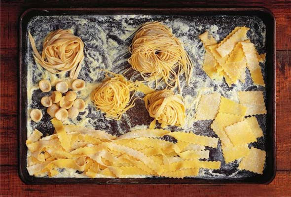

# Fresh Pasta Dough

*This is the classic Italian egg pasta dough: simple, elegant, and infinitely versatile. Just flour, eggs, olive oil, and salt, no water needed. The richness of the eggs creates tender, silky pasta with golden color.*

**Yield:** Approximately 350 grams fresh pasta (serves 2-3)

## Overview
Fresh pasta dough is foundational to Italian cooking. The traditional method, making a well in flour, cracking eggs into it, and gradually drawing in the flour, creates a perfectly textured dough. Resting allows the flour to fully hydrate and gluten to develop. This dough rolls thin for sheets (lasagne, ravioli) or can be cut into shapes (fettuccine, pappardelle, tagliatelle). The texture of fresh pasta is incomparably tender compared to factory-made dried pasta.

## Ingredients

### Base Dough
- 300 grams Italian 00 flour (doppio zero)
- 3 large eggs
- 1 pinch fine sea salt

### For Working
- 1 tablespoon extra virgin olive oil
- Extra flour for dusting

## Method

### Stage 1 – Create Flour Well
1. Mound the flour on a clean work surface, making a well in the center (like a volcano).
1. Crack all 3 eggs into the well.
1. Add the pinch of salt.
1. Pour the olive oil into the well with the eggs.

### Stage 2 – Gradually Incorporate Flour
1. Using a fork, beat the eggs together gently until combined, just as you would scramble them.
1. Gradually bring the flour from the inner walls of the well into the egg mixture.
1. Work slowly and deliberately; rushing this causes the egg to break through and spill onto the work surface.
1. Continue until the flour and eggs have mostly combined into a shaggy mass.

### Stage 3 – Knead the Dough
1. Roll the dough into a ball (it will be rough and slightly sticky).
1. Begin kneading on a very lightly floured surface, using the heel of your hand to push the dough away from you, then fold it back.
1. Knead steadily and firmly for 10 minutes.
1. The dough should gradually become smooth, elastic, and silky (not sticky).
1. If very sticky, dust lightly with flour; if dry, dampen your hands slightly.

### Stage 4 – Rest the Dough
1. Form the kneaded dough into a smooth ball.
1. Wrap it tightly in plastic wrap or place under an inverted bowl.
1. Rest at room temperature for 30 minutes (this allows gluten to relax and flour to fully hydrate).
1. The dough can rest for up to 1 hour with no ill effects; longer resting improves extensibility.

### Stage 5 – Roll and Cut
1. Cut the rested dough into 4 equal portions (this makes rolling easier).
1. Working with one portion at a time (keep others covered), flatten with your palm.
1. Using a rolling pin, roll out flat with long, even strokes, rotating and turning the dough frequently.
1. Roll thin enough to see your hand through it for sheets; slightly thicker for cut shapes.
1. Cut into desired shapes (fettuccine, pappardelle, lasagne sheets) or allow sheets to dry slightly before cutting.
1. Use immediately or lay on a lightly floured tray to dry for 15-30 minutes before cooking.

## Notes
- **Flour Type:** Italian 00 flour (doppio zero) is softer than all-purpose and creates more tender pasta; it's worth seeking out at Italian markets.
- **Egg Quality:** Fresh, room-temperature eggs incorporate more smoothly; cold eggs can make the dough hard to work with.
- **Hydration:** The eggs provide all necessary moisture; don't add water or the dough becomes dense and starchy.
- **Resting is Essential:** This 30-minute rest allows gluten to develop and relax, making the dough easier to roll thin without breaking.
- **Hand Work:** Kneading by hand (rather than a food processor) creates the best texture and gives you tactile feedback about the dough's moisture level.
- **Resting Before Cooking:** Fresh pasta cooks very quickly (2-4 minutes); if storing for later, dust lightly with semolina to prevent sticking.

## Variations
**Spinach Pasta:** Purée 100g fresh spinach, squeeze dry, and reduce eggs to 2; add spinach to the well with eggs.
**Herb Pasta:** Finely chop fresh herbs (basil, parsley) and fold into the dough after kneading.
**Saffron Pasta:** Infuse a pinch of saffron threads in 1 tablespoon warm water; add to the egg well instead of using one egg.
**Whole Wheat:** Replace 75g of 00 flour with whole wheat flour for nutty flavor and rustic appearance.
**Beet Pasta:** Add 2 tablespoons beet purée to the eggs, omit one egg.

## Serving
Serve immediately after cooking (fresh pasta is best served within seconds of draining)
Dress with: Butter and sage, olive oil and garlic, quick tomato sauce, creamy sauces, or pesto
Amount: 350g dough serves 2-3 people
Shape options: Cut into ribbons (fettuccine, pappardelle, tagliatelle), shapes for filling (ravioli, tortellini), or lasagne sheets

## Storage
- Fresh, uncooked pasta: Store on a lightly floured tray at room temperature for up to 2 hours, or refrigerate covered for up to 1 day
- Dried fresh pasta: Lay on wire racks and allow to dry completely (4-8 hours), then store in an airtight container for up to 1 month
- Frozen: Lay fresh pasta on a tray, freeze until hard, then transfer to freezer bags for up to 3 months; cook directly from frozen (add 1-2 minutes to cooking time)
- Never thaw frozen pasta before cooking