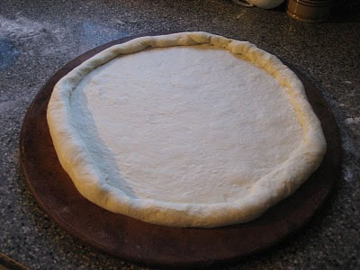

# Classic Pizza Dough

*A straightforward, approachable pizza dough using standard yeast leavening and a single fermentation. The result is solid, reliable pizza base with good chewy interior and light crust when topped and baked properly.*

**Prep Time:** 15 minutes
**Rising Time:** 1 hour
**Yield:** 1 large pizza (approximately 30 cm diameter), serves 4-6

## Overview
This is a forgiving pizza dough suitable for home cooks, no complex temperature calculations or extended fermentation. Mixed and risen in one straightforward stage, it produces respectable pizza base with balanced chew and crispness when properly topped and cooked. The dough is forgiving with hydration and timing; it's designed for everyday pizza-making rather than artisanal showcase. Pricking the base before topping helps prevent excessive bubbling, and allowing the dough to rest after shaping creates better structure.

## Ingredients

### Dry Mix
- 225 grams strong white bread flour
- 7 grams fast-acting dried yeast
- 1 teaspoon caster sugar
- ½ teaspoon fine sea salt

### Wet Mix & Fat
- 2 tablespoons extra virgin olive oil (divided: 1 tablespoon for dough, 1 tablespoon for coating)
- 85 ml whole milk (tepid, approximately 40°C)
- 85 ml warm water (approximately 40°C)

## Method

### Stage 1 – Mix Dough
1. Place the flour, yeast, sugar, and salt in a large mixing bowl.
1. Combine 1 tablespoon olive oil with tepid milk and warm water in a small bowl.
1. Pour the liquid mixture into the flour.
1. Stir thoroughly with a wooden spoon until no dry flour remains.
1. The dough should be soft and slightly sticky; do not add extra flour.

### Stage 2 – Knead
1. Place dough on a lightly floured work surface.
1. Knead firmly for 5 minutes until the dough becomes soft and smooth.
1. If too sticky, use a little oil on your hands rather than flour.
1. The dough should be elastic and hold together.

### Stage 3 – First Rise
1. Lightly oil a bowl with the remaining 1 tablespoon olive oil.
1. Place the dough in the bowl and turn to coat evenly with oil.
1. Cover with a tea towel.
1. Leave in a warm place (approximately 20-25°C) for 1 hour.
1. The dough should roughly double in size.

### Stage 4 – Shape Base
1. Preheat oven to 210°C.
1. Place dough on a lightly floured surface.
1. Punch down gently to expel excess gas.
1. Knead for approximately 5 minutes until smooth again.
1. Shape the dough into a neat, rounded ball.
1. Using your hands or a rolling pin, stretch the dough to approximately 30 cm diameter.
1. The base should be approximately 5 mm thick.

### Stage 5 – Final Rest & Topping
1. Transfer to a lightly oiled pizza tray.
1. Allow the dough to rest for 15-30 minutes (this relaxes gluten and creates better rise in oven).
1. Before topping, prick the base with a fork 8-10 times (this prevents excessive bubbling during baking).
1. Top as desired with sauce, cheese, and toppings.

### Stage 6 – Bake
1. Bake pre-topped pizza at 210°C for 12-15 minutes until the crust is golden and cheese is melted and bubbling.
1. The base should sound hollow when tapped from underneath.
1. Allow to cool for 2 minutes before slicing.

## Notes
- **Dough Hydration:** The dough is intentionally soft; this creates tender crumb. Don't add extra flour.
- **Milk vs. Water:** Milk adds subtle richness; you can substitute all water if preferred for a crisper crust.
- **Pricking Technique:** Four to 8 evenly distributed fork pricks prevent large air bubbles that prevent toppings from adhering properly.
- **Stretching Method:** If dough springs back during stretching, let it rest 2-3 minutes then continue. This indicates gluten relaxation needed.
- **Thick vs. Thin Crust:** Thinner base (3mm) = crisper result; thicker base (8mm) = chewier, bread-like texture. Adjust your stretching accordingly.
- **Oven Temperature:** 210°C is moderate; higher (220-230°C) creates crispier crust; lower creates softer, less cooked base.
- **Stuffed Crust Option:** Before topping, fold cheese along the outer edge of the dough inward slightly to create edge cheese pockets.

## Variations
**Whole Wheat:** Replace 75g white flour with whole wheat flour for nutty flavor and denser crumb.
**Garlic & Herb:** Add 2 minced garlic cloves and 1 tablespoon fresh basil to the dough after kneading.
**Sourdough-Style:** Use 150g sourdough starter in place of 75ml water + yeast; ferment for 2-4 hours for more sour flavor.
**Gluten-Free:** Use gluten-free flour blend; dough will be more delicate but can work with careful handling.
**New York Style:** Use only water (no milk) and extend rise to 2-3 hours for more open crumb and chew.
**Detroit-Style:** Use a 30 x 20 cm rectangular pan, stretch dough to fill, and allow it to poof in the pan for 2 hours before topping.

## Serving
Serve immediately after baking while cheese is melted and crust is warm.
Toppings: Any combination of tomato sauce, cheese, vegetables, cured meats, or fresh herbs
Temperature: Serve hot; pizza is best eaten within 5 minutes of coming from oven
Accompaniments: Olive oil for dipping, fresh basil, oregano

## Storage
- Uncooked dough: Refrigerate in oiled bowl covered for up to 2 days; allow to come to room temperature (1 hour) before stretching
- Uncooked dough: Freeze in oiled portions for up to 3 months; thaw in refrigerator overnight then bring to room temperature before using
- Cooked pizza: Best served fresh, but keeps at room temperature in airtight container for 1 day
- Reheating: Warm slice in a 160°C oven for 2-3 minutes to restore crispness, or briefly in a dry pan on stovetop
