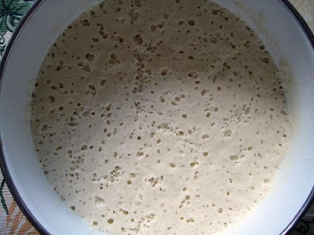

# Poolish (Bread Pre-Ferment)

*Authentic French bread requires a pre-fermentation stage known as a Poolish, a starter made with equal parts water and flour and a tiny amount of yeast. This ferments for 12-18 hours, developing flavor and improving dough structure. Poolish adds complexity, acidity, and distinctive character to bread.*

**Yield:** Approximately 200 grams (enough for one batch of French bread)

## Overview
Poolish is a classical French bread-making technique: a preferment that develops yeast flavor and creates a stronger gluten network before the final dough is mixed. Made from equal weights of flour and water plus yeast, it rests 12-18 hours. This extended fermentation allows beneficial bacteria to thrive, developing sour and complex flavors. The Poolish is then incorporated into the final dough as part of the liquid and flour calculation. This is the foundation of authentic baguettes and fine French breads.

## Ingredients

### Poolish Base
- 100 grams bread flour or all-purpose flour
- 100 grams water (room temperature, approximately 20-22°C)
- 1/4 teaspoon (about 0.5g) instant or active dry yeast

### Storage & Notes
- Container: Large bowl with cling film cover
- Fermentation temperature: Warm, dry place (approximately 18-22°C)
- Fermentation time: 12-18 hours (ideally 16-18 hours for maximum flavor development)

## Method

### Stage 1 – Activate Yeast
1. Pour the water into a small bowl.
1. Add the yeast to the water, stirring constantly for 20 seconds.
1. Allow the yeast to sit for 1 minute; it will hydrate and begin to activate.
1. The mixture will become slightly foamy as the yeast wakes up.

### Stage 2 – Mix Poolish
1. Put the flour in a large mixing bowl.
1. Pour the yeast-water mixture into the flour.
1. Using a fork or wooden spoon, stir vigorously to help develop the long gluten strands.
1. Mix until you reach a thick, batter-like consistency (thicker than pancake batter, thinner than cookie dough).
1. There should be no dry flour remaining.

### Stage 3 – Ferment
1. Cover the bowl completely with cling film (this prevents a crust from forming on top and helps retain moisture).
1. Leave to rest in a warm, dry place for 12-18 hours.
1. **Ideal fermentation:** 16-18 hours develops the most complex flavor.
1. The Poolish will rise to roughly 2-3 times its original volume, becoming full of bubbles.
1. The surface may develop a slightly sunken appearance as fermentation slows.

### Stage 4 – Use in Final Dough
1. The Poolish is now ready to use in a final bread dough recipe.
1. When a bread recipe calls for flour and water, subtract the Poolish's weight from these amounts.
1. **Example:** If a recipe calls for 850g flour and 510g water, and you have 200g Poolish (100g flour + 100g water), use 750g flour + 410g water + the 200g Poolish.
1. The Poolish will be incorporated as part of the liquid and flour amounts in your final dough.
1. Mix the Poolish along with the remaining flour, water, and salt into your final dough.

## Notes
- **Cold Fermentation:** If your kitchen is cold, fermentation takes longer; a warm place (ideally 20-22°C) accelerates fermentation.
- **Extended Fermentation:** Poolish can be left to ferment for up to 24 hours; longer fermentation creates more sour, complex flavor (but past 24 hours, the yeast may weaken).
- **Temperature Matters:** Cold water and cool environments slow fermentation significantly; warm environments speed it up.
- **Active Dry vs. Instant Yeast:** Both work; instant (bread) yeast ferments slightly faster. Use the same amount.
- **No Poolish Starter:** Some bakers use a small portion of previous day's dough instead of new yeast; this creates even more complex flavor (called a "biga" in Italian tradition).
- **Storage:** Poolish can be refrigerated for up to 3 days before use (fermentation continues very slowly in cold); allow to come to room temperature before mixing into final dough.

## Variations
**Extended Fermentation Polenta:** Use cornmeal instead of flour for a corn-flavored preferment (creates interesting flavor in corn bread).
**Liquid Poolish:** Use all liquid and flour with no salt (as here) for lighter flavor; some bakers add 1/4 teaspoon salt to slow fermentation slightly and increase complexity.
**Cold Fermentation:** Make Poolish as usual, then refrigerate for 8-16 hours instead of fermenting at room temperature; this creates more sour, complex flavor (the cold slows yeast but bacteria continue slowly).
**Longer Autolyse:** After mixing, let the Poolish rest for 1 hour before final mixing; this develops even more gluten strength.
**Multiple Poolish:** Some breads use two different Poolish stages made at different times, creating layered complexity.

## Serving
Use in: Baguettes, ciabatta, focaccia, high-hydration artisan breads
Percentage: Typically 20-40% of total dough weight
Effect: Adds depth, slight tartness, better crust development, improved fermentation

## Storage
- Poolish should be used immediately after fermentation (when bubbly and active)
- If fermented for longer than 18 hours, it can be refrigerated before use
- Refrigerated Poolish keeps for up to 3 days in an airtight container
- Do not freeze; yeast won't survive thawing
- Always allow refrigerated Poolish to return to room temperature before using