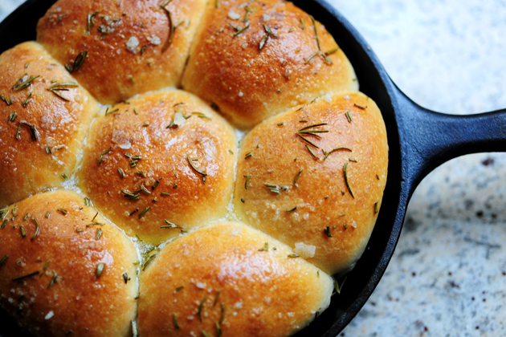

# Rosemary Bread Trio

*These fragrant bread buns compliment soups perfectly, and are equally delicious with a generous spread of creamy butter. Where most people go wrong is not making the mixture wet enough and so the finished bread ends up too doughy and dry. Once the water is added, don't flood the work surface with flour as it will unbalance the recipe, instead, use olive oil if need be.*

**Servings:** 10 people

## Overview
These rustic bread buns are perfumed with fresh rosemary sprigs and shaped in trios, creating distinctive clover-like rolls. The dough is intentionally wet and soft, creating a tender crumb. They're ideal for accompanying soups or serving with butter, and the fragrant rosemary makes them special for entertaining. The key is not adding excessive flour to a naturally soft, slightly sticky dough.

## Ingredients

### Yeast Starter
- 7 grams fast-acting dried yeast
- 1 teaspoon caster sugar (for proofing yeast)
- 60 ml warm water (for proofing yeast)

### Dough
- 500 grams plain flour
- 1 tablespoon caster sugar
- 1.5 teaspoons fine sea salt
- 250 ml warm milk
- 60 ml vegetable oil

### Finishing
- 10 sprigs fresh rosemary
- 1 egg yolk mixed with 1 teaspoon water (eggwash)
- Sea salt flakes (for decoration)

## Method

### Stage 1 – Activate Yeast
1. Combine the fast-acting yeast, 1 teaspoon caster sugar, and 60 ml warm water in a small bowl.
1. Stir well and let sit for about 5 minutes.
1. You should see light froth forming on top, indicating the yeast is active.

### Stage 2 – Make Dough
1. Sift the 500 grams flour into a large bowl.
1. Stir in the remaining 1 tablespoon caster sugar and the salt.
1. Make a well in the center of the flour.
1. Pour the warm milk, vegetable oil, and activated yeast mixture into the well.
1. Mix with a wooden spoon until completely combined, stirring until no dry flour remains.
1. The dough should be soft but not sticky at this stage.

### Stage 3 – Knead
1. Turn the dough out onto a lightly floured surface.
1. Knead for 10 minutes until smooth and elastic, using minimal additional flour.
1. If the dough is too sticky, rub a little olive oil on your hands rather than adding more flour.

### Stage 4 – First Rise
1. Place the dough in a large, lightly oiled bowl.
1. Cover loosely with a damp tea towel.
1. Leave in a warm place for 1 hour until the dough has visibly risen.

### Stage 5 – Shape
1. Punch down the dough gently to release gas.
1. Turn onto a very lightly floured surface and knead for 1 minute.
1. Lightly grease 2 large baking trays.
1. Divide the dough into 10 equal pieces.
1. Roll each piece into a smooth ball.
1. Arrange three balls together on each baking tray, creating a clover-like trio shape.
1. Place one fresh rosemary sprig in the center where the three balls meet.

### Stage 6 – Second Rise & Proof
1. Cover the trios loosely with a damp tea towel.
1. Set aside for 20 minutes while you preheat the oven to 180°C.

### Stage 7 – Bake
1. Brush each trio lightly with the eggwash (egg yolk mixed with water).
1. Sprinkle a few sea salt flakes on top of each trio.
1. Bake for 15 minutes until golden brown.
1. Cool briefly on the baking tray before transferring to a wire rack.

## Notes
- **Dough Wetness:** The original recipe emphasizes the importance of a wet, soft dough. Don't panic if it seems very soft; this creates the tender crumb that makes these special.
- **Oil vs. Flour:** If the dough is sticky, use olive oil on your hands rather than additional flour. Too much flour throws off the hydration.
- **Rosemary Placement:** Replace rosemary sprigs with fresh ones after baking if desired for better presentation.
- **Yeast Activation:** Fast-acting yeast activates quickly; don't leave it sitting too long before adding to the dough.
- **Trio Arrangement:** Shaping three balls together creates a characterful presentation; they'll fuse slightly during baking while remaining distinct.

## Variations
**Herbed:** Replace rosemary with thyme, oregano, or a mixed herb topping.
**Seeded:** Add 1 tablespoon sesame seeds or poppy seeds to the dough before mixing.
**Garlic & Herb:** Add 2 minced garlic cloves and minced parsley to the dough base.
**Focaccia Style:** Dimple the top of each trio with your fingers, brush with olive oil, and top with sea salt.
**Plain Dinner Rolls:** Omit the rosemary for simple, versatile dinner rolls.

## Serving
Serve with: Soup, salad, butter, or jam
Temperature: Serve warm or at room temperature
Amount: 1 trio (3 buns) per person
Accompaniments: Butter, spreadable cheese, or soup for dipping

## Storage
- Best served warm on the day of baking
- Keeps in an airtight container at room temperature for 1 day
- Freeze for up to 1 week in a freezer bag
- Reheat in a 180°C oven wrapped in foil for 5-10 minutes until warm
- Do not refrigerate; cold stales the bread