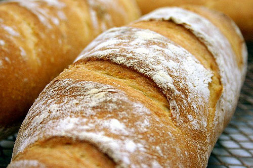

# White Bread

*This bread forms a lovely crunchy crust when cooked, and is especially delightful when eaten warm. Where most people go wrong is not making the mixture wet enough and so the finished bread ends up too doughy and dry. Once the water is added, don't flood the work surface with flour as it will unbalance the recipe, instead, use olive oil if needed.*

**Yield:** 1 large loaf (serves 6-8)

## Overview
This is a simple, rustic white bread with excellent crust and tender crumb. The combination of salt, oil, and water creates a supple dough that develops wonderful flavor through slow fermentation. The high water content creates steam during baking, resulting in the characteristic crispy, shattering crust. This is a straightforward bread made with no enrichments, pure flour, water, yeast, salt, and time.

## Ingredients

### Base Dough
- 500 grams strong white flour
- 1 tablespoon fine sea salt
- 14 grams fast-acting dried yeast (approximately 1 packet)
- 50 ml extra virgin olive oil
- 250 ml warm water (approximately 40°C)

### For Finishing
- Extra flour for dusting

## Method

### Stage 1 – Mix Dough
1. Sift the flour into a large bowl.
1. Add the salt and yeast (keep them slightly separated so the salt doesn't directly touch the yeast).
1. Pour in the olive oil and warm water.
1. Mix the ingredients into a soft, shaggy dough using your hands or a wooden spoon.
1. The dough should be quite wet and sticky; resist the urge to add flour.

### Stage 2 – Knead
1. Turn the dough out onto an unfloured work surface (the dampness is intentional).
1. Knead well with your hands for about 10 minutes until the dough is smooth and elastic.
1. If it's too sticky, rub your hands with a little olive oil rather than dusting with flour.
1. The dough should be tacky but not sticky; it should hold together.

### Stage 3 – First Rise
1. Cover the bowl with a clean tea towel.
1. Leave in a warm place (about 20-25°C) for 1 hour to prove.
1. The dough should roughly double in size and become puffy.

### Stage 4 – Shape
1. After the dough has risen and doubled in size, knock it back with your hands, gently pressing out gas.
1. Tip it out onto a very lightly floured work surface.
1. Mold the dough gently into a rugby ball or oval shape.
1. Place on a baking sheet dusted with flour.

### Stage 5 – Final Rise
1. Leave the shaped dough to rise in a warm place for a further 30 minutes.
1. The dough should become puffy and visibly lighter.

### Stage 6 – Score & Bake
1. Meanwhile, preheat the oven to 230°C.
1. When ready to bake, dust the top of the loaf with flour.
1. Using a very sharp knife, score the top with a few diagonal slashes (this helps the bread expand and creates a crispy surface).
1. Bake in the oven for 30-35 minutes until deeply golden.

### Stage 7 – Cool
1. To check whether the bread is fully cooked, carefully remove it from the oven and turn it over.
1. Tap the base of the loaf, it should sound hollow when the bread is done.
1. Place on a wire rack to cool completely (at least 1 hour) before slicing.
1. Cutting too early releases steam and makes the interior damp.

## Notes
- **Water Ratio:** The dough should be quite wet; this is what creates the open crumb and crispy crust. Don't fight it with extra flour.
- **Yeast Temperature:** Warm water (40°C) activates yeast without killing it; too hot (above 50°C) kills the yeast; too cool slows fermentation.
- **Salt Placement:** Keep yeast and salt slightly separated in the dry ingredients; direct contact can slow fermentation.
- **Oil vs. Flour:** When the dough is sticky, use olive oil on your hands rather than flour; flour toughens the dough.
- **Doubling Test:** Poke the risen dough gently; if the indent springs back slowly, it's ready; if it springs back immediately, it needs more time.
- **Hollow Sound:** This is the best test for doneness; an under-baked loaf will sound dull.

## Variations
**Olive Oil Bread:** Use 75 ml olive oil instead of 50 ml for richer, more flavorful crumb.
**Herbed:** Add 1 tablespoon finely chopped fresh rosemary or thyme to the dough after mixing.
**Seeded:** Sprinkle sesame seeds, poppy seeds, or sunflower seeds on top before baking.
**Wholemeal Mix:** Replace 150g white flour with wholemeal flour for nuttier flavor and denser crumb.
**Longer Fermentation:** Allow the first rise to extend to 2 hours (or even overnight in the cold) for deeper, more developed flavor.

## Serving
Serve: Warm from the oven, sliced, with butter or olive oil
Best within: 24 hours of baking; use for toast after day 1
Pairing: Excellent with soups, stews, or simply butter and sea salt

## Storage
- Best served the day it's baked
- Store in a paper bag at room temperature for up to 2 days
- After 2 days, slice and freeze wrapped in plastic wrap for up to 1 month
- Refresh stale bread: Sprinkle lightly with water and warm in a 180°C oven for 5-10 minutes
- Do not refrigerate; cold temperature stales bread faster than room temperature

