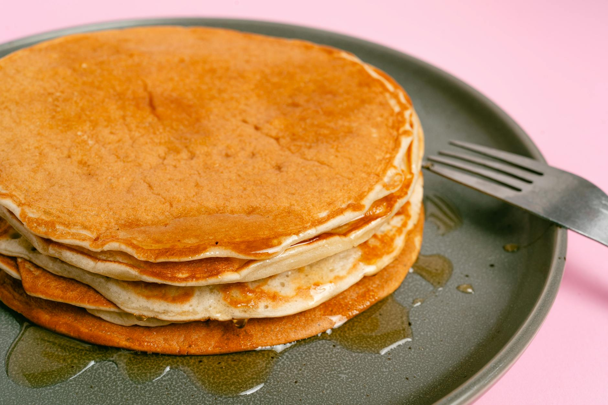

# Buttermilk Pancakes

*Fluffy American-style pancakes: tall, soft, the colour of caramel. The buttermilk reacts with baking soda for the lift; stand mixing optional, fluff is structural. Stack high, drown in butter and maple syrup.*

**Makes:** 12 pancakes

**Prep Time:** 5 minutes (plus 10 minutes batter rest)

**Cook Time:** 15 minutes

## Overview
Dry ingredients whisk in one bowl; wet (buttermilk, eggs, butter) in another. Combine briefly — lumps are good — and rest 10 minutes for the baking powder and soda to start working. Cook on a medium pan; flip when bubbles appear and the edges look set.

## Ingredients

- 250 g plain flour
- 2 tablespoons caster sugar
- 1 teaspoon baking powder
- ½ teaspoon bicarbonate of soda
- ½ teaspoon salt
- 350 ml buttermilk (or 350 ml whole milk + 1 tablespoon lemon juice, rested 5 minutes)
- 2 large eggs
- 50 g unsalted butter (melted, cooled slightly)
- 1 teaspoon vanilla extract
- Butter or oil for the pan

### To serve
- Butter
- Maple syrup
- Fresh berries or sliced banana

## Method

### Stage 1 – Dry mix
1. Whisk the flour, sugar, baking powder, bicarbonate of soda and salt in a bowl.

### Stage 2 – Wet mix
1. In another bowl, whisk the buttermilk, eggs, melted butter and vanilla.

### Stage 3 – Combine and rest
1. Pour the wet into the dry; whisk briefly with a fork — STOP while there are still lumps. Overmixing = chewy pancakes.
1. Rest 10 minutes.

### Stage 4 – Cook
1. Heat a wide non-stick pan over medium-low heat. Wipe with a tiny knob of butter.
1. Ladle 80 ml of batter for each pancake (about a third of a cup).
1. Cook 2-3 minutes until bubbles appear across the surface and the edges look set.
1. Flip; cook another 1-2 minutes until puffed and golden.
1. Stack on a plate; keep warm in a low oven if making several batches.

### Stage 5 – Serve
1. Stack 3 per plate.
1. Top with butter, maple syrup and berries.

## Notes
- **Lumpy batter is the goal:** Smooth batter develops gluten and gives chewy, dense pancakes. Mix until just combined.
- **Medium-low heat:** Too hot and the outside burns before the inside cooks. Patience.
- **Buttermilk is structural:** The acidity reacts with the bicarb for the rise. Substitute with milk + lemon juice if needed but real buttermilk is better.

## Storage
- Best fresh. Keep 1 day refrigerated; reheat in a toaster or hot pan.
- Freeze 2 months, separated by parchment.
