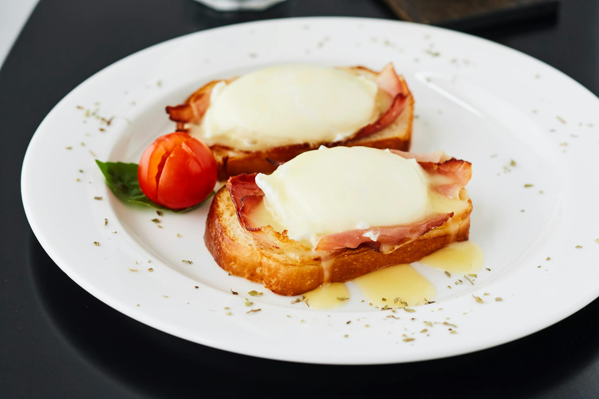

# Eggs Benedict

*Toasted English muffin halves, ham (or smoked salmon), poached egg, hollandaise sauce. The Sunday brunch icon. Looks fancy; rewards twenty minutes of focused work. The hollandaise is the only tricky bit; the rest is timing.*

**Serves:** 4

**Prep Time:** 15 minutes

**Cook Time:** 15 minutes

## Overview
Hollandaise builds first (it can wait briefly in a warm spot). Eggs poach in vinegar-spiked simmering water. English muffins toast and butter; ham warms briefly. Everything stacks: muffin, ham, egg, hollandaise. Eat immediately.

## Ingredients

### Hollandaise
- 200 g unsalted butter
- 3 large egg yolks
- 1 tablespoon water
- 1 tablespoon lemon juice
- A pinch of salt
- A pinch of cayenne

### Poached eggs
- 8 large eggs (very fresh)
- 2 tablespoons white wine vinegar
- 1 teaspoon salt

### To assemble
- 4 English muffins (split in half)
- 8 slices good ham (or smoked salmon)
- 1 tablespoon chopped chives or parsley

## Method

### Stage 1 – Clarify the butter
1. Melt the butter in a small pan over low heat.
1. Skim any foam from the top.
1. Pour off the clear yellow butter (clarified butter), leaving the milky solids in the pan. Discard the solids. Keep the clarified butter warm.

### Stage 2 – Hollandaise
1. Whisk the egg yolks with the water and lemon juice in a heatproof bowl.
1. Set the bowl over a pan of barely-simmering water (don't let it touch the water).
1. Whisk continuously for 3-4 minutes until thick, pale and ribboning.
1. Off the heat, drizzle in the warm clarified butter slowly while whisking, until the sauce is glossy and thick.
1. Season with salt and cayenne.
1. Cover loosely with a tea towel; sit in a warm spot.

### Stage 3 – Poach the eggs
1. Bring 5 cm of water to a bare simmer in a wide pan; add the vinegar and salt.
1. Crack each egg into a ramekin or small cup.
1. Stir the water gently to create a whirlpool; lower an egg in. Repeat for 2-3 eggs at a time (don't crowd).
1. Poach 3 minutes for runny yolks. Lift out with a slotted spoon; trim ragged edges.
1. Place on kitchen paper to drain.

### Stage 4 – Assemble
1. Toast the muffin halves; butter lightly.
1. Lay a slice of ham on each.
1. Top with a poached egg.
1. Spoon hollandaise generously over.
1. Scatter chives.

## Notes
- **Fresh eggs poach best:** Old eggs have loose whites that turn into wisps. The vinegar helps, but freshness is the structural fix.
- **Don't overheat the hollandaise:** Direct heat scrambles it. Bain-marie + steady whisking is the technique.
- **If the hollandaise splits:** Whisk a teaspoon of cold water into a fresh bowl, then slowly whisk the split sauce in. Usually rescues it.

## Variations
**Eggs Royale:** Smoked salmon instead of ham.
**Eggs Florentine:** Wilted spinach instead of ham.

## Storage
- Eat immediately. Hollandaise doesn't keep; poached eggs and toasted muffins go off fast.
