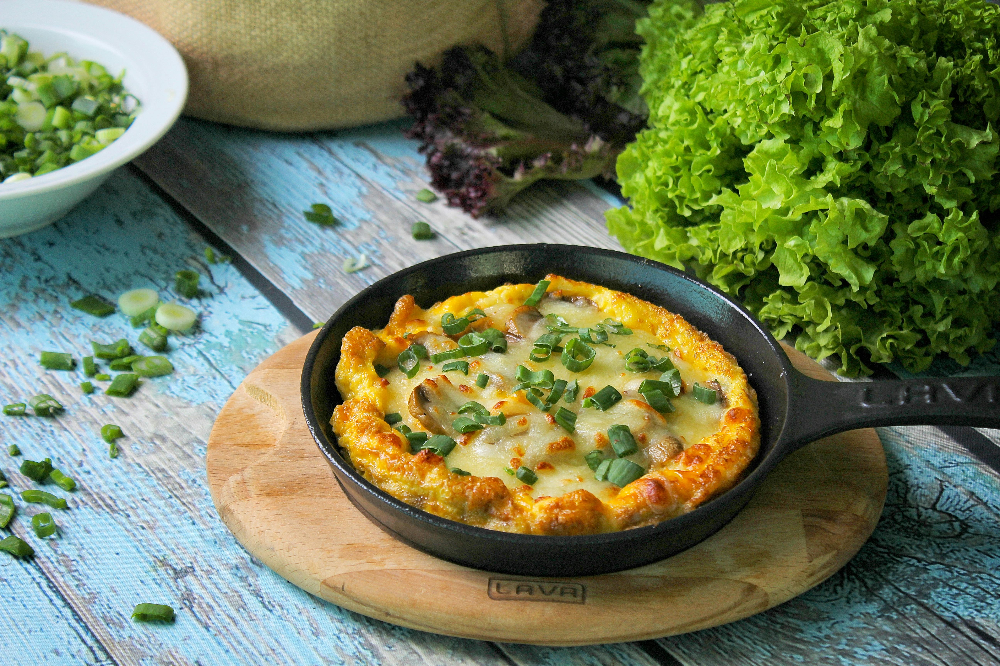

# Frittata

*Italian flat omelette: eggs and whatever vegetables, herbs and cheese the fridge offers, started on the hob and finished under the grill. Eats hot, warm or cold. The oldest leftover-redemption dish in Italian cooking.*

**Serves:** 4-6

**Prep Time:** 10 minutes

**Cook Time:** 15 minutes

## Overview
Vegetables (spinach, courgette, peas — anything) cook in an oven-proof pan with onion. Beaten eggs with parmesan, herbs and seasoning pour over; the bottom sets on the hob, the top finishes under a hot grill until just puffed.

## Ingredients

- 2 tablespoons olive oil
- 1 onion (sliced)
- 1 small courgette (cubed) or other vegetables (peas, asparagus, leftover potatoes, etc.)
- 200 g spinach
- 8 large eggs
- 50 g parmesan or pecorino (grated)
- 100 g feta or goat cheese (crumbled, optional)
- A small bunch of fresh herbs (parsley, chives, basil, dill)
- Salt and freshly ground black pepper
- A grating of nutmeg

## Method

### Stage 1 – Vegetables
1. Heat the grill on its highest setting.
1. Heat the oil in a 25 cm oven-proof non-stick or cast-iron pan over medium heat.
1. Cook the onion for 5 minutes.
1. Add the courgette; cook 4-5 minutes.
1. Add the spinach in handfuls; let it wilt down.
1. Spread the vegetables evenly across the pan.

### Stage 2 – Egg mixture
1. Whisk the eggs in a bowl with the parmesan, half the herbs, salt, pepper and nutmeg.

### Stage 3 – Cook
1. Pour the egg mixture into the pan over the vegetables.
1. Scatter feta on top.
1. Cook on the hob over medium-low heat for 5-6 minutes until the bottom is set and the sides are firm but the centre is still wobbly.
1. Slide the pan under the hot grill for 3-4 minutes until the top is golden and the centre is just set.

### Stage 4 – Rest and serve
1. Rest the pan on the hob for 2-3 minutes.
1. Slide onto a board; cut into wedges.
1. Scatter remaining herbs.

## Notes
- **Oven-proof pan:** No plastic handles. Cast iron or all-metal non-stick.
- **Don't overcook:** A puffy, just-set centre stays moist; an over-baked frittata goes dry. Pull when slightly wobbly.
- **Whatever vegetables:** Asparagus, leftover roast potatoes, peas, broccoli, mushrooms — frittata is forgiving.

## Storage
- Eats hot, warm or cold. Keeps 3 days refrigerated; great in a packed lunch.
