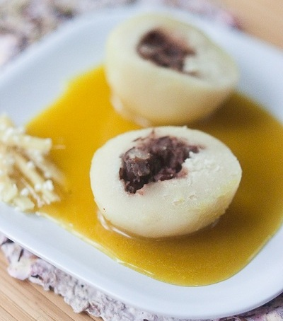

# Banana sauce

*With its Caribbean flavour, this simple sauce is a perfect accompaniment to a dish of exotic fruits*

**Serves:** 8

## Overview
A tropical, creamy dessert sauce featuring caramelized sugar, velvety banana purée, and a hint of rum. Perfect drizzled over fruit compotes, ice cream, or pastries. The balance of sweetness, slight bitterness from caramel, and warmth of rum makes this sauce unexpectedly sophisticated despite its simplicity.

## Ingredients
- 2 medium bananas
- juice of 1 lemon
- 350 grams caster sugar
- 200 grams crème fraîche
- 100 ml white rum
- 150 ml milk

## Method
1. Peel the bananas, slice into rounds and immediately toss with the lemon juice to stop them discolouring.
1. Dissolve the sugar in 150 ml water in a heavy-based saucepan over a low heat, then bring to the boil and cook to a pale caramel. 
1. Take off the heat and add all the other ingredients, mixing gently with a spatula.
1. Return the pan to a medium heat and cook at a gentle bubble for about 20 minutes, delicately stirring the mixture frequently.
1. Leave the sauce to cool slightly, then transfer to a blender and purée for 1 minute. 
1. Pass the sauce through a fine-meshed conical sieve into a bowl and keep it in the fridge until ready to use.

## Notes
- **Lemon juice:** Essential to prevent oxidation and browning of banana purée. Add immediately after peeling.
- **Caramel color:** Cook the sugar to pale caramel, not brown, to maintain the sauce's vibrant hue.
- **Straining:** Pressing through a sieve removes any banana fibers for a smooth, refined texture.
- **Rum quality:** Use dark rum for deeper, more complex tropical flavors.

## Serving
Serve with: Exotic fruit medley, poached pears, vanilla ice cream, or pastries
Drizzle on: Warm plates for an elegant plating presentation

## Storage
- Keeps 3-4 days refrigerated in an airtight container
- Does not freeze well due to banana texture degradation
- Serve chilled or at room temperature
- Flavor increases and mellows during storage