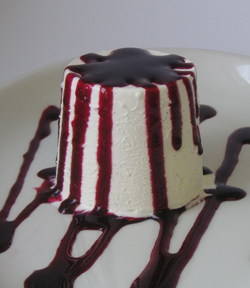

# Blackberry coulis

*Delicious served with poached pears, parfaits, ice bombes or ice creams.*

**Serves:** 6 - 8

## Overview
A jewel-toned berry sauce featuring fresh blackberries blended with Kirsch and light sugar syrup. The tart, fruity coulis is elegant enough for fine dining yet simple enough for everyday desserts. Perfect for creating stunning plated presentations with vibrant color and bright berry flavor.

## Ingredients
- 450 grams blackberries
- 150 ml [sirop a sorbet](../../base-ingredients/syrup/sirop-a-sorbet.md)
- 50 ml Kirsch
- juice of half a lemon

## Method
1. Place all the ingredients into a blender and purée for about 1 minute until it forms a purée, then rub through a fine-meshed conical sieve.

## Notes
- **Berry quality:** Use ripe, in-season blackberries for maximum flavor and beautiful color.
- **Kirsch:** This clear brandy adds floral brightness; substitute with raspberry liqueur if preferred.
- **Sirop à sorbet:** Essential for proper consistency. If unavailable, use equal parts sugar and water syrup.
- **Straining:** Push the coulis through the sieve with the back of a spoon to extract all flavor while leaving seeds behind.

## Serving
Serve with: Poached pears, vanilla ice cream, parfaits, or as a plating element on dessert plates
Drizzle on: White plates for striking color contrast and elegant presentation

## Storage
- Keeps 4-5 days refrigerated in an airtight container
- Freezes well up to 2 months
- Best served chilled
- Color and flavor may intensify slightly during storage