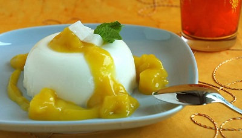

# Mango coulis with saffron

*This fragrant coulis can be served topped with soft poached meringues, as a variation of the classic floating islands, which uses a base of crème anglaise.*

**Serves:** 6

## Overview
A luxurious, silky mango sauce infused with delicate saffron and brightened by fresh lemon. The golden color and exotic flavor pair beautifully with light desserts like meringues, ice cream, or fruit salads. Elegant enough for fine dining yet simple enough for everyday elegance.

## Ingredients
- 250 grams mango (diced)
- juice of 1/2 a lemon
- 250 ml [sirop a sorbet](../../base-ingredients/syrup/sirop-a-sorbet.md)
- pinch saffron threads

## Method
1. Put the diced mango into a blender with the lemon juice and all but 2 tablespoons of the sirop a sorbet. 
1. Purée the mixture for 2 minutes in a blender, then strain the purée through a fine-meshed conical sieve into a bowl.
1. In a small saucepan, warm the reserved syrup with the saffron threads, then leave to cool. 
1. When the syrup is cold, mix it into the mango coulis and chill until ready to serve. 

## Notes
- **Mango ripeness:** Use perfectly ripe, fragrant mangoes; unripe fruit produces dull, flat flavor.
- **Saffron infusion:** The brief steeping in syrup extracts color and elegance without overpowering the delicate mango.
- **Straining:** Removes any fibrous bits for a silky, refined texture.
- **Make-ahead:** Coulis improves when chilled for several hours as flavors meld.

## Serving
Serve with: Soft poached meringues, vanilla ice cream, fruit salads, or panna cotta
Temperature: Well chilled
Garnish with: A few saffron threads or a mint leaf

## Storage
- Keeps 3-4 days refrigerated in an airtight container
- Does not freeze well due to mango texture degradation
- Serve well chilled
- Flavour mellows as it sits; best after 2+ hours chilling 