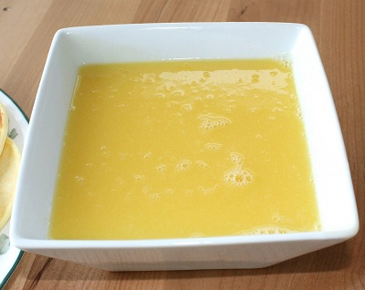

# Orange butter sauce

*A lovely rich, tangy sauce to serve with crêpes , a warm plum tart or a chocolate soufflé. A few drops of Grand Marnier can be added for extra warmth.*

**Serves:** 6

## Overview
A luxurious warm sauce combining fresh orange juice reduced to concentrate with silky butter. The result is glossy, bright, and intensely citrus, the perfect foil to rich desserts, chocolate, or delicate pastries. Restaurant-quality elegance in minutes.

## Ingredients
- juice of 6 oranges
- 100 grams icing sugar
- 125 grams butter (softened)

## Method
1. Strain the orange juice through a conical sieve into a heavy-based saucepan and add the icing sugar. 
1. Slowly bring to the boil and let bubble over a medium heat until reduced by half.
1. Turn off the heat and whisk in the softened butter, a little at a time. 
1. Serve the sauce at room temperature.

## Notes
- **Orange juice:** Use freshly squeezed juice from ripe oranges; bottled juice cannot replicate the brightness.
- **Reduction:** Cooking to half-volume concentrates flavor and creates the right consistency for whisking in butter.
- **Butter incorporation:** Remove from heat before whisking butter, too much heat will break the emulsion.
- **Grand Marnier:** Optional but highly recommended for warming spice and extra depth.

## Serving
Serve with: Crêpes, warm tarts, chocolate soufflés, or poached fruits
Drizzle on: Warm plates for best flavor delivery

## Storage
- Best served warm or at room temperature immediately
- Keeps 1-2 days refrigerated; reheat gently over low heat, whisking constantly
- Cannot be frozen as butter separates upon thawing
- Sauce will thicken as it cools; thin with a touch of orange juice if needed