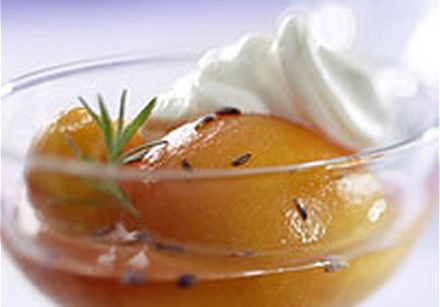

# Coulis of peaches with lavender honey

*This delectable sauce is superb served with slices of toasted brioche or with a panna cotta.*

**Serves:** 6

## Overview
A fragrant, silky peach sauce infused with floral lavender honey. The result is a sophisticated sauce that's naturally sweet yet refined, perfect for elegant plated desserts. The gentle poaching creates a smooth purée that's both comforting and impressive.

## Ingredients
- 4 very ripe peaches
- juice of 1 lemon
- 4 tablespoons lavender honey
- 1 flowering lavender sprig (optional)

## Method
1. Peel, halve and stone the peaches. 
1. Put them in a saucepan with the lemon juice, honey and 150 ml of water. 
1. Slowly bring to a simmer over a low heat and poach gently for 5 minutes. 
1. Add the lavender sprig, if using, and cook for a further 30 seconds.
1. Leave to cool for a few minutes, then transfer the contents of the pan to a blender and purée for 1 minute.
1. Pass the sauce through a fine-meshed conical sieve into a bowl and leave to cool completely. 
1. When cold, refrigerate until ready to use.

## Notes
- **Peach selection:** Use ripe, fragrant peaches at their seasonal peak for best flavor.
- **Lavender honey:** This specialty honey carries floral notes that pair perfectly with peaches. Use sparingly, it's potent.
- **Gentle poaching:** Low heat preserves the delicate peach flavor and creates a naturally silky texture.
- **Lavender sprig:** Fresh flowering sprigs add visual elegance; dried lavender can substitute if gentle on quantity.

## Serving
Serve with: Toasted brioche, panna cotta, vanilla ice cream, or as a plating element
Drizzle on: Light-colored plates for beautiful presentation

## Storage
- Keeps 3-4 days refrigerated in an airtight container
- Does not freeze well due to peach texture degradation
- Serve well chilled or at room temperature
- Flavor develops and mellows upon storage