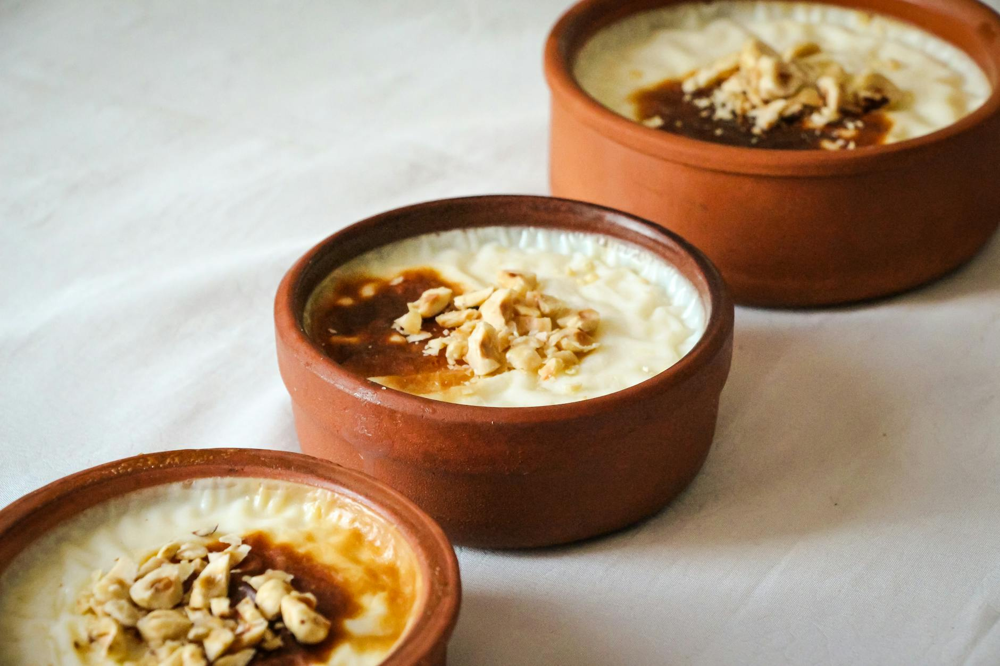

# Firni

*Afghan rice flour pudding: a smooth, custardy dessert thickened with finely-ground rice, scented with cardamom and rosewater, topped with crushed pistachios and almonds. Lighter and sweeter than its Persian cousin sholeh zard; eaten chilled in shallow bowls or at room temperature with tea.*

**Serves:** 6

**Prep Time:** 10 minutes

**Cook Time:** 30 minutes (plus 3 hours setting)

## Overview
Rice flour (very finely ground from soaked basmati, traditionally) is whisked into cold milk to a slurry. The rest of the milk warms with sugar; the slurry pours in; the mixture cooks slowly until thick and creamy. Cardamom and rosewater finish; the lot pours into shallow dishes to set. Crushed nuts on top.

## Ingredients

- 1.2 litres whole milk
- 100 g rice flour (or 100 g basmati ground in a high-speed blender)
- 200 g caster sugar
- 1 teaspoon ground cardamom
- 2 tablespoons rosewater
- ½ teaspoon vanilla extract (optional)
- A pinch of saffron (steeped in 2 tablespoons hot water 10 min, optional)

### Topping
- 50 g pistachios (chopped)
- 30 g flaked almonds
- 2 tablespoons desiccated coconut (optional)
- A few rose petals (optional)

## Method

### Stage 1 – Slurry
1. Whisk the rice flour with 200 ml of the cold milk until completely smooth.

### Stage 2 – Heat
1. Combine the remaining 1 litre of milk with the sugar in a heavy saucepan.
1. Heat over medium, stirring, until just beginning to simmer and the sugar dissolves.

### Stage 3 – Thicken
1. Whisk in the rice flour slurry steadily.
1. Reduce the heat to medium-low.
1. Cook 18-22 minutes, whisking constantly, until thickened to a thin custard.
1. The mixture should coat the back of a spoon and a finger drawn through should leave a clear path.

### Stage 4 – Flavour
1. Off the heat, stir in the cardamom, rosewater, vanilla and saffron-water if using.

### Stage 5 – Set
1. Pour into 6 shallow bowls or one wide platter.
1. Cool 30 minutes; refrigerate at least 3 hours, ideally overnight.

### Stage 6 – Decorate and serve
1. Just before serving, top with chopped pistachios, almonds, coconut and rose petals.
1. Serve cold or at room temperature.

## Notes
- **Whisk constantly:** Rice flour catches on the bottom of the pan if you stop whisking. Stir steadily for the full 20 minutes.
- **Strain if needed:** Any small lumps strain out through a fine sieve before pouring into bowls — gives a silkier set.
- **Don't over-thicken:** Pull off the heat when the consistency is "thin custard" — it sets considerably as it chills.

## Storage
- Keeps 4 days refrigerated; eats well cold.
