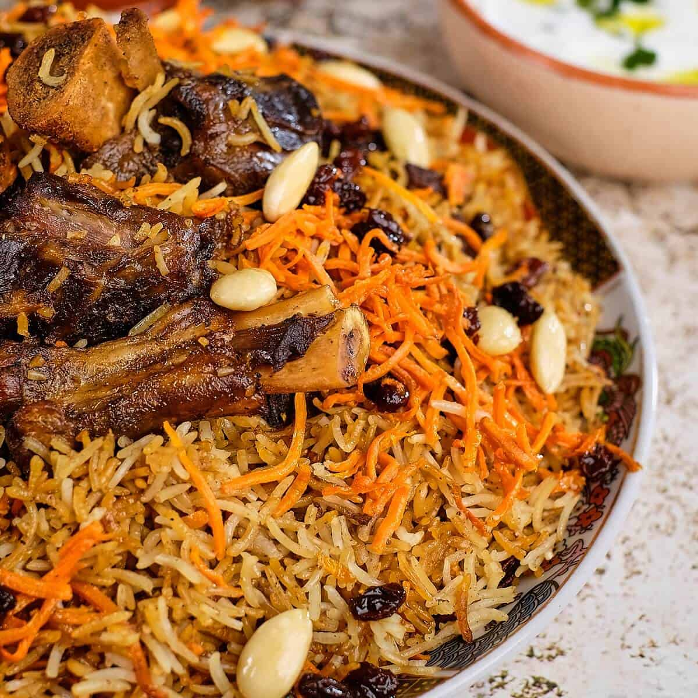

# Kabuli Pulao

*Afghanistan's national dish: long-grain basmati rice cooked with tender lamb, topped with sweet-cooked carrots, raisins and toasted nuts. The rice is amber from the lamb stock and a little caramel; the carrots are soft and golden; the whole thing is celebratory food. The protein is buried in the rice; the topping crowns it.*

**Serves:** 6

**Prep Time:** 30 minutes

**Cook Time:** 2 hours

## Overview
Lamb shoulder browns then braises in spiced stock until tender — the stock is the base for the rice. Carrots cut into matchsticks fry slowly in butter and sugar until golden and soft. Raisins plump in butter. Rice parboils in salted water, then layers in the cooking pot with lamb on the bottom, rice piled on top, drizzles of stock, and the lid clamped on for the steam-cook.

## Ingredients

### Lamb
- 1 kg lamb shoulder (cut into 6 cm chunks, bone-in if possible)
- 2 tablespoons vegetable oil
- 2 large onions (sliced)
- 6 garlic cloves (crushed)
- 2 cm ginger (grated)
- 4 cardamom pods (bashed)
- 1 cinnamon stick
- 1 teaspoon ground cumin
- 1 teaspoon ground coriander
- 1 teaspoon black pepper
- 1.2 litres water
- 2 teaspoons salt

### Carrots and raisins
- 4 large carrots (julienned into matchsticks)
- 50 g unsalted butter
- 4 tablespoons caster sugar
- 100 g raisins (or sultanas)
- ¼ teaspoon ground cardamom

### Rice
- 600 g basmati rice (rinsed; soaked 30 min)
- 2 tablespoons vegetable oil
- 1 teaspoon ground cumin
- 1 tablespoon caramelised sugar (1 tbsp sugar + 1 tbsp water cooked to deep amber, optional but classic)

### Topping
- 50 g flaked almonds (toasted)
- 50 g shelled pistachios (chopped)

## Method

### Stage 1 – Cook the lamb
1. Heat the oil in a large heavy pot over medium-high heat.
1. Brown the lamb in batches; lift out.
1. Add the onions; cook 8-10 minutes until golden.
1. Add the garlic, ginger, cardamom, cinnamon, cumin, coriander and black pepper; cook 1 minute.
1. Return the lamb; pour in the water; add salt.
1. Bring to the boil; reduce to a simmer; cover; cook 1 hour - 1¼ until the lamb is fork-tender.
1. Lift the lamb out; strain the stock; reserve both. You should have about 1 litre of stock — top up with hot water if less.

### Stage 2 – Carrots and raisins
1. Melt the butter in a wide pan over medium heat.
1. Add the carrots and sugar; cook 8-10 minutes, stirring, until soft and golden (not browned).
1. Add the raisins and cardamom; cook 2 minutes; remove half for the topping. Reserve the rest.

### Stage 3 – Parboil rice
1. Bring 2 litres of water to the boil with 1 tablespoon salt.
1. Drain the rice; tip in; cook 5-6 minutes — al dente; drain.

### Stage 4 – Layer
1. Wipe out the lamb pot; heat the oil over medium heat.
1. Add the cumin and the caramelised sugar (if using); stir 30 seconds.
1. Place the lamb pieces on the bottom of the pot.
1. Add half the carrot-raisin mixture over.
1. Pile the parboiled rice on top.
1. Pour the reserved lamb stock over (the rice should be just-covered or a bit less).

### Stage 5 – Steam
1. Cover with a tea towel under the lid (absorbs steam).
1. Cook over medium-high heat 5 minutes until simmering.
1. Reduce to lowest heat; cook 25-30 minutes.
1. Off the heat, rest covered 10 minutes.

### Stage 6 – Plate
1. Spoon the rice onto a wide platter, fluffing as you go.
1. Lift the lamb pieces from the bottom and arrange on top.
1. Top with the remaining carrot-raisin mixture.
1. Scatter toasted almonds and pistachios.

### Stage 7 – Serve
1. Serve with yogurt and a simple cucumber-tomato salad on the side.

## Notes
- **Carrots cooked separately, sweet:** The carrots in Kabuli pulao are nearly candied — soft, sweet, golden. Don't skip the sugar or under-cook.
- **Tea towel under lid:** Standard South-Central Asian rice technique; gives drier, fluffier grains and helps the bottom crisp.
- **Caramelised sugar for colour:** Optional but traditional. Cook sugar with water to deep amber; this colours the rice the proper Kabuli amber.

## Storage
- Keeps 3 days refrigerated; reheat covered with a splash of water.
- Freezes 3 months.
