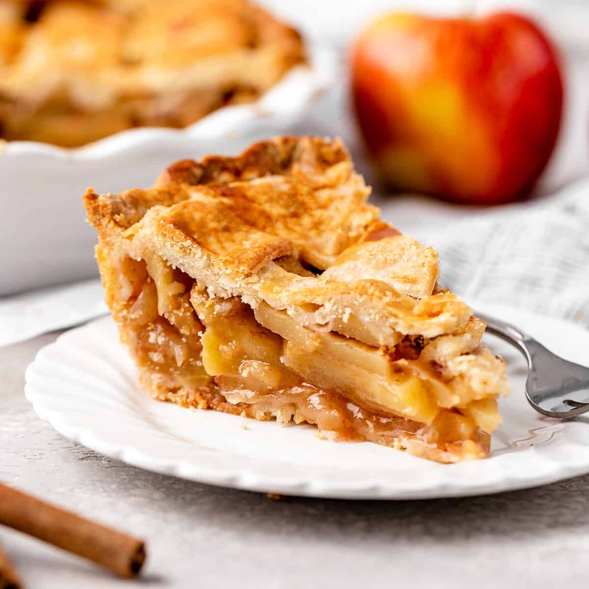

# Apple Pie

*The American apple pie: double-crust, made-from-scratch, cooked-down apple filling spiced with cinnamon and a touch of nutmeg, sealed in flaky butter pastry, the top vented or lattice-cut. The crust shatters in shards; the filling is just-set, neither runny nor solid. Eats warm with a scoop of vanilla ice cream.*

**Serves:** 8

**Prep Time:** 1 hour (plus 1 hour chilling)

**Cook Time:** 1 hour

## Overview
All-butter pie pastry rests in two discs. The filling — a mix of apples (Bramleys for tartness and break-down, Granny Smith and Braeburn for hold), brown sugar, cinnamon, lemon, cornflour — pre-cooks slightly to release water and keep the crust from going soggy. Bottom crust lines a pie dish; filling piles in tall (it sinks); top crust seals on, vented. Egg-washed and sugar-dusted; baked until deep gold.

## Ingredients

### Pastry
- 400 g plain flour
- 1 tablespoon caster sugar
- 1 teaspoon salt
- 250 g cold unsalted butter (cubed)
- 6-8 tablespoons ice water

### Filling
- 1.4 kg mixed apples (Bramley + Granny Smith + Braeburn; peeled, cored, sliced 8 mm)
- 150 g light brown sugar
- 50 g caster sugar
- 3 tablespoons cornflour
- 2 teaspoons ground cinnamon
- ½ teaspoon ground nutmeg
- ¼ teaspoon ground allspice
- ¼ teaspoon salt
- Juice of 1 lemon
- 30 g unsalted butter (cubed)

### Glaze
- 1 large egg (beaten with 1 tablespoon water)
- 2 tablespoons demerara or coarse sugar

## Method

### Stage 1 – Pastry
1. Whisk the flour, sugar and salt in a wide bowl.
1. Rub in the cold butter until roughly the size of small peas (some larger flakes are good — they make the crust flaky).
1. Add the ice water a tablespoon at a time, mixing with a knife, until the dough just comes together.
1. Divide into 2 unequal discs (slightly larger for the bottom).
1. Wrap in cling film; refrigerate 1 hour.

### Stage 2 – Filling
1. Combine the apples, both sugars, cornflour, spices, salt and lemon juice in a wide pan.
1. Cook over medium heat 8-10 minutes, stirring, until the apples release liquid and it thickens slightly.
1. Cool fully — warm filling melts the bottom crust.

### Stage 3 – Assemble
1. Heat the oven to 200°C (180°C fan).
1. Roll the larger disc to a 32 cm round; line a 23 cm pie dish, leaving overhang.
1. Pile in the cooled filling; mound it slightly higher in the centre (it'll sink).
1. Dot with the cubed butter.
1. Roll the smaller disc to a 28 cm round; lay over the filling.
1. Trim both crusts to a 1.5 cm overhang; tuck under itself; crimp the edge.
1. Cut 4-5 vents in the top with a sharp knife (or weave a lattice).

### Stage 4 – Glaze
1. Brush the top with the egg wash; sprinkle generously with demerara sugar.

### Stage 5 – Bake
1. Place the pie on a foil-lined baking tray (catches drips).
1. Bake 55-65 minutes until the crust is deep golden and you can see filling bubbling through the vents.
1. If the edge browns too fast, cover with foil after 30 minutes.

### Stage 6 – Cool
1. Cool at least 3 hours before slicing — this is non-negotiable. Hot pie is filling soup; the cornflour needs time to set.

### Stage 7 – Serve
1. Cut wedges; serve warm with vanilla ice cream.

## Notes
- **Cold butter, cold water:** Pastry-making rule. Warm butter melts into the flour instead of staying in flakes; the result is dense, not flaky.
- **Pre-cook the filling:** Raw apples release a lot of water during baking; uncooked filling makes a soggy bottom and a runny pie. The brief cook drives water off and starts the cornflour thickening.
- **Cool before slicing:** A pie cut hot oozes everywhere. 3-4 hours minimum at room temperature lets the filling set.

## Storage
- Keeps 3 days at room temperature, covered loosely. Day 2 is arguably the best — the filling has fully set.
- Freezes 3 months.
