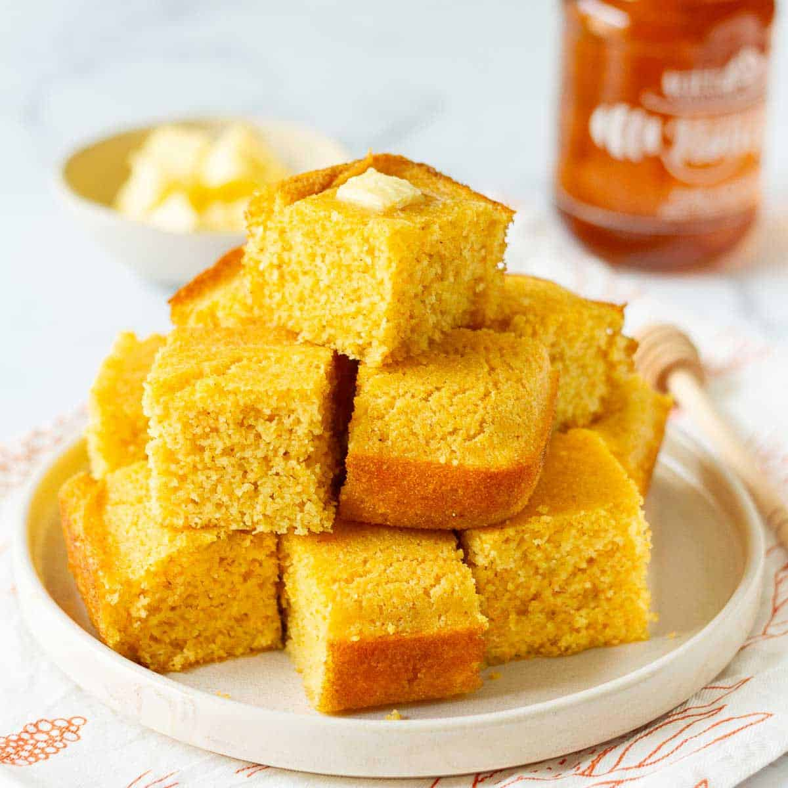

# Cornbread

*Skillet cornbread: a hot, well-buttered cast-iron pan with a crisp golden crust on the bottom, a slightly sweet (or not, depending on your geography) crumb above. The Southern argument runs hot — Northerners want sugar, Southerners traditionally don't. This recipe sits in the middle. Eats with chilli, fried chicken, greens; or just butter and honey.*

**Serves:** 8

**Prep Time:** 10 minutes

**Cook Time:** 25 minutes

## Overview
A 25 cm cast-iron skillet preheats in the hot oven with a generous knob of butter — the butter browns slightly while the pan heats. The batter is fast: cornmeal, flour, sugar, baking powder, salt, plus buttermilk, eggs and melted butter. The hot pan gets the batter; the cornmeal sears immediately on contact, giving the crisp golden crust. 25 minutes; tip out and slice.

## Ingredients

- 200 g coarse yellow cornmeal (or polenta)
- 150 g plain flour
- 60 g caster sugar (reduce to 1 tablespoon for the Southern style)
- 1 tablespoon baking powder
- 1 teaspoon salt
- ½ teaspoon bicarbonate of soda
- 350 ml buttermilk
- 2 large eggs
- 80 g unsalted butter (melted)
- 50 g unsalted butter (extra, for the pan)

## Method

### Stage 1 – Heat the pan
1. Heat the oven to 200°C (180°C fan).
1. Place the 50 g of butter in a 25 cm cast-iron skillet (or 23 cm cake tin).
1. Set in the oven 5 minutes — the butter should melt and just start to colour.

### Stage 2 – Dry mix
1. Whisk the cornmeal, flour, sugar, baking powder, salt and bicarb in a large bowl.

### Stage 3 – Wet mix
1. Whisk the buttermilk, eggs and 80 g melted butter in a separate bowl.

### Stage 4 – Combine
1. Pour the wet mixture into the dry; whisk until just combined (some lumps OK; don't overmix).

### Stage 5 – Bake
1. Pull the hot skillet from the oven.
1. Swirl the melted butter to coat the bottom and sides.
1. Pour any excess into the batter; whisk in.
1. Pour the batter into the hot skillet — listen for the sizzle.
1. Bake 22-26 minutes until deep golden on top and a skewer in the centre comes out clean.

### Stage 6 – Rest and serve
1. Cool 5 minutes in the pan.
1. Run a knife around the edge; tip out onto a board.
1. Cut into wedges. Serve warm with butter.

## Notes
- **Hot skillet, hot pan:** The bottom crust depends on the batter hitting hot buttered iron. Cold skillet cornbread is just cake.
- **Buttermilk:** Real buttermilk tenderises and tangs the bread. If using milk + lemon juice as a substitute, let it sit 5 minutes.
- **Sweetness is regional:** 60 g sugar is moderate. Reduce for a Southern, savoury bread; double for sweet, cake-like cornbread.

## Storage
- Best fresh and warm. Keeps 2 days at room temperature; reheat at 180°C for 5 minutes to revive.
- Stale cornbread crumbles into stuffings or turns into cornbread pudding.
