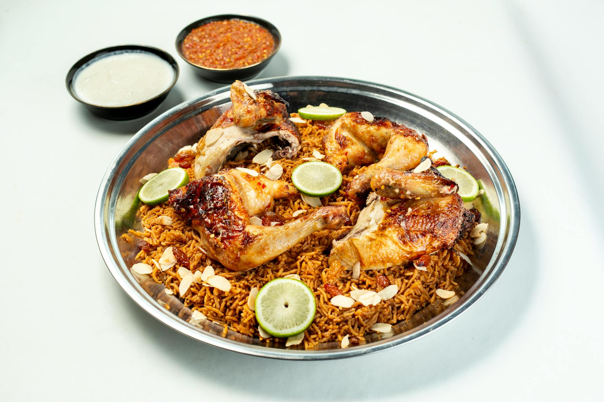

# Kabsa

*Saudi Arabia's national dish: long-grain rice cooked in spiced tomato stock with chicken or lamb, scented with dried lime, cardamom and cinnamon. The protein lifts onto a mound of rice; toasted almonds and raisins scatter on top; a punchy salsa of tomato, chilli and lime serves alongside. Eaten communally from a single platter.*

**Serves:** 6

**Prep Time:** 20 minutes

**Cook Time:** 1¼ hours

## Overview
Chicken pieces or lamb shoulder brown; onions, garlic, ginger and tomato build the base; baharat (or kabsa spice mix) blooms; tomato puree and stock loosen. The protein simmers until tender. Rice cooks in the same liquid, absorbing all the flavour. Almonds toast in butter; raisins plump. A fresh salsa of tomato, onion, chilli and parsley balances the richness.

## Ingredients

### Protein
- 1.2 kg chicken pieces (bone-in thighs and drumsticks; or lamb shoulder cubed)
- 2 tablespoons vegetable oil
- 1 tablespoon salt

### Stock base
- 2 large onions (chopped)
- 4 garlic cloves (crushed)
- 2 cm ginger (grated)
- 2 tablespoons tomato paste
- 2 medium tomatoes (chopped) or 1 x 400 g tin
- 2 dried limes (loomi; pierced)
- 1 cinnamon stick
- 6 cardamom pods (bashed)
- 4 cloves
- 2 bay leaves
- 1 tablespoon kabsa spice mix (or baharat)
- 1 teaspoon ground turmeric
- 1.2 litres hot water

### Rice
- 600 g basmati rice (rinsed, soaked 30 min)

### Topping
- 50 g flaked almonds
- 30 g pine nuts
- 50 g raisins (soaked 10 min)
- 30 g unsalted butter

### Daqqus (salsa) — to serve
- 4 tomatoes (chopped)
- 1 small onion (finely chopped)
- 2 long green chillies (or jalapeños; chopped)
- 4 garlic cloves (crushed)
- Juice of 1 lemon
- A small bunch coriander (chopped)
- 1 teaspoon salt

## Method

### Stage 1 – Brown the chicken
1. Heat the oil in a large heavy pot over medium-high heat.
1. Salt the chicken; brown 4-5 minutes per side; lift out.

### Stage 2 – Build the stock
1. Reduce the heat to medium.
1. Cook the onions in the rendered fat 8 minutes.
1. Add the garlic and ginger; cook 1 minute.
1. Stir in the tomato paste, tomatoes, dried limes, cinnamon, cardamom, cloves, bay, spice mix and turmeric.
1. Cook 4-5 minutes — the mixture should darken.
1. Pour in the hot water; return the chicken.

### Stage 3 – Simmer
1. Bring to the boil; reduce to a steady simmer.
1. Cover loosely; cook 30 minutes until the chicken is tender.
1. Lift the chicken out; place on a tray; brush with a little oil and place under a hot grill or in a 220°C oven for 10 minutes to crisp the skin while the rice cooks.

### Stage 4 – Cook the rice
1. Drain the soaked rice.
1. Strain the cooking liquid; you should have about 1.2 litres — top up with hot water if less.
1. Return the strained liquid to the pot; add the rice.
1. Bring to the boil; reduce to lowest heat; cover; cook 18-20 minutes.
1. Off the heat, rest covered 10 minutes.

### Stage 5 – Toast nuts and plump raisins
1. Cook the almonds and pine nuts in the butter over medium heat until golden.
1. Add the drained raisins; toss for 30 seconds; remove.

### Stage 6 – Daqqus
1. Combine all the salsa ingredients in a bowl. Rest 10 minutes.

### Stage 7 – Serve
1. Mound the rice on a wide platter.
1. Place the crispy chicken on top.
1. Scatter the nuts and raisins.
1. Serve with daqqus on the side; the diners spoon it over their portion.

## Notes
- **Kabsa spice mix:** A blend of black pepper, cardamom, coriander, cumin, cloves, dried lime and cinnamon. Pre-mixed jars are sold at Middle Eastern grocers; otherwise baharat is the closest substitute.
- **Dried lime (loomi):** Black or yellow whole dried limes pierce to release their flavour. Lemon juice is a poor substitute.
- **Crisp the chicken:** Saudi kabsa serves chicken with crisp skin. Hot grill or oven blast after the simmer; otherwise the skin stays soggy.

## Storage
- Keeps 3 days refrigerated; reheat covered with a splash of water.
- Freezes 3 months.
