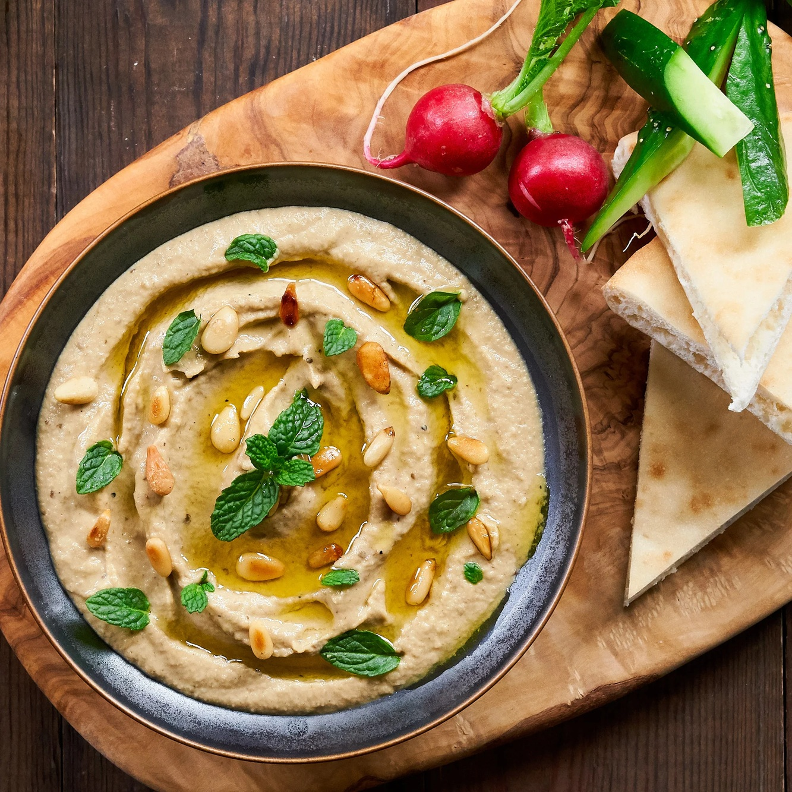

# Mutabbal

*Smoky aubergine dip, similar to baba ganoush but richer — yogurt joins the tahini, giving a creamier, slightly tart finish. The aubergines must char over flame for the proper smoky depth. Eats with warm flatbread, alongside meze, or smeared under grilled lamb.*

**Serves:** 4-6 as a side or starter

**Prep Time:** 15 minutes

**Cook Time:** 15 minutes

## Overview
Aubergines char whole over a gas flame until completely soft and the skins blackened. Cooled, peeled, drained. The flesh chops or mashes — never blends; texture matters. Tahini, yogurt, lemon juice, garlic and salt fold in. A pool of olive oil and a sprinkle of pomegranate seeds finish.

## Ingredients

- 3 large aubergines (around 1.2 kg total)
- 100 g tahini (well-stirred)
- 100 g plain yogurt (Greek-style)
- 4 garlic cloves (crushed to paste with salt)
- Juice of 1 lemon (or to taste)
- 1 teaspoon salt
- ½ teaspoon ground cumin
- A pinch of cayenne or Aleppo pepper
- 4 tablespoons extra-virgin olive oil

### To serve
- 2 tablespoons pomegranate seeds
- A small handful of flat-leaf parsley (chopped)
- A pinch of sumac
- Warm flatbread

## Method

### Stage 1 – Char
1. Place the aubergines whole directly on a gas flame; turn every couple of minutes.
1. Char 10-15 minutes until the skins are blackened all over and the aubergines feel completely soft and collapsed.
1. Or roast at 220°C for 40-45 minutes — less smoky but workable.
1. Cool slightly until handleable.

### Stage 2 – Drain
1. Peel off the blackened skins; discard.
1. Place the flesh in a colander; weight with a plate; rest 15 minutes — this drains excess water that would make the dip soggy.

### Stage 3 – Combine
1. Chop the drained flesh roughly with a knife (not a blender).
1. Tip into a bowl with the tahini, yogurt, garlic, lemon juice, salt, cumin and cayenne.
1. Stir thoroughly with a fork; the texture should be coarse but cohesive.
1. Taste; adjust lemon and salt.

### Stage 4 – Serve
1. Spread on a flat plate; create a swirl with the back of a spoon.
1. Drizzle generously with olive oil — the oil pool should sit in the swirl.
1. Top with pomegranate seeds, parsley and sumac.
1. Serve with warm flatbread.

## Notes
- **Char over flame for the smoke:** This is the difference between mutabbal and any other aubergine dip. Open windows; turn often.
- **Drain properly:** Wet aubergine flesh dilutes the tahini and yogurt. The 15-minute drain is non-negotiable.
- **Don't blend:** A food processor turns mutabbal into baby food. Chop with a knife or mash with a fork for proper texture.

## Storage
- Keeps 3 days refrigerated; the flavour deepens. Bring to room temperature before serving.
