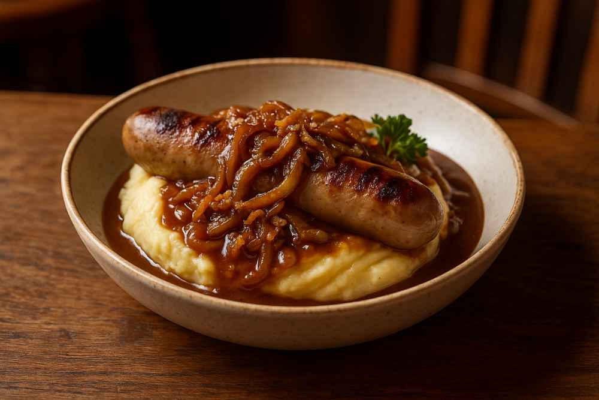

# Bangers and Mash

*Pork sausages with buttery mash and slow-cooked onion gravy. The British pub plate that costs nothing, takes thirty minutes, and tastes like home cooking. Use the best sausages you can find; they're 80% of the dish.*

**Serves:** 4

**Prep Time:** 10 minutes

**Cook Time:** 35 minutes

## Overview
Sausages slow-pan-fried so the skins blister and the fat renders, served on top of a soft butter-and-milk mash, smothered in dark onion gravy with mustard and thyme.

## Ingredients

### Sausages
- 8 good-quality pork sausages (Cumberland, Lincolnshire or similar)
- 1 tablespoon vegetable oil

### Mash
- 1 kg floury potatoes (Maris Piper), peeled and cubed
- 75 g unsalted butter
- 100 ml whole milk
- Salt and freshly ground black pepper

### Onion gravy
- 2 tablespoons unsalted butter
- 3 large onions (thinly sliced)
- 1 teaspoon caster sugar
- 1 tablespoon plain flour
- 500 ml beef stock
- 1 tablespoon Worcestershire sauce
- 1 teaspoon Dijon mustard
- 1 teaspoon fresh thyme leaves
- Salt and freshly ground black pepper

## Method

### Stage 1 – Onion gravy
1. Melt the butter in a heavy pan over medium-low heat.
1. Add the onions and a pinch of salt. Cook gently for 20 minutes, stirring often, until deep golden brown. Add the sugar in the last 5 minutes.
1. Stir in the flour and cook 1 minute.
1. Pour in the stock gradually, whisking until smooth. Add the Worcestershire, mustard and thyme.
1. Simmer 8-10 minutes until thickened. Season; keep warm.

### Stage 2 – Mash
1. Boil the potatoes in well-salted water for 15-18 minutes until tender.
1. Drain, return to the hot pan, steam dry for 1 minute.
1. Mash with the butter and warm milk until smooth. Season.

### Stage 3 – Sausages
1. Heat the oil in a heavy frying pan over medium-low heat.
1. Add the sausages and cook for 15-20 minutes, turning frequently, until the skins are deep brown and the insides are cooked through (juices run clear when pierced).
1. Don't crank the heat; slow cooking gives even browning and prevents bursting.

### Stage 4 – Plate
1. Spoon mash into a low mound on each plate. Lean two sausages against it. Pour gravy generously over both.

## Notes
- **Cook sausages slow:** High heat splits the skins and sets the outside before the centre cooks. Medium-low for 15+ minutes is the move.
- **Onions need 20 minutes:** Rushed onions taste raw. The deep colour is where the gravy gets its sweetness.
- **Floury potatoes only:** Waxy potatoes mash gluey. Maris Piper or King Edward.

## Storage
- Mash keeps 2 days refrigerated; loosen with a splash of milk when reheating.
- Gravy keeps 3 days refrigerated, freezes 2 months.
- Sausages eat best the day they're cooked.
