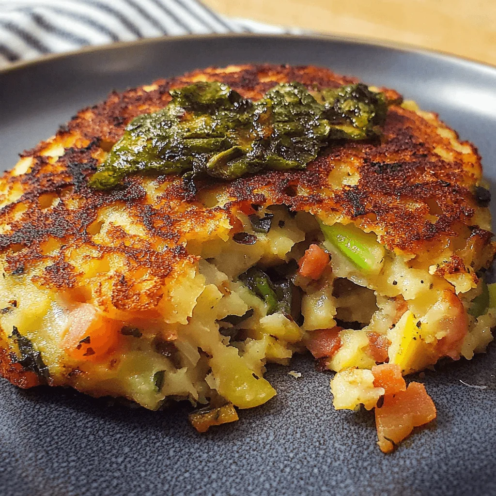

# Bubble and Squeak

*The Boxing Day classic: leftover roast potatoes and cabbage (or sprouts) fried hard in a pan until a deep crust forms beneath. Named for the noise the cabbage makes as it cooks. Better the second day than the first; the soul of British leftover cookery.*

**Serves:** 4

**Prep Time:** 10 minutes

**Cook Time:** 25 minutes

## Overview
Cooked potatoes and greens are roughly mashed together, pressed into a hot buttered pan, and left to brown undisturbed until a crust forms. Flipped (or turned in pieces), then served with a fried egg or alongside cold meats.

## Ingredients

- 600 g cooked potatoes (leftover roasties or boiled and mashed)
- 300 g cooked Brussels sprouts or cabbage (chopped)
- 1 onion (finely chopped)
- 50 g unsalted butter
- 2 tablespoons goose fat or beef dripping (optional, for extra crust)
- Salt and freshly ground black pepper
- A pinch of nutmeg (optional)

## Method

### Stage 1 – Combine
1. Melt half the butter in a wide non-stick or cast-iron pan over medium heat.
1. Cook the onion for 5 minutes until soft.
1. Roughly crush the potatoes with a fork (chunks are good; this isn't smooth mash).
1. Stir in the cooked greens and onions; season with salt, pepper and nutmeg.

### Stage 2 – Crisp
1. Wipe the pan, add the goose fat (or remaining butter) and heat over medium-high.
1. Tip the mixture in and press flat with a spatula to fill the pan.
1. DON'T STIR. Cook for 8-10 minutes until a deep brown crust forms beneath.
1. Flip in pieces (don't try to flip the whole thing), pressing flat again.
1. Cook another 6-8 minutes until the second side is also crisp.

### Stage 3 – Serve
1. Slide onto plates in rough wedges, crust uppermost.
1. Top with a fried egg, or serve alongside cold ham, sausages or smoked fish.

## Notes
- **Don't stir:** The crust is the entire point. Resist the urge to scrape and turn early; commit to the long, undisturbed sear.
- **Goose fat for the second fry:** Adds savoury depth and helps form a glossier crust. Beef dripping works.
- **Sprouts > cabbage:** Both are traditional but sprouts give a nuttier flavour and don't go soggy.

## Storage
- Best eaten freshly cooked; the crust softens within an hour.
- Keeps 2 days refrigerated; re-crisp in a hot pan with a knob of butter.
