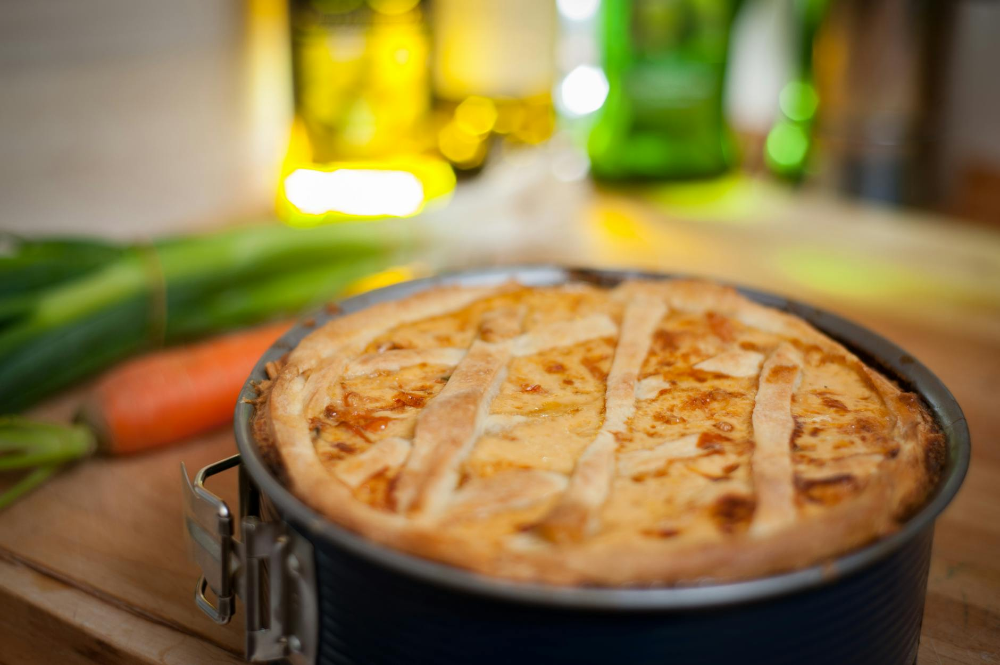

# Cheese and Onion Pie

*A Northern British staple: shortcrust pastry filled with sweated onions, mature cheddar and a small amount of mash to bind. Eats hot or cold; just as good in a packed lunch as on a Sunday plate.*

**Serves:** 6

**Prep Time:** 30 minutes

**Cook Time:** 50 minutes

## Overview
Onions cook slowly in butter until very soft and sweet. Mashed potato + grated cheddar binds the filling so it slices cleanly. Shortcrust pastry top and bottom; egg-washed and baked until deep golden.

## Ingredients

### Pastry
- 350 g plain flour
- 175 g cold unsalted butter (cubed) or half butter half lard
- ½ teaspoon salt
- 4-6 tablespoons cold water
- 1 egg (beaten, for glaze)

### Filling
- 4 large onions (thinly sliced)
- 50 g unsalted butter
- 300 g floury potatoes (peeled and cubed)
- 400 g mature cheddar (grated)
- 2 teaspoons English mustard
- 1 teaspoon fresh thyme leaves
- Salt and black pepper

## Method

### Stage 1 – Pastry
1. Rub the butter into the flour and salt until breadcrumbs.
1. Add cold water a tablespoon at a time, mixing with a knife until the dough just comes together.
1. Wrap and chill 30 minutes.

### Stage 2 – Onions
1. Melt the butter; cook the onions 20-25 minutes over medium-low heat with a pinch of salt until very soft, sweet and just starting to colour. Cool.

### Stage 3 – Mash
1. Boil the potatoes 12-15 minutes until tender; drain well; mash. Cool slightly.

### Stage 4 – Filling
1. Mix the onions, mash, cheese, mustard, thyme, salt and plenty of black pepper. Should be loose enough to spread, firm enough to hold shape.

### Stage 5 – Assemble and bake
1. Heat the oven to 200°C (180°C fan).
1. Roll out two thirds of the pastry; line a 23 cm pie dish.
1. Pile in the filling; level the top.
1. Roll out the rest of the pastry; lay over; trim and crimp the edges. Cut a steam hole in the middle.
1. Brush all over with beaten egg.
1. Bake 35-40 minutes until deep golden. If browning too fast, cover loosely with foil.
1. Rest 10 minutes before slicing.

## Notes
- **Onions need time:** Rushing the onions gives a sharp, raw flavour. 20+ minutes for that mellow sweetness.
- **Mature cheddar:** Mild cheddar tastes flat in this. The sharper the better.
- **Serve with:** Pickles, brown sauce, salad, or mushy peas (proper Lancashire).

## Storage
- Keeps 4 days refrigerated; reheat in a 180°C oven for 15 minutes to re-crisp the pastry.
- Freezes well baked or unbaked for 2 months.
