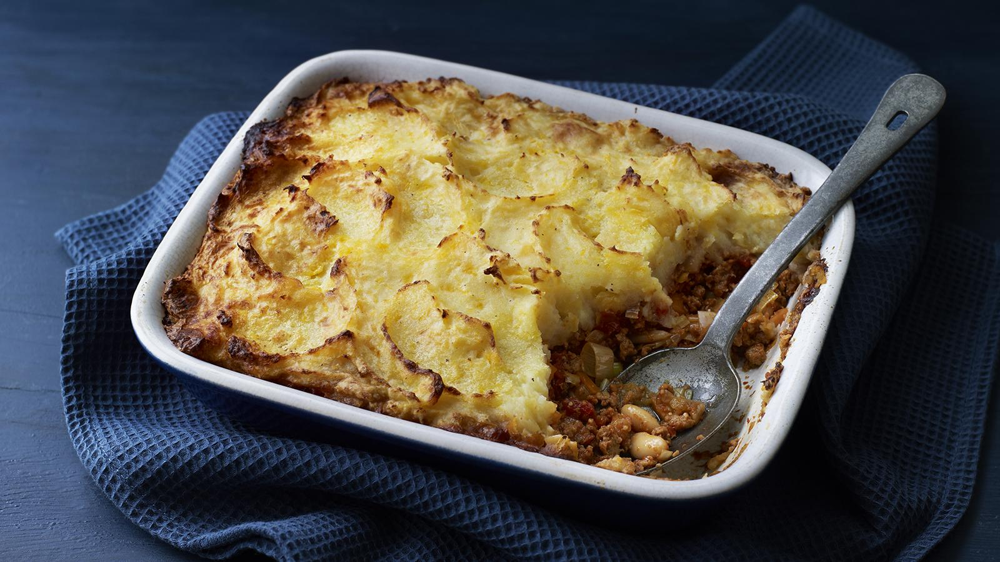

# Cottage Pie

*Beef mince's answer to shepherd's pie. The same comforting structure (rich savoury filling, mash on top, bake until crisp) but built around beef and a touch of red wine, giving a deeper, sweeter gravy. Named after the rural cottages where it traditionally fed working families.*

**Serves:** 4-6

**Prep Time:** 25 minutes

**Cook Time:** 1 hour

## Overview
Beef mince browned with aromatics, simmered into a thick red-wine gravy with tomato and Worcestershire, topped with cheddar mash and baked until the peaks crisp. Forgiving, freezer-friendly, and the textbook British family dinner.

## Ingredients

### Filling
- 1 tablespoon olive oil
- 500 g beef mince (15% fat)
- 1 onion (finely chopped)
- 2 carrots (finely diced)
- 2 celery sticks (finely diced)
- 2 garlic cloves (crushed)
- 2 tablespoons tomato purée
- 1 tablespoon Worcestershire sauce
- 100 ml red wine
- 300 ml beef stock
- 1 tablespoon plain flour
- 1 teaspoon fresh thyme leaves or ½ teaspoon dried
- 1 bay leaf
- Salt and freshly ground black pepper

### Topping
- 1 kg floury potatoes (Maris Piper or King Edward), peeled and cubed
- 75 g unsalted butter
- 75 ml whole milk
- 75 g mature cheddar (grated)
- Salt

## Method

### Stage 1 – Brown the beef
1. Heat the oil in a large heavy pan over medium-high heat.
1. Add the beef mince and brown thoroughly, breaking up clumps with a wooden spoon. Drain off most of the fat (keeping a tablespoon for the soffritto).
1. Scoop out and set aside.

### Stage 2 – Build the filling
1. Cook the onion, carrot and celery in the reserved fat over medium heat for 10 minutes until soft and slightly caramelised.
1. Add the garlic and cook another minute.
1. Stir in the tomato purée and cook for 1 minute, then deglaze with the red wine, scraping up the brown bits from the pan.
1. Sprinkle the flour over, stir for 30 seconds, then return the beef and add the Worcestershire, stock, thyme and bay leaf.
1. Bring to a simmer and cook uncovered for 25-30 minutes until thickened to a glossy gravy. Discard the bay leaf and taste for seasoning.

### Stage 3 – Make the mash
1. Boil the potatoes in well-salted water for 15-18 minutes until tender.
1. Drain, return to the hot pan, and steam off any residual moisture for a minute.
1. Mash with the butter and warm milk until smooth. Stir in half the cheese and season with salt.

### Stage 4 – Assemble and bake
1. Heat the oven to 200°C (180°C fan).
1. Spread the beef filling into a 25 x 20 cm baking dish.
1. Top with mash, smoothing then dragging a fork across the surface in long lines to create peaks.
1. Scatter the remaining cheese on top.
1. Bake for 25-30 minutes until the cheese is golden and the filling is bubbling at the edges.
1. Rest 5 minutes before serving.

## Notes
- **Mince with some fat:** 15% fat mince gives more flavour and a glossier gravy; very lean mince produces a flatter result.
- **Don't skip the wine:** The acidity cuts the richness and gives the gravy depth. Substitute extra stock + 1 tablespoon red wine vinegar if avoiding alcohol.
- **Beef vs lamb defines the dish:** Cottage = beef, shepherd's = lamb. Mixing the two is sometimes called "cottage shepherd's pie" in older British cookbooks.

## Storage
- Keeps 3 days refrigerated.
- Reheats at 180°C for 20-25 minutes (covered, then uncovered).
- Freezes well baked or unbaked for up to 3 months.
