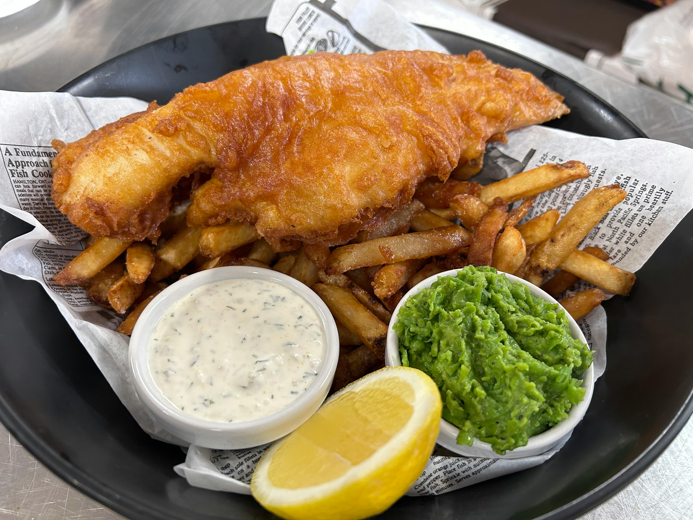

# Fish and Chips

*The British takeaway icon: cod or haddock in a beer-batter shell that shatters when you bite, alongside thick chunky chips fried twice for the crispest crust. Mushy peas and a wedge of lemon on the side; vinegar at the table.*

**Serves:** 4

**Prep Time:** 15 minutes

**Cook Time:** 30 minutes

## Overview
Floury Maris Piper potatoes are blanched, drained, and fried twice (once at low temperature to cook through, again at high temperature to crisp). The fish dunks in a cold beer batter and goes into the same hot oil. Mushy peas alongside.

## Ingredients

### Chips
- 1 kg Maris Piper potatoes (peeled, cut into 1.5 cm thick chips)
- Vegetable oil or beef dripping for deep-frying
- Sea salt

### Fish
- 4 skinless cod or haddock fillets (about 150 g each)
- 2 tablespoons plain flour (for dusting)
- Salt and pepper

### Beer batter
- 200 g plain flour
- 1 teaspoon baking powder
- ½ teaspoon salt
- 300 ml very cold beer (lager or a pale ale)

### Mushy peas
- 400 g frozen peas
- 30 g unsalted butter
- 2 tablespoons crème fraîche
- 1 tablespoon mint (chopped, optional)
- Salt and pepper

### To serve
- Lemon wedges
- Malt vinegar
- Tartare sauce

## Method

### Stage 1 – First fry of the chips
1. Soak the cut chips in cold water for 10 minutes, then drain and pat thoroughly dry.
1. Heat the oil to 130°C in a deep fryer or heavy pan.
1. Fry the chips in batches for 6-7 minutes until soft but uncoloured.
1. Drain on a wire rack. Let rest while you make the batter and peas.

### Stage 2 – Mushy peas
1. Cook the peas in boiling salted water for 3 minutes. Drain.
1. Mash with the butter and crème fraîche to a chunky purée. Stir in the mint and season.
1. Keep warm.

### Stage 3 – Batter the fish
1. Whisk the flour, baking powder and salt in a bowl.
1. Pour in the cold beer and whisk just until smooth (some lumps are fine; don't over-mix).
1. Pat the fish fillets dry, season, and dust lightly with the extra flour.

### Stage 4 – Second fry of the chips, then the fish
1. Increase the oil to 190°C.
1. Fry the chips again in batches for 2-3 minutes until deep golden and crisp. Drain, salt immediately, keep warm in a low oven.
1. Dip each fish fillet in the batter and lower carefully into the oil. Fry for 5-6 minutes until the batter is deep golden and the fish is cooked through (it'll feel firm).
1. Drain briefly on a wire rack and serve immediately.

## Notes
- **Twice-fried chips:** The first fry cooks the inside; the second crisps the outside. A single fry at high heat gives raw centres and burnt edges.
- **Beer must be cold:** Cold batter against hot oil causes the dramatic crisping. Room-temperature batter goes flabby.
- **Don't crowd the oil:** Dropping more than 2 fillets at a time drops the temperature; the batter absorbs oil instead of crisping.
- **Dripping is traditional:** Beef dripping gives the proper chippy flavour and crisper chips. Vegetable oil works.

## Storage
- Best eaten immediately. Fish + chips don't reheat well; the batter goes leathery and the chips soften.
- Mushy peas keep 2 days refrigerated.
