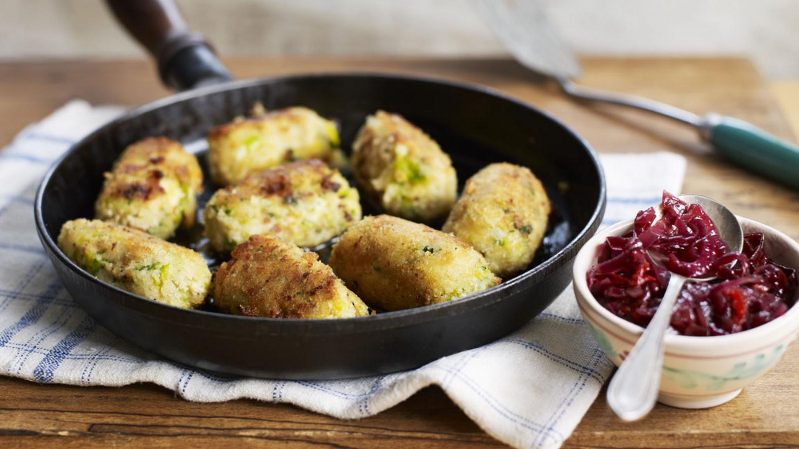

# Glamorgan Sausages

*Welsh leek-and-cheese sausages, breadcrumb-coated and fried until crisp. The "sausage" is a misnomer — there's no meat, no skin, just a tightly bound mixture of caerphilly, leeks and sage rolled and shallow-fried. A 19th-century Glamorgan classic.*

**Makes:** 8 sausages

**Prep Time:** 20 minutes (plus 30 min chilling)

**Cook Time:** 10 minutes

## Overview
Leeks soften in butter; mix with grated caerphilly (or mature cheddar), breadcrumbs, mustard, sage and beaten egg. The mixture chills to firm up, then rolls into sausage shapes, gets a flour-egg-breadcrumb coat and fries until golden.

## Ingredients

- 2 medium leeks (white and pale green only, very finely chopped)
- 30 g unsalted butter
- 200 g caerphilly (or mature cheddar; grated)
- 200 g fresh white breadcrumbs (plus 100 g for coating)
- 2 tablespoons fresh sage (chopped) or 1 teaspoon dried
- 1 tablespoon English mustard
- 2 teaspoons fresh thyme leaves
- 2 large eggs (1 for binding, 1 beaten for coating)
- 50 g plain flour (for coating)
- Salt and black pepper
- 4 tablespoons sunflower or vegetable oil (for frying)

## Method

### Stage 1 – Leeks
1. Melt the butter in a pan over medium-low heat; cook the leeks 8-10 minutes until soft and silky but not coloured. Cool fully.

### Stage 2 – Mix
1. Combine the cooled leeks, cheese, 200 g of the breadcrumbs, sage, thyme, mustard, 1 egg, salt and plenty of black pepper. Mix until cohesive — should hold its shape when pressed.
1. Cover and chill 30 minutes (firms the mix; makes shaping easier).

### Stage 3 – Shape and coat
1. Divide the mixture into 8 equal portions. Roll each into a sausage shape about 8 cm long.
1. Set up a coating station: flour, beaten egg, remaining breadcrumbs.
1. Roll each sausage in flour, then egg, then breadcrumbs.

### Stage 4 – Fry
1. Heat the oil in a frying pan over medium heat.
1. Fry the sausages 6-8 minutes, turning to colour all sides. The breadcrumb coat should be deep golden and crisp; the centre warm and just-set.

## Notes
- **Caerphilly is traditional:** A crumbly, tangy Welsh cheese. Mature cheddar works; Lancashire and Wensleydale also good substitutes.
- **Don't skip the chill:** Warm mixture cracks while shaping and falls apart in the pan.
- **Serve with:** A sharp chutney, mustard, or mashed potatoes.

## Storage
- Keeps 3 days refrigerated; reheat in a hot oven (180°C) for 8 minutes to re-crisp.
- Freeze raw or cooked for 2 months.
