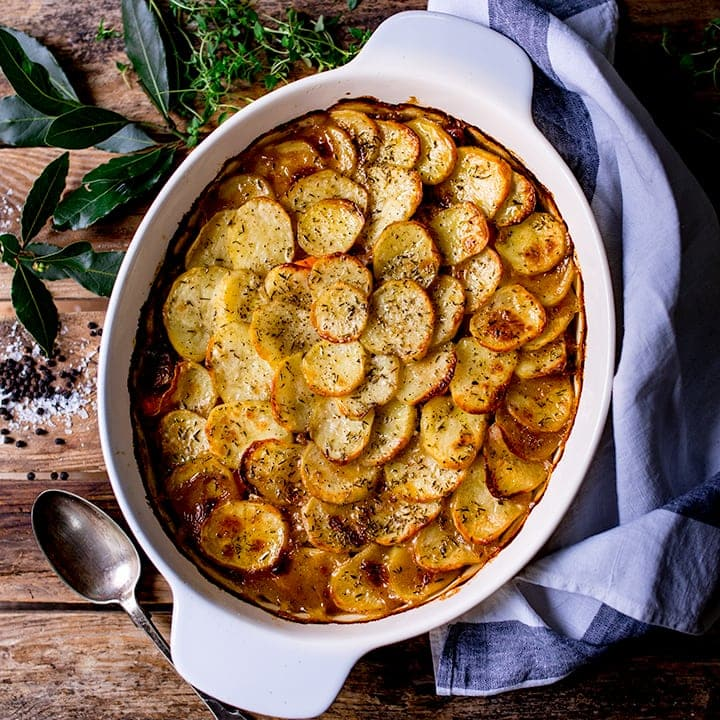

# Lancashire Hotpot

*Northern English layered casserole: lamb and onions sealed under overlapping discs of potato that crisp golden in the oven while the stew braises beneath. Slow-cooked, frugal, and the textbook example of how three ingredients become greater than their sum.*

**Serves:** 4

**Prep Time:** 25 minutes

**Cook Time:** 2 hours

## Overview
Lamb shoulder or middle-neck chunks layered with onions and stock in a deep dish, topped with sliced waxy potatoes that protect the meat below while crisping golden above. Long, low oven time builds depth without intervention.

## Ingredients

- 700 g lamb shoulder or middle-neck (cut into 3 cm chunks)
- 2 tablespoons plain flour
- 2 tablespoons vegetable oil
- 2 onions (sliced)
- 2 carrots (sliced)
- 1 tablespoon Worcestershire sauce
- 1 teaspoon fresh thyme leaves
- 500 ml lamb or beef stock
- 1 kg waxy potatoes (Charlotte or similar), peeled and sliced 5 mm thick
- 50 g unsalted butter (melted)
- Salt and freshly ground black pepper

## Method

### Stage 1 – Brown the lamb
1. Heat the oven to 160°C (140°C fan).
1. Toss the lamb in flour seasoned with salt and pepper.
1. Heat the oil in a heavy ovenproof casserole and brown the lamb in batches. Set aside.

### Stage 2 – Build the layers
1. In the same pan, cook the onions and carrots over medium heat for 8 minutes.
1. Stir in the Worcestershire and thyme.
1. Return the lamb to the pan and pour in the stock. Bring to a simmer.
1. Arrange the sliced potatoes in overlapping rounds across the surface, completely covering the lamb.
1. Brush the potatoes generously with melted butter and season with salt.

### Stage 3 – Bake
1. Cover the casserole with a tight-fitting lid (or foil) and bake for 1½ hours.
1. Remove the lid, increase the oven to 200°C (180°C fan), and bake another 30 minutes until the potatoes are deep golden and crisp.
1. Rest 10 minutes before serving.

## Notes
- **Waxy potatoes hold their shape:** Floury potatoes (Maris Piper, King Edward) crumble into the stock and turn it cloudy. Charlotte, Maris Peer or new potatoes keep their slices.
- **Don't skip the butter brush:** It's what crisps the top layer.
- **Middle-neck of lamb is traditional:** A bony cut that makes a richer braise. Shoulder is easier to find and works fine.

## Storage
- Keeps 3 days refrigerated. Reheat at 180°C for 20 minutes (the top can be re-crisped under a hot grill for 2-3 minutes).
- Freezes well for up to 2 months; the potato top will need re-crisping after defrosting.
