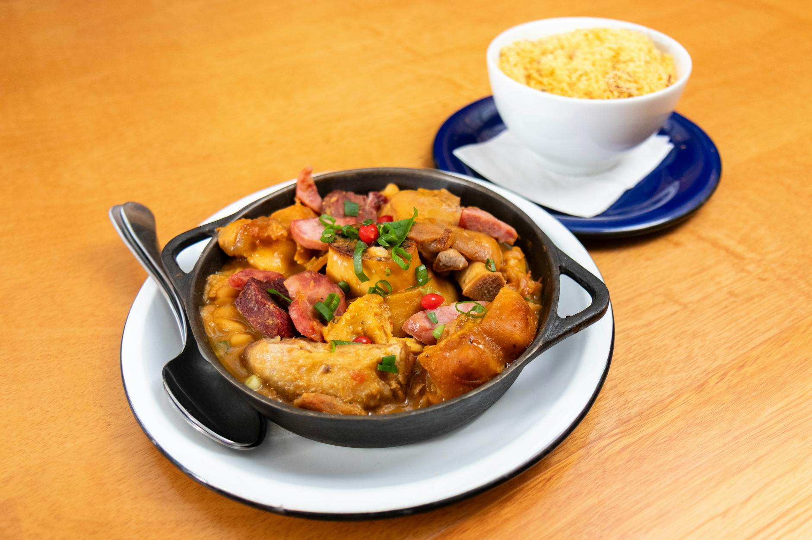

# Sausage and Butter Bean Stew

*Pork sausages browned then simmered in a tomato-and-rosemary sauce with creamy butter beans. The fastest stew that tastes like it took all afternoon. Weeknight food at its most useful.*

**Serves:** 4

**Prep Time:** 10 minutes

**Cook Time:** 35 minutes

## Overview
Sausages browned in a casserole, joined by onion, garlic and rosemary, then a tin of tomatoes and a tin of butter beans. Twenty minutes on the hob and dinner's ready.

## Ingredients

- 8 good-quality pork sausages
- 2 tablespoons olive oil
- 1 onion (sliced)
- 3 garlic cloves (sliced)
- 1 tablespoon fresh rosemary (chopped) or 1 teaspoon dried
- 1 teaspoon smoked paprika
- 1 tablespoon tomato purée
- 400 g tinned chopped tomatoes
- 2 x 400 g tins butter beans (drained and rinsed)
- 200 ml chicken stock
- 1 teaspoon brown sugar
- Salt and freshly ground black pepper
- A handful of fresh parsley (chopped, to finish)

## Method

### Stage 1 – Brown the sausages
1. Heat the oil in a heavy casserole over medium heat.
1. Brown the sausages on all sides for 8-10 minutes (they don't need to cook through; they'll finish in the sauce).
1. Lift out and set aside.

### Stage 2 – Build the sauce
1. In the same pan, cook the onion for 6-7 minutes until soft.
1. Add the garlic, rosemary and smoked paprika; cook 1 minute.
1. Stir in the tomato purée and cook another minute.
1. Tip in the chopped tomatoes, butter beans, stock and sugar. Season.

### Stage 3 – Simmer
1. Cut each sausage into 3-4 chunks; return to the pan.
1. Bring to a simmer, partially cover, and cook 20-25 minutes until the sausages are cooked through and the sauce has thickened.
1. Taste for seasoning; scatter parsley on top.

## Notes
- **Brown the sausages whole:** Easier to handle and gets a better crust than chopped pieces. Cut into chunks once browned.
- **Smoked paprika is the flavour:** A scant teaspoon shifts the dish from "sausages and beans" to "stew you want to make again".
- **Crusty bread to mop:** This isn't a stew you serve over rice or pasta. Bread for the sauce.

## Storage
- Keeps 3 days refrigerated; the flavour deepens overnight.
- Freezes 2 months.
