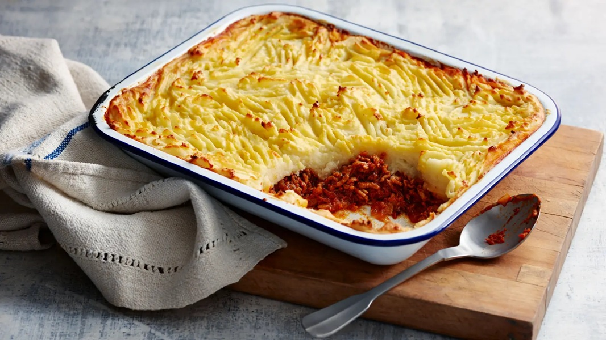

# Shepherd's Pie

*Lamb mince in a deeply savoury onion-and-rosemary gravy, sealed under a buttery mash crust that crisps on top in the oven. The British nursery-food staple, named after the lamb (a "shepherd" doesn't herd cattle); use beef and you're making cottage pie instead.*

**Serves:** 4-6

**Prep Time:** 25 minutes

**Cook Time:** 1 hour

## Overview
Lamb mince browned with onion, carrot and celery, simmered with stock, tomato purée, Worcestershire and rosemary into a thick gravy, topped with garlic-butter mash and baked until the peaks crisp golden.

## Ingredients

### Filling
- 1 tablespoon olive oil
- 500 g lamb mince
- 1 onion (finely chopped)
- 2 carrots (finely diced)
- 2 celery sticks (finely diced)
- 2 garlic cloves (crushed)
- 2 tablespoons tomato purée
- 1 tablespoon Worcestershire sauce
- 1 teaspoon fresh rosemary (chopped) or ½ teaspoon dried
- 1 teaspoon fresh thyme leaves or ½ teaspoon dried
- 300 ml lamb or beef stock
- 1 tablespoon plain flour
- Salt and freshly ground black pepper

### Topping
- 1 kg floury potatoes (Maris Piper or King Edward), peeled and cubed
- 75 g unsalted butter
- 75 ml whole milk
- 50 g mature cheddar (grated, optional)
- Salt

## Method

### Stage 1 – Brown the lamb
1. Heat the oil in a large heavy pan over medium-high heat.
1. Add the lamb mince and brown it well, breaking up clumps with a wooden spoon. Once browned, scoop the mince out and set aside, leaving the rendered fat in the pan.

### Stage 2 – Build the filling
1. Reduce the heat to medium and add the onion, carrot and celery to the pan. Cook for 8-10 minutes until soft and starting to colour.
1. Add the garlic and cook another minute.
1. Stir in the tomato purée, Worcestershire, rosemary and thyme; cook for 1 minute.
1. Sprinkle the flour over and stir for 30 seconds, then return the lamb to the pan.
1. Pour in the stock, bring to a simmer, season generously with salt and pepper, and cook uncovered for 25-30 minutes until thickened to a gravy. Taste and adjust seasoning.

### Stage 3 – Make the mash
1. Boil the potatoes in well-salted water for 15-18 minutes until a knife slides through easily.
1. Drain thoroughly, return to the hot pan, and let any residual moisture steam off for a minute.
1. Mash with the butter and warm milk until smooth. Season with salt; mix in half the cheese if using.

### Stage 4 – Assemble and bake
1. Heat the oven to 200°C (180°C fan).
1. Spread the lamb filling into a 25 x 20 cm baking dish.
1. Top with the mash, smoothing first then dragging a fork in long lines across the surface to create peaks (the bits that crisp).
1. Scatter the remaining cheese on top.
1. Bake for 25-30 minutes until the peaks are golden and the filling is bubbling around the edges.
1. Rest for 5 minutes before serving.

## Notes
- **Forky peaks crisp best:** A flat mash top steams; the dragged-fork peaks brown and add textural contrast against the soft mash beneath.
- **Lamb fat carries the flavour:** Don't drain the rendered fat after browning; it builds the base of the gravy.
- **Make ahead:** Both filling and mash can be made a day ahead and refrigerated separately. Assemble cold and add 10 minutes to the bake.

## Storage
- Keeps 3 days refrigerated in an airtight container.
- Reheats well at 180°C for 20-25 minutes (cover with foil, uncover for the last 10).
- Freezes well unbaked or baked for up to 3 months; defrost overnight before reheating.
