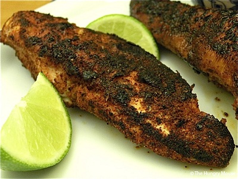

# Blackened Chicken

## Overview
Blackened chicken is a Cajun classic where a bold spice mixture creates a charred, flavourful crust on the outside while keeping the meat tender inside. The dark finish comes from the high-heat searing of the spice-coated chicken, a technique that seals in juices and creates a distinctive smoky flavour. This versatile dish works equally well with fish and is delicious served over salads, in sandwiches, or as a standalone protein.

**Serves:** 4

## Ingredients

### Chicken & Cooking Fat
- 4 chicken breasts
- 1 tablespoon oil
- 1 tablespoon butter

### Blackened Spice Mix
- 1 tablespoon salt
- 1½ teaspoons garlic powder
- 1½ teaspoons freshly ground black pepper
- 1 teaspoon ground white pepper
- 1 teaspoon onion powder
- 1 teaspoon ground cumin
- ½ teaspoon cayenne pepper
- ½ teaspoon paprika

## Method

### Stage 1 – Prepare Spice Mix
1. In a small bowl, mix all the spice ingredients together thoroughly.
2. Spread the spice mix on a large plate.

### Stage 2 – Season the Chicken
1. Pat the chicken breasts dry with paper towels.
2. Coat the chicken breasts completely in the spice mix, pressing gently so the spices adhere.
3. You can coat both sides or just the skin side, depending on preference.

### Stage 3 – Sear on Stovetop
1. Preheat the oven to 200°C.
2. Mix the oil and butter together in a large frying pan over medium-high heat.
3. Once the butter is bubbling and foaming (but not smoking), carefully add the chicken breasts skin-side down.
4. Cook for 3–5 minutes until the spice crust is blackened and charred.
5. Turn the chicken and cook the other side for another 3–5 minutes until blackened.
6. The chicken should develop a dark, almost burnt appearance, this is correct.

### Stage 4 – Finish in Oven
1. Transfer the seared chicken to a baking tray.
2. Bake in the preheated oven for 8–10 minutes until the chicken is cooked through (internal temperature 75°C).
3. Let rest for 2–3 minutes before serving.

## Notes
- **The black crust:** The high-heat searing creates a charred spice crust. Don't worry if it looks almost burnt, this is authentic to the dish.
- **Don't overcrowd:** Cook only 2 chicken breasts at a time to maintain high pan heat and ensure proper blackening.
- **Protein alternatives:** Fish fillets (especially salmon, mahi-mahi, or snapper) work beautifully with this spice mix. Reduce cooking time to 2–3 minutes per side.
- **Oil temperature:** Keep the pan hot enough that the spices blacken quickly but not so hot that the butter burns. Medium-high is ideal.

## Variations
**Blackened fish:** Use firm white fish fillets or salmon; reduce pan-searing to 2–3 minutes per side
**Extra spicy:** Increase cayenne pepper to 1 teaspoon for more heat
**Milder version:** Reduce salt to 1½ teaspoons and cayenne to ¼ teaspoon
**Dry rub ahead:** Mix the spice blend in advance and store in an airtight container for up to 3 months

## Serving
Serve with: Caesar salad, coleslaw, club sandwich filling, rice pilaf, or roasted vegetables. A squeeze of fresh lemon brightens the dish.

## Storage
- Keeps 2 days refrigerated
- Can be frozen up to 1 month (reheat gently to avoid drying out)
- Best enjoyed fresh for optimal crust texture