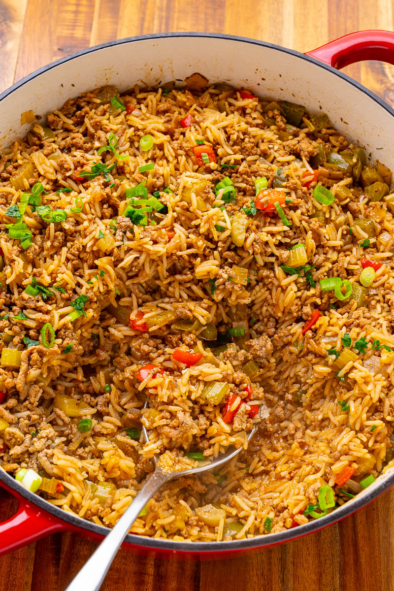

# Dirty Rice

*Cajun "dirty" rice: white rice cooked with browned chicken livers and minced pork or beef, the trinity, Cajun spice, stock — the meat tints the rice grey-brown ("dirty"), and the liver gives an iron-rich, deeply savoury background note. Served as a side or a meal in itself; one of the most defining Cajun dishes despite its modest ingredients.*

**Serves:** 6 as a side

**Prep Time:** 15 minutes

**Cook Time:** 50 minutes

## Overview
Chicken livers blitz to a fine paste (so they melt into the rice rather than appearing as recognisable pieces). Minced beef or pork browns hard; trinity follows; spice blooms; rice toasts; stock joins. Everything simmers covered until the rice is tender. The result is grey-brown rice studded with meat — the "dirty" name describes the look, not the cleanliness.

## Ingredients

- 200 g chicken livers (trimmed)
- 250 g minced pork (or beef)
- 3 tablespoons vegetable oil or pork fat
- 1 large onion (chopped)
- 3 celery sticks (chopped)
- 1 green pepper (chopped)
- 6 garlic cloves (crushed)
- 1 tablespoon Cajun seasoning
- 2 bay leaves
- 1 teaspoon dried thyme
- 1 teaspoon dried oregano
- ½ teaspoon cayenne (or to taste)
- 350 g long-grain white rice (rinsed)
- 800 ml chicken stock
- 2 tablespoons Worcestershire sauce
- 1 teaspoon salt
- ½ teaspoon black pepper

### To finish
- 4 spring onions (sliced)
- A small bunch of flat-leaf parsley (chopped)
- Hot sauce (to serve)

## Method

### Stage 1 – Liver paste
1. Pulse the chicken livers in a food processor to a smooth paste; or chop very fine with a sharp knife.

### Stage 2 – Brown the meat
1. Heat 2 tablespoons of oil in a heavy pot over medium-high heat.
1. Add the minced pork; cook 5-6 minutes, breaking it up, until well-browned.
1. Add the liver paste; cook 4-5 minutes, stirring, until cooked through and slightly crumbly.
1. Lift everything out into a bowl; reserve.

### Stage 3 – Trinity
1. Add the remaining 1 tablespoon of oil to the pot.
1. Cook the onion, celery and green pepper 8 minutes until soft.
1. Add the garlic; cook 1 minute.

### Stage 4 – Spice and rice
1. Stir in the Cajun seasoning, bay, thyme, oregano and cayenne; cook 1 minute.
1. Add the rice; toast 2 minutes.

### Stage 5 – Cook
1. Return the meat mixture to the pot.
1. Pour in the stock, Worcestershire, salt and pepper; bring to the boil.
1. Reduce to lowest heat; cover; cook 18-20 minutes.
1. Off the heat, rest covered 10 minutes.

### Stage 6 – Finish
1. Discard the bay leaves.
1. Fluff with a fork.
1. Stir in half the spring onions and parsley.

### Stage 7 – Serve
1. Pile onto plates; top with the remaining spring onions and parsley.
1. Pass hot sauce at the table. Eats well as a side to fried chicken, étouffée, or alongside red beans.

## Notes
- **Liver is the soul:** Without the chicken livers, this is just spiced rice with mince. The liver gives the iron-rich savoury depth that defines dirty rice.
- **Blitz the liver:** Coarse pieces of liver in finished dirty rice put many people off. Smooth-blended, it disappears into the rice as flavour.
- **Don't lift the lid:** Steam is what cooks the rice through. Set a timer.

## Storage
- Keeps 4 days refrigerated; reheats well with a splash of stock.
- Freezes 3 months.
