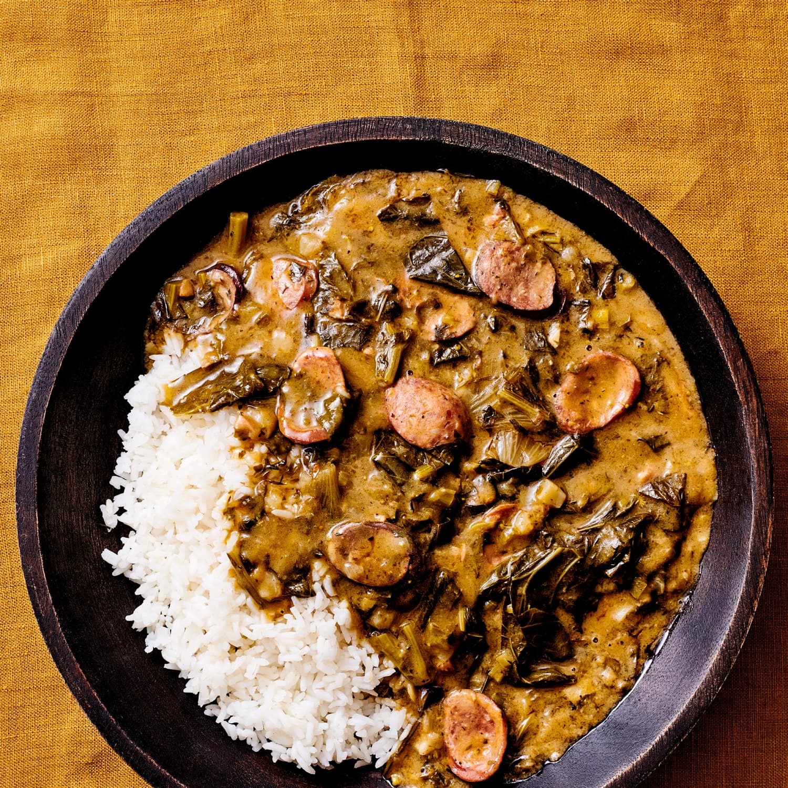

# Gumbo Z'Herbes

*Lent-time Louisiana gumbo built on greens — collards, mustard greens, kale, spinach, parsley — chopped and stewed in a roux-thickened broth. Originally a "no meat" Friday dish that, traditionally, you put as many different greens in as you wanted blessings. Eats over rice; tastes deeper than the simple ingredients suggest.*

**Serves:** 6

**Prep Time:** 25 minutes

**Cook Time:** 1¼ hours

## Overview
A dark roux is built first — flour cooked in oil to peanut-butter brown. The Cajun trinity (onion, celery, pepper) joins; greens — finely chopped — pile in with stock and simmer for 45 minutes until they're meltingly soft and the broth has darkened. Hot sauce, file powder and rice finish the bowl.

## Ingredients

### Roux
- 100 ml vegetable oil
- 80 g plain flour

### Trinity and aromatics
- 1 large onion (chopped)
- 4 celery sticks (chopped)
- 1 green pepper (chopped)
- 6 garlic cloves (crushed)
- 2 bay leaves
- 1 teaspoon thyme leaves
- 2 teaspoons smoked paprika
- 1 teaspoon dried oregano
- ½ teaspoon cayenne pepper

### Greens
- 1 bunch collard greens (around 250 g; tough stems removed; chopped)
- 1 bunch mustard greens or turnip tops (around 200 g; chopped)
- 1 bunch kale (around 200 g; chopped)
- 1 bunch flat-leaf parsley (chopped)
- 200 g spinach (chopped)
- 4 spring onions (sliced)

### Liquid and finish
- 1.5 litres vegetable stock
- 2 tablespoons soy sauce
- 1 teaspoon salt
- Black pepper
- 1 tablespoon filé powder (optional, off the heat)
- Hot sauce (Crystal or Tabasco)
- Cooked white rice (to serve)

## Method

### Stage 1 – Roux
1. Heat the oil in a heavy pot over medium-low heat.
1. Whisk in the flour; cook 25-30 minutes, stirring constantly, until the roux is deep peanut-butter brown. Don't rush — burning means starting over.

### Stage 2 – Trinity
1. Add the onion, celery and pepper to the roux; cook 8-10 minutes (the heat will drop; the vegetables release water and stop the roux from over-browning).
1. Add the garlic, bay, thyme, smoked paprika, oregano and cayenne; cook 1 minute.

### Stage 3 – Greens and broth
1. Pile in all the greens; they'll wilt down dramatically.
1. Pour in the stock; add the soy sauce and salt.
1. Bring to the boil; reduce to a steady simmer.
1. Cook 45 minutes, stirring occasionally — the greens will collapse, the broth will deepen.

### Stage 4 – Finish
1. Discard the bay leaves.
1. Off the heat, sprinkle in the filé powder if using (don't boil after; it gets stringy).
1. Taste; adjust salt, pepper and hot sauce.

### Stage 5 – Serve
1. Spoon over a mound of white rice in shallow bowls.
1. Pass extra hot sauce at the table.

## Notes
- **The roux is the base:** Pale roux gives weak flavour; black roux is bitter. Aim for the colour of milky coffee, working slowly. Stop just before you think it's ready — it keeps darkening off the heat.
- **As many greens as you can find:** Traditional Lenten gumbo z'herbes calls for an odd number — 7, 9, or 11 different greens. The variety matters more than the proportion.
- **Filé powder:** Ground sassafras leaves; gives an okra-like body and a subtle root-beer flavour. Optional but classic.

## Storage
- Keeps 5 days refrigerated; tastes better day two.
- Freezes 3 months.
