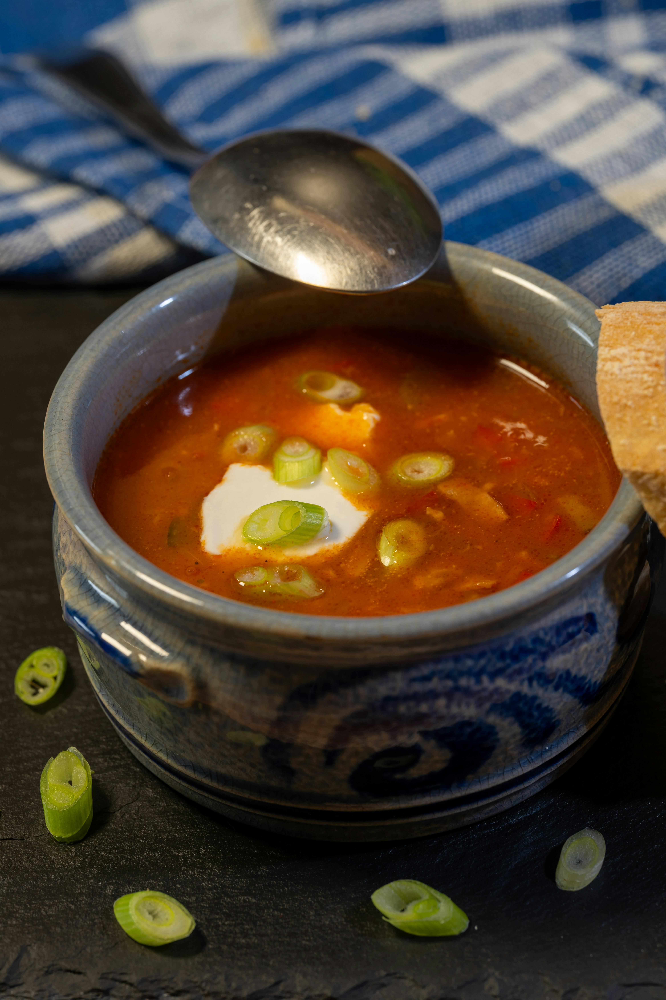

# Shellfish Gumbo

## Overview
Gumbo is a traditional Cajun soup that's served over rice as a main course. This shellfish version showcases the holy trinity of Cajun cooking, onion, celery, and sweet pepper, combined with fresh mussels, prawns, and crab in a rich, flavourful roux-based broth. The addition of fresh chilli adds a modern twist while honouring the classic Cajun tradition of bold, layered flavours.

**Serves:** 6

## Ingredients

### Shellfish & Stock Base
- 450 grams fresh mussels
- 450 grams raw prawns (in their shells)
- 1 cooked crab (about 1 kg)
- Small bunch of parsley (leaves chopped and stalks reserved)

### Roux & Holy Trinity
- 150 ml vegetable oil
- 115 grams plain flour
- 1 green pepper (deseeded and chopped)
- 1 large onion (chopped)
- 2 celery sticks (sliced)
- 1 fresh green chilli (deseeded and chopped)
- 3 garlic cloves (finely chopped)

### Protein & Aromatics
- 75 grams smoked spiced sausage (skinned and sliced)
- 1 tablespoon fresh thyme (chopped)
- 6 spring onions (sliced)

### Serving
- 275 grams white long-grain rice
- Tabasco sauce (to taste)
- Salt to taste

## Method

### Stage 1 – Make the Shellfish Stock
1. Wash the mussels in several changes of cold water, pulling away the black "beards".
2. Discard any mussels that are broken, or those that do not close when tapped firmly.
3. Bring 250 ml water to the boil in a deep pan.
4. Add the prepared mussels, cover the pan tightly with a glass lid, and cook over high heat, shaking frequently, for 3 minutes.
5. As the mussels open, lift them out with tongs into a chinois or fine-meshed conical sieve set over a bowl.
6. Discard any mussels that fail to open.
7. Shell the mussels, discarding most of the shells but reserving 12–18 for garnish.
8. Peel the prawns and devein, setting the meat aside.
9. Put all the prawn shells and heads into the pan.
10. Remove the meat from the crab, separating the brown and white meat.
11. Add all the pieces of crab shell to the pan and stir in 1 teaspoon of salt.
12. Return the mussel liquid from the bowl to the pan and make it up to 2 litres with water.
13. Bring the shellfish stock to the boil, skimming regularly.
14. When there is no more froth on the surface, add the parsley stalks and simmer for 15 minutes.
15. Cool the reduced stock, then add enough water to make it up to 2 litres.

### Stage 2 – Make the Roux
1. Heat the oil in a heavy pan over medium heat.
2. Stir in the flour with a wooden spoon or whisk.
3. Stir constantly until the roux reaches a golden-brown colour (about 5–8 minutes).
4. Be careful not to burn it, adjust heat as needed.

### Stage 3 – Build the Gumbo Base
1. Immediately add the green pepper, onion, celery, chilli, and garlic to the roux (called "the holy trinity" plus chilli).
2. Continue cooking for about 3 minutes until the onion is soft.
3. Stir in the smoked sausage and cook for 1 minute.
4. Reheat the shellfish stock in a separate pot.

### Stage 4 – Combine Stock & Roux
1. Stir the brown crab meat into the roux.
2. Ladle in the hot stock a little at a time, stirring constantly until it has been smoothly incorporated.
3. Bring to a low boil, partially cover the pan, then simmer for 30 minutes.

### Stage 5 – Cook Rice & Finish Gumbo
1. Meanwhile, cook the rice in plenty of lightly salted water until the grains are tender.
2. Add the prawns, mussels, white crab meat, thyme, and spring onions to the gumbo.
3. Return to the boil and season with salt if necessary.
4. Taste and add a dash or two of Tabasco sauce to heighten the heat.
5. Simmer for a further minute, then add the chopped parsley leaves and reserved mussel shells for garnish.

## Notes
- **The Holy Trinity:** Onion, celery, and sweet pepper form the aromatic base of Cajun cooking, essential to authentic gumbo.
- **Roux technique:** Golden-brown roux takes time and requires constant stirring. Don't rush it; burnt roux ruined the dish.
- **Stock-making:** Fresh shellfish stock is crucial for authentic flavour. Don't skip this step.
- **Serving:** Gumbo is traditionally ladled over hot rice in soup plates rather than mixed together.
- **Roux colour:** Darker roux has deeper flavour but burns more easily; medium-brown is safest for beginners.

## Variations
**Chicken & Sausage Gumbo:** Replace shellfish with diced chicken and additional smoked sausage; use chicken stock instead
**Vegetarian:** Omit all proteins and make vegetable stock; add okra or extra vegetables for body
**Spicier version:** Add cayenne pepper or hot sauce to the roux or at the finish
**With okra:** Add 150g sliced okra during the final simmer for a traditional thickening agent

## Serving
Serve in soup plates over hot rice with crusty bread and hot sauce on the side

## Storage
- Keeps 3 days refrigerated
- Freezes well up to 3 months (remove mussel shells before freezing)
- Flavour improves after 24 hours as spices meld