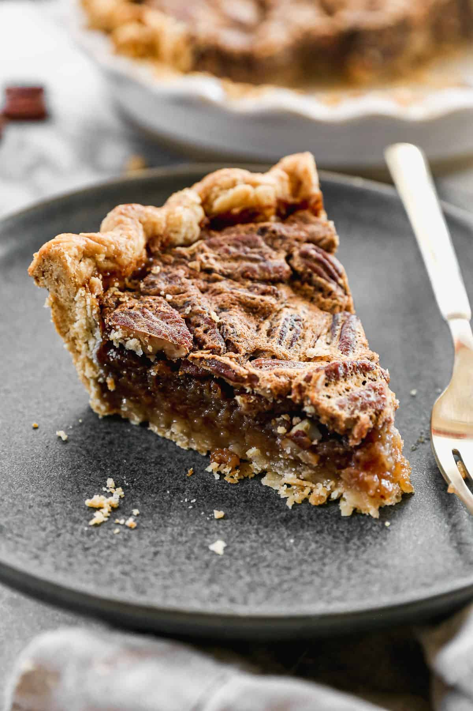

# Pecan Pie

*Southern Cajun-influenced pecan pie: a pre-baked shortcrust shell filled with toasted pecans suspended in a custardy filling of brown sugar, eggs, butter, vanilla and a splash of bourbon. The filling sets to a barely-sweet caramel; the pecans on top toast deeply. Best slightly warm with bourbon-spiked whipped cream.*

**Serves:** 8

**Prep Time:** 30 minutes (plus 1 hour pastry chill)

**Cook Time:** 1 hour

## Overview
A simple all-butter shortcrust blind-bakes to a deep golden shell. Pecans toast briefly to bring out their oils. The filling — eggs, brown sugar, golden syrup (or corn syrup), butter, vanilla, bourbon, salt — whisks smooth and pours over the pecans. Bakes at moderate heat until the centre has just set with a slight wobble.

## Ingredients

### Pastry
- 250 g plain flour
- 125 g cold unsalted butter (cubed)
- 30 g caster sugar
- ½ teaspoon salt
- 1 large egg yolk
- 3-4 tablespoons cold water

### Filling
- 250 g pecan halves
- 200 g light brown sugar
- 100 g caster sugar
- 200 ml golden syrup (or light corn syrup)
- 80 g unsalted butter (melted)
- 4 large eggs
- 2 tablespoons bourbon (optional but classic)
- 2 teaspoons vanilla extract
- ½ teaspoon salt

## Method

### Stage 1 – Pastry
1. Rub the butter into the flour, sugar and salt until breadcrumb texture.
1. Stir in the yolk; add cold water a tablespoon at a time until the dough comes together.
1. Wrap; chill 1 hour.

### Stage 2 – Blind bake
1. Heat the oven to 200°C (180°C fan).
1. Roll the pastry to 3 mm; line a 23 cm pie dish; trim with overhang; chill 15 minutes.
1. Line with parchment; fill with baking beans.
1. Bake 18 minutes; remove parchment and beans; bake 6 minutes more until the base is dry and pale gold.
1. Reduce the oven to 170°C (150°C fan).

### Stage 3 – Toast pecans
1. Lay the pecans on a tray; toast in the oven (or a dry pan) 5-6 minutes until fragrant. Cool.

### Stage 4 – Filling
1. Whisk the brown and caster sugars with the golden syrup, melted butter, eggs, bourbon, vanilla and salt until smooth.

### Stage 5 – Assemble
1. Scatter the toasted pecans evenly across the pastry shell.
1. Pour the filling slowly over — it'll seep around the pecans, and the pecans will mostly float to the top.

### Stage 6 – Bake
1. Bake 45-55 minutes until the filling has set around the edges and just-wobbles in the centre.
1. If the crust browns too fast, cover the edges with foil at 30 minutes.

### Stage 7 – Cool and serve
1. Cool fully — at least 3 hours, ideally overnight. Cutting warm gives a runny filling.
1. Slice and serve at room temperature, or briefly warmed; bourbon-whipped cream alongside.

## Notes
- **Don't overbake:** The filling continues to set as it cools. Pull when the centre still wobbles slightly; rock-firm pie filling is overdone.
- **Toast the pecans first:** Untoasted pecans taste flat and slightly bitter under the sweet filling. The brief toast brings out their oils.
- **Bourbon variations:** A bourbon-rich version uses 4 tablespoons; the version above is moderate. Substitute extra vanilla for an alcohol-free pie.

## Storage
- Keeps 3 days at room temperature, covered.
- Freezes 2 months.
