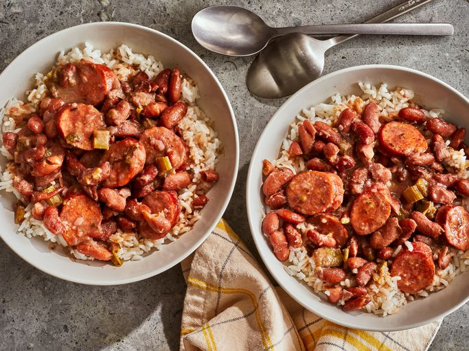

# Red Beans and Rice

*Louisiana's Monday-night dish — a vegetarian version, where the smoke usually given by andouille comes from smoked paprika and a long simmer with bay and thyme. Beans break down on the edges and stay whole at the heart; the broth thickens to a gravy. Spooned over white rice, with hot sauce on the side.*

**Serves:** 4-6

**Prep Time:** 15 minutes (plus overnight bean soak)

**Cook Time:** 1¾ hours

## Overview
Trinity (onion, celery, pepper) softens in oil; smoked paprika and Cajun seasoning bloom. Soaked red kidney beans go in with stock, bay and thyme; simmer until tender. The last 30 minutes, beans get partially mashed against the side of the pot to thicken the broth into a gravy. Vinegar and hot sauce at the finish.

## Ingredients

- 350 g dried red kidney beans (soaked overnight)
- 4 tablespoons olive oil
- 1 large onion (chopped)
- 4 celery sticks (chopped)
- 1 green pepper (chopped)
- 6 garlic cloves (crushed)
- 1 tablespoon smoked paprika
- 1 tablespoon dried oregano
- 1 teaspoon dried thyme
- 1 teaspoon ground black pepper
- ½ teaspoon cayenne (or to taste)
- 2 bay leaves
- 1.5 litres vegetable stock (or water)
- 2 tablespoons soy sauce
- 2 teaspoons salt
- 1 tablespoon cider vinegar
- Hot sauce (to taste)
- Cooked long-grain white rice (to serve)
- 4 spring onions (sliced; to garnish)

## Method

### Stage 1 – Trinity
1. Drain the soaked beans.
1. Heat the oil in a heavy pot over medium heat.
1. Cook the onion, celery and pepper 8-10 minutes until softened.
1. Add the garlic, smoked paprika, oregano, thyme, black pepper and cayenne; cook 1 minute.

### Stage 2 – Simmer
1. Add the beans, bay leaves and stock.
1. Bring to the boil; reduce to a steady simmer.
1. Cook 1 hour partly covered.

### Stage 3 – Mash and thicken
1. Add the soy sauce and salt.
1. Use a wooden spoon to mash some of the beans against the side of the pot — about a third — to thicken the broth.
1. Continue cooking uncovered another 30 minutes until the beans are creamy and the gravy is thick enough to coat a spoon.

### Stage 4 – Finish
1. Discard the bay leaves.
1. Stir in the vinegar.
1. Taste; adjust salt and hot sauce.

### Stage 5 – Serve
1. Spoon over white rice; top with sliced spring onions.
1. Pass hot sauce and extra vinegar at the table.

## Notes
- **Soak the beans:** Unsoaked kidney beans need a longer cook and the texture suffers. Overnight soak is best; a quick-soak (boil 1 minute, rest 1 hour) works too.
- **Mashing thickens:** Cajun gravy comes from the beans themselves, not a roux or flour. Mashing is the whole technique.
- **Vinegar wakes it up:** The cider vinegar at the end is what makes this taste alive instead of muddy. Don't skip it.

## Storage
- Keeps 5 days refrigerated; tastes better the next day.
- Freezes 3 months.
