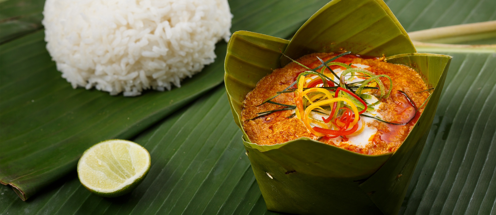

# Amok Trey

*Cambodia's national dish: fish steamed in a banana-leaf cup with kroeung (the lemongrass-galangal-turmeric paste that defines Khmer cooking), coconut cream and noni leaves. The fish stays soft; the custard thickens around it; the leaves perfume everything. Served from the banana-leaf parcels with rice.*

**Serves:** 4

**Prep Time:** 30 minutes

**Cook Time:** 25 minutes

## Overview
Kroeung is pounded fresh from lemongrass, galangal, turmeric, garlic, shallots, kaffir lime zest and coriander root. The paste fries briefly to bloom; coconut cream and stock loosen it; eggs whisk in to set the custard. Fish chunks fold through with chopped greens; the mix is spooned into banana-leaf cups (or ramekins) and steamed.

## Ingredients

### Kroeung (curry paste)
- 3 stalks lemongrass (white parts, sliced thin)
- 4 cm galangal (sliced)
- 3 cm fresh turmeric (or 1½ teaspoons ground)
- 6 garlic cloves
- 4 shallots
- Zest of 2 kaffir limes (or 4 lime leaves, central stems out, finely chopped)
- 1 small bunch coriander roots (cleaned)
- 1 long red chilli
- 1 teaspoon shrimp paste (skip for vegetarian; 1 teaspoon brown miso instead)

### Custard
- 600 g white fish fillet (cod, basa, sea bass; cut into 3 cm chunks)
- 250 ml thick coconut cream
- 100 ml fish stock or water
- 2 large eggs
- 2 tablespoons fish sauce (or vegetarian fish sauce / soy)
- 1 tablespoon palm sugar
- 1 teaspoon salt
- 1 small handful Thai basil (chopped)
- 100 g spinach or noni leaves (shredded)

### To assemble
- 4 banana leaves (cut into 18 cm squares; or use 4 ramekins)
- Hot cooked jasmine rice (to serve)

### Topping
- 4 tablespoons coconut cream (extra)
- 1 long red chilli (sliced thin)
- A few kaffir lime leaves (julienned)

## Method

### Stage 1 – Kroeung
1. Pound or blend everything in the kroeung list to a smooth paste, scraping down. A high-speed blender or small food processor with a tablespoon of water works fine.

### Stage 2 – Banana-leaf cups (optional)
1. Soften banana leaves over a flame for 5 seconds — they turn glossy and pliable.
1. Fold each square into a small open box: bring two opposite corners up and pin together; do the same with the other two. Use cocktail sticks. (Skip and use ramekins if simpler.)

### Stage 3 – Custard base
1. Heat 1 tablespoon vegetable oil in a wok over medium heat.
1. Add the kroeung; fry 4-5 minutes until darker and aromatic.
1. Pour in the coconut cream and stock; whisk; bring to a simmer.
1. Whisk the eggs lightly; pour into the wok off the heat, whisking — they shouldn't curdle but they're not meant to stay liquid either.
1. Stir in the fish sauce, palm sugar, salt.

### Stage 4 – Fold
1. Stir in the spinach (or noni) and the fish chunks gently, just to coat.

### Stage 5 – Steam
1. Spoon the mixture into the banana-leaf cups or ramekins.
1. Set in a steamer over boiling water; cover.
1. Steam 18-20 minutes until the custard is set and the fish is cooked through (no pink in the centre).

### Stage 6 – Finish
1. Drizzle each cup with a teaspoon of extra coconut cream.
1. Top with sliced chilli and shredded lime leaves.
1. Serve hot with jasmine rice.

## Notes
- **Kroeung is the dish:** The paste is unique to Khmer cooking — different from Thai green or red curry pastes. The galangal-lemongrass-turmeric balance makes it.
- **Fish that holds together:** Firm white fish — cod, basa, sea bass, halibut — chunks of 3 cm hold up to steaming. Tilapia and barramundi are traditional.
- **Banana leaves vs ramekins:** Banana leaves give a subtle, tea-like aroma; ramekins are cleaner and easier. Both are valid.

## Storage
- Best fresh; the custard separates on reheat. Eat the day it's made.
