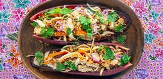

# Nhom Trav

*Cambodian banana flower salad: thinly-sliced banana flower tossed with herbs, peanuts, fried shallots, lime and a salty-sweet dressing. The banana flower is bitter at first, but sliced thin and rinsed, it goes pale and floral. Eats as a starter or alongside grilled food.*

**Serves:** 4 as a starter

**Prep Time:** 25 minutes

**Cook Time:** 5 minutes

## Overview
Banana flower is sliced thin and immediately submerged in lemon water to stop browning. Tofu cubes (or shredded chicken in non-vegetarian versions) join the salad. Peanuts toast; shallots fry crisp. The dressing is lime, palm sugar, soy and chilli; everything tosses together with herbs at the last minute.

## Ingredients

### Salad
- 1 banana flower (around 400 g; outer red leaves discarded)
- Juice of 1 lemon (for the soaking water)
- 200 g firm tofu (cubed and pan-fried until golden)
- 1 small carrot (julienned)
- 50 g beansprouts
- A small bunch Thai basil
- A small bunch coriander
- A small bunch mint
- 4 spring onions (sliced)
- 50 g roasted peanuts (chopped)

### Crispy shallots
- 4 shallots (thinly sliced)
- 4 tablespoons vegetable oil

### Dressing
- 3 tablespoons lime juice
- 2 tablespoons light soy sauce
- 2 tablespoons palm sugar (or brown sugar)
- 1-2 bird's-eye chillies (finely sliced)
- 2 garlic cloves (crushed)
- 2 tablespoons water

## Method

### Stage 1 – Banana flower
1. Fill a large bowl with cold water and the lemon juice.
1. Discard the outer 2-3 red leaves of the banana flower; save the small immature finger-like flowers inside (remove the woody stamen).
1. Slice the flower itself crosswise as thinly as possible with a sharp knife (1-2 mm).
1. Drop the slices straight into the lemon water as you work — they brown otherwise.
1. Soak 10 minutes; drain; squeeze gently.

### Stage 2 – Crispy shallots
1. Heat the oil in a small pan over medium heat.
1. Cook the shallots 6-8 minutes, stirring, until deep golden and crisp. Don't burn — they go from done to over fast.
1. Lift onto kitchen paper.

### Stage 3 – Dressing
1. Whisk the lime juice, soy sauce, palm sugar, chillies, garlic and water until the sugar dissolves.
1. Taste; should be balanced sour-salty-sweet with heat. Adjust as needed.

### Stage 4 – Combine
1. Toss the banana flower, tofu, carrot, beansprouts, basil, coriander, mint and spring onions in a wide bowl.
1. Pour over the dressing; toss to coat.

### Stage 5 – Serve
1. Pile onto a platter.
1. Top with peanuts and crispy shallots.

## Notes
- **Banana flower is essential:** Cambodian, Thai, Vietnamese groceries stock fresh banana flowers. Tinned ones (in brine) work as a substitute — drain and rinse well.
- **Slice immediately into acid:** The cut surfaces oxidise within minutes. Keep them submerged.
- **Crispy shallots:** Worth the small effort — the textural contrast against the soft flowers is the dish.

## Storage
- Best eaten right away. Soak banana flower up to a few hours ahead; assemble at the last minute.
